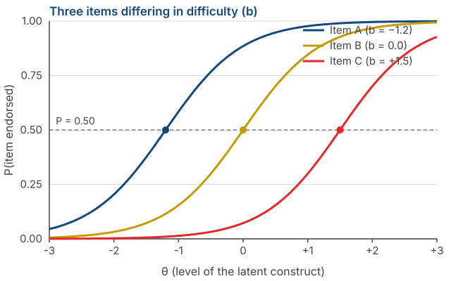
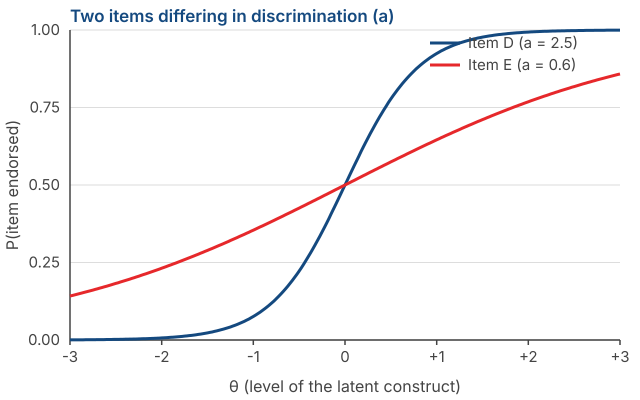

## _Outline_

::: {.incremental}

* What a **latent variable** is, and why we call it a *cause*
* ***Classical Test Theory***: $X = T + E$ and its assumptions
* Why reliability can be defined as a **proportion of variance**
* What *true score* actually means — and why it is **not** "the real amount of the construct"
* Consequences of CTT: number of items, attenuation, and sample dependence
* The family of CTT models: *parallel*, *tau-equivalent*, *congeneric*
* A glimpse of ***Item Response Theory*** and what it offers

:::

::: aside
***Disclosure* on the use of artificial intelligence (AI)**

We used Claude Code (Opus 5 and Sonnet 5) to brainstorm material, locate references, and troubleshoot `quarto` and `git` code. We (Amel and Dian) take full responsibility for the substance and presentation of these slides.

:::

# From assumptions to a model {background-color="#14497F" .center}

## Where we are

::: {.incremental}

* **Session 1**: psychological measurement is indirect, and not every set of items is a scale.

* **Session 2**: there are six assumptions we rely on, most of them without noticing.

* **Today**: those assumptions get tidied into a **formal mathematical model**.

:::

. . .

::: {.callout-note}
#### Why we need a model
As long as assumptions are only a list, nothing can be computed from them. Once they are written as equations, we can **derive their consequences** — including the reliability formulas you will use in Session 13.
:::

# What is a latent variable {background-color="#14497F" .center}

## Two words, two properties

:::: {.columns}
::: {.column width="55%"}

::: {.incremental}

* ***Latent***, not manifest. Not directly observable. Parents' aspirations for their child's achievement cannot be seen, only inferred.

* ***Variable***, not constant. Something about it changes — its strength, its magnitude — across people, times, and situations.

* A latent variable is usually a **characteristic of the person supplying the data** (e.g., the parent), not of the object being asked about (e.g., the child's achievement).

:::

:::
::: {.column width="45%"}

{fig-align="center" width="72%"}

:::
::::

::: aside
DeVellis & Thorpe (2022), Chapter 2.
:::

## Notice who is actually being measured

::: {.incremental}

* If we ask **parents** to report their aspirations for their child, we are measuring a characteristic of the **parents**, not the child.

* If we ask parents to report **their child's own** aspirations, the latent variable is better described as *parents' perceptions of their child's aspirations*.

* If we ask shoppers to rate a brand, we are measuring **shoppers' perceptions**, not the brand's actual properties.

:::

. . .

::: {.callout-warning}
#### A naming error that happens often
The name of your construct must reflect **whose data you collected** (e.g., the *estimand*).
:::

## The latent variable as a *cause*

::: {.columns}
::: {.column width="70%"}

::: {.incremental}

* The core idea: **the strength of the latent variable causes an item to take a particular value.**

* Take the item *"No sacrifice is too great if it helps my child succeed."* How strongly someone agrees is determined by how strong their aspiration is.

* Note the direction of the arrow: from construct **to** item (e.g., ["Reflective Model"](slides/pertemuan1-en.html#/a-scale-items-as-effects)). Not the other way round.

:::

. . .

::: {.callout-tip}
#### Everything else follows from this
If one common cause drives ten items, those ten items **must correlate with one another**.

Inter-item correlations can be computed. The latent variable cannot. So those correlations are the **only way in** to estimating something we cannot observe.
:::

:::
::: {.column width="30%"}

{fig-align="center" width="60%"}

:::
:::

## This is what makes item analysis possible

::: {.incremental}

* We can never compute the correlation between an item and the true score, because the true score is unobserved.

* But we can compute the correlations **between items**.

* From the pattern of inter-item correlations, we can infer how strongly each item is tied to the latent variable.

:::

. . .

::: {.callout-note}
### Worth remembering
The procedures you will run in Session 13 — corrected item-total correlations, dropping weak items — rest entirely on this logic.
:::

# Classical Test Theory {background-color="#14497F" .center}

## The equation

$$X = T + E$$

. . .

::: {.incremental}

* $X$ — the ***observed score***. What you actually get from a respondent.

* $T$ — the ***true score***. What that person would score if measurement were perfect.

* $E$ — ***error***. Everything that makes $X$ deviate from $T$.

:::

. . .

::: {.callout-note}
#### What goes into $E$
The respondent's physical state, a passing mood, an ambiguous item, noise in the room, a mis-click. CTT does **not separate** these sources. They are all collected into a single error term.
:::

## The three CTT assumptions

::: {.incremental}

1. **The mean of the errors is zero**: $E(e) = 0$. Over infinitely many repeated measurements, errors cancel out.

2. **Error is uncorrelated with true score**: $\text{Cov}(T, E) = 0$. Highly anxious people do not systematically have larger errors.

3. **Errors across measurements are uncorrelated**: $\text{Cov}(E_1, E_2) = 0$.

:::

. . .

::: {.callout-warning}
#### Notice what is being assumed
All three say that error is **random**, not systematic. A consistent bias — for example every respondent answering more positively because of social desirability — does **not** enter $E$.
:::

## From scores to variance

If $X = T + E$ and $\text{Cov}(T, E) = 0$, the variance separates too:

$$\sigma^2_X = \sigma^2_T + \sigma^2_E$$

. . .

::: {.incremental}

* In words: **the variability we observe in scores** consists of variability from genuine differences between people, plus variability from noise.

* The reliability question then becomes very simple: **what proportion of that variability is not noise?**

:::

## Reliability as a proportion of variance

$$\rho_{XX'} = \frac{\sigma^2_T}{\sigma^2_X} = \frac{\sigma^2_T}{\sigma^2_T + \sigma^2_E}$$

. . .

::: {.incremental}

* It ranges from 0 to 1, because it is a proportion.

* $\rho = 0.80$ means **80% of the variability in scores** comes from genuine differences between people, and 20% from error.

* Note that this is a statement about how *consistent* the scores are, not about how *correct* they are.

:::

## A worked example

Suppose your scale has a total-score standard deviation of $\sigma_X = 5$, so $\sigma^2_X = 25$, with reliability $\rho = 0.80$.

. . .

$$\sigma^2_T = 0.80 \times 25 = 20 \qquad \sigma^2_E = 25 - 20 = 5$$

. . .

The ***standard error of measurement***, the standard deviation of the errors:

$$SEM = \sigma_X\sqrt{1-\rho} = 5\sqrt{0.20} = 2.24$$

. . .

::: {.callout-tip}
#### Why this number is useful
Someone who scores **30** is really located within a range, not at a point. At 95% confidence:

$$30 \pm 1.96 \times 2.24 \;\approx\; 25.6 \text{ to } 34.4$$
:::

## What that range means

::: {.incremental}

* Two people scoring **30** and **33** **cannot** be said to differ. Their ranges overlap almost entirely.

* And a scale with $\rho = 0.80$ already counts as good by the usual rules of thumb.

* The lower the reliability, the wider the range, and the less we can say about any individual.

:::

. . .

::: {.callout-warning}
#### Remember this when you build norms
In Session 14 you will convert scores into categories. If your category boundaries are narrower than your scale's $SEM$, those categories are **not meaningful** — the same person could land in different categories simply by responding on a different day.
:::

# What is a *true score*, really? {background-color="#14497F" .center}

## The definition

::: {.incremental}

* In CTT, the true score is defined as the **expected value of the observed score** if the same person were measured repeatedly and independently with the same instrument.

* Note: the definition attaches to **the instrument**, not to the construct.

* A true score is "the stable score this instrument produces", not "the real amount of the construct that person has".

:::

::: aside
Lord & Novick (1968/2008); DeVellis & Thorpe (2022), Chapter 3.
:::

## The miscalibrated scale analogy

::: {.incremental}

* Imagine a bathroom scale that always reads **2 kg heavier** than the truth.

* Weigh someone a hundred times. The results are highly consistent — random error is small, so **reliability is high**.

* That person's true score, by the CTT definition, is their real weight **+ 2 kg**.

:::

. . .

::: {.callout-warning}
#### The important conclusion
CTT has **no way** to detect a consistent bias. Systematic bias goes into $T$, not into $E$.

Which means: **a reliable instrument can measure the wrong thing, very consistently.**
:::

## Reliability is not validity

::: {.incremental}

* **Reliability** is a property of **scores**: how consistent they are when measurement is repeated.

* **Validity** is also a property of scores — more precisely, of the **interpretation of scores for a proposed use**.

* The first does **not guarantee** the second. Your scale can have $\alpha = 0.92$ and its scores still reflect a construct other than the one you claim.

:::

. . .

::: {.callout-note}
#### But they are connected
Reliability sets an **upper bound** on the *validity coefficient*, the correlation between your scores and a criterion:

$$r_{XY} \leq \sqrt{\rho_{XX'} \times \rho_{YY'}}$$

This involves the criterion's reliability too. If the criterion is assumed to be measured without error ($\rho_{YY'}=1$), the formula simplifies to $r_{XY} \leq \sqrt{\rho_{XX'}}$: with $\rho_{XX'} = 0.64$, the largest correlation you could possibly obtain is $0.80$ — however strong the real relationship is. If the criterion is itself fallible, the upper bound drops further.
:::

## Validity is not a property of a scale

> Validity refers to the degree to which evidence and theory support the interpretations of test scores for proposed uses of tests.
>
> — AERA, APA, & NCME (2014), *Standards for Educational and Psychological Testing*

. . .

::: {.incremental}

* The sentence "our scale is valid" is **incomplete**. What evidence can or cannot support is an **interpretation of scores**, for a **stated purpose**, in a **stated population**.

* [Messick (1989)](https://psycnet.apa.org/record/1996-10004-001) describes validity as an integrated judgement of how far evidence and theory support the **inferences and actions** taken on the basis of scores.

:::

## Why this distinction matters

::: {.incremental}

* Validity evidence **does not transfer automatically**. A scale whose score interpretation is supported for research on students is not thereby supported for job selection or clinical diagnosis.

* As soon as the population, the purpose, or the use changes, the evidence has to be re-examined.

* So validity is **never finished**. It is not stamped once and valid forever.

:::

. . .

::: {.callout-tip}
#### How to write this in your report
Avoid "our scale is valid". Write instead:

*"There is evidence supporting the interpretation of scores on scale X as an indicator of construct Y, in population Z, for purpose W."*

We cover the types of evidence in Session 7.
:::

## Connect this back to Session 1

::: {.incremental}

* Recall Michell's objection: are psychological attributes genuinely quantitative?

* The equation $X = T + E$ **presumes the answer is yes**. We add and subtract $T$ and $E$ as though both were magnitudes.

* CTT does not prove that assumption. CTT **builds on it**.

:::

# Consequences of CTT {background-color="#14497F" .center}

## Why adding items raises reliability

::: {.incremental}

* Error is random. Some items push a score too high, others too low.

* When items are summed, errors in opposite directions **cancel out** — while true score accumulates.

* The more items, the smaller $\sigma^2_E$ is as a proportion of $\sigma^2_X$.

:::

. . .

::: {.callout-note}
#### Remember Bernoulli's arrows from Session 1
Exactly the same principle: one shot tells you little, but the average of many shots converges on the real centre.

The formula (*Spearman-Brown*) comes in Session 6.
:::

## There is a limit

::: {.incremental}

* Adding items only helps if the new items **actually measure the same construct**.

* Adding near-duplicate items will raise $\alpha$ without adding any information — this is the local independence violation from Session 2.

* And an over-long questionnaire creates new problems: fatigue and careless responding.

:::

. . .

::: {.callout-warning}
#### For your project
A high $\alpha$ is **not** evidence that your scale is good. It can be achieved by writing ten paraphrases of the same sentence.
:::

## Now attenuation makes sense

In Session 1 we used this formula without explaining it:

$$r_{XY} = \rho_{T_X T_Y} \times \sqrt{\rho_{XX'} \times \rho_{YY'}}$$

. . .

::: {.incremental}

* Its origin is now clear: what we correlate is $X$, and $X$ contains $E$.

* The $E$ part correlates with nothing — by CTT's second assumption.

* So error adds to the denominator without adding to the numerator, and the correlation shrinks.

:::

. . .

::: {.callout-tip}
### The takeaway
The larger the share of noise in your scores, the smaller every correlation you report.
:::

## The most serious weakness of CTT

::: {.incremental}

* Reliability in CTT **depends on the sample**.

* If your respondents are very uniform on the attribute, their range of true scores is narrow. Inter-item correlations shrink, and the **computed reliability drops** — even though the instrument is unchanged.

* Conversely, a highly heterogeneous sample makes the same instrument look more reliable.

:::

::: aside
DeVellis & Thorpe (2022), Chapter 8.
:::

. . .

::: {.callout-warning}
#### A practical consequence for your pilot study
The reliability you report is **not purely a property of your instrument** — it is partly a property of your sample. So always report **sample characteristics** alongside the coefficient.
:::

## And not only reliability

::: {.incremental}

* **Item difficulty** in CTT is the proportion of respondents endorsing an item. That number changes when the sample changes.

* **Item discrimination** is the item's correlation with the total score. That shifts with the sample too.

* So nearly every item statistic in CTT is **relative to whichever group you happened to measure**.

:::

# The family of CTT models {background-color="#14497F" .center}

## Three measurement models

{fig-align="center" width="78%"}

::: aside
**1** marks the reference indicator; **a** marks loadings constrained to be equal; **b** marks error variances constrained to be equal; $\lambda_2, \lambda_3$ mark free loadings (allowed to differ from each other) in the congeneric model.
:::

## What separates them

::: {.incremental}

* ***Congeneric*** — each item may relate to the construct with a **different strength**, and may have a different error variance. The loosest and most realistic.

* ***Tau-equivalent*** — all items are assumed to relate to the construct **equally strongly**, but error variances may differ.

* ***Parallel*** — equal relationships to the construct **and** equal error variances. The strictest, and rarely satisfied.

:::

. . .

::: {.callout-note}
Note that all three are assumptions about **your items**, not about the people. This follows directly from the unit-weighting assumption in Session 2.
:::

## Why this will matter in Session 6

::: {.incremental}

* ***Cronbach's alpha*** assumes the **tau-equivalent** model — that every item contributes equally.

* If your items are really congeneric (and they almost always are), $\alpha$ will **underestimate** the true reliability.

* The ***omega*** coefficient ($\omega$) does not require that assumption, and is generally more appropriate.

:::

. . .

::: {.callout-tip}
#### What to take from this slide
You do not need to compute anything yet. What you should carry forward is: **$\alpha$ has an assumption, and that assumption is rarely met.** We check the consequences in Session 6.
:::

# A glimpse of Item Response Theory {background-color="#14497F" .center}

## The problem it sets out to solve

::: {.incremental}

* In physical measurement, **20 kilograms means the same thing** whatever is being weighed. The instrument's properties do not depend on the object (e.g., [*specific objectivity*](https://www.rasch.org/rmt/rmt83e.htm)).

* IRT wants the same for questionnaire items: item properties that are **independent of who completes them**.

* CTT has a built-in linkage between the instrument and the people measured. IRT, at least in theory, does not.

:::

::: aside
DeVellis & Thorpe (2022), Chapter 8.
:::

## First difference: the focus is on items

:::: {.columns}
::: {.column width="50%"}

### CTT

Emphasises properties of the **scale as a whole**.

Reliability is raised mainly by **adding items**.

:::
::: {.column width="50%"}

### IRT

Emphasises properties of **each item**.

Reliability is raised by **selecting better items**.

:::
::::

. . .

::: {.callout-note}
This difference has a large practical consequence: CTT tends to produce long, redundant scales; IRT tends to produce short, selected ones.
:::

## Second difference: items have a "difficulty"

::: {.incremental}

* The item *"I sometimes feel sad"* measures a **lower** level of depression than *"I feel that life is not worth living."*

* The first distinguishes people who are rarely sad from those who are sad more often. It is **useless** for distinguishing the severely depressed from the very severely depressed.

* The second only distinguishes people at the top of the continuum.

:::

. . .

::: {.callout-tip}
#### The core idea
Every item is **sensitive to a particular region** of the construct's range. IRT makes that explicit and computable.
:::

## Item characteristic curves

{.nostretch fig-align="center" width="70%"}

::: {.incremental}

* Horizontal axis: a person's level on the latent construct ($\theta$). Vertical axis: the probability of endorsing the item.

* The **difficulty** parameter ($b$) is the point where that probability is exactly 0.50 — marked by the dots.

:::

## Reading that figure

::: {.incremental}

* **Item A** ($b = -1.2$) is easy to endorse. Even people below average on the construct tend to agree with it.

* **Item C** ($b = +1.5$) is hard to endorse. Only people at the top tend to agree.

* A good scale contains items **spread across** the range, rather than bunched at one point.

:::

. . .

::: {.callout-warning}
#### A weakness that often goes unnoticed
If all your items are "easy", your scale cannot distinguish people at the top. They will all score near the maximum. This is a ***ceiling effect***, and a high $\alpha$ will not reveal it.
:::

## The second parameter: discrimination

{.nostretch fig-align="center" width="70%"}

::: {.incremental}

* **Item D** is steep: a small change in $\theta$ changes the probability of endorsement sharply. This item **separates people cleanly**.

* **Item E** is shallow: its probability changes slowly. This item barely distinguishes anyone.

:::

. . .

::: {.callout-note}
The closest CTT equivalent of discrimination is the **item–total correlation**, which you will compute in Session 13.
:::

## The IRT family of models

::: {.incremental}

* **Rasch / 1PL** — models **difficulty** ($b$) only.

* **2PL** — models **difficulty** and **discrimination** ($a$).

* **3PL** — adds a **guessing** parameter ($c$), useful for multiple-choice tests.

* For Likert items with ordered categories, polytomous models such as the ***Graded Response Model*** are used.

:::

## What IRT demands in return

::: {.incremental}

* **Unidimensionality** — the same as CTT. Items must share one latent variable.

* **Local independence** — formally required, not merely recommended.

* **Large, heterogeneous samples.** IRT's theoretical advantage is only realised when items are calibrated on such samples.

:::

. . .

::: {.callout-note}
#### Notice
The first two are precisely assumption 4 from Session 2. IRT does **not remove** assumptions — it demands them more strictly.
:::

## Why this course still uses CTT

::: {.incremental}

* **Sample size.** A realistic pilot study for your group this semester will not support stable IRT calibration.

* **Software.** We use jamovi, where the CTT workflow is far simpler to learn in one semester.

* **The results are still good.** For constructing a Likert scale for research purposes, classical methods are adequate.

:::

. . .

::: {.callout-tip}
#### What to take from this section
Not the ability to run an IRT analysis, but the awareness that **CTT item statistics are relative to your sample** — and that another framework exists which tackles that problem head-on.
:::

# Group exercise {background-color="#14497F" .center}

## Rank the items by "difficulty"

Here are six items for the construct **social anxiety**:

::: {.incremental}

a. I get a little nervous when I have to introduce myself in a new class.
b. I avoid events where I would have to talk to people I do not know.
c. I cancel important plans because I am afraid of meeting many people.
d. I feel uncomfortable when other people are paying attention to me.
e. I cannot study or work because I am afraid of being judged.
f. I prefer to sit at the back so that I will not be asked anything.

:::

. . .

**Rank them from easiest to endorse to hardest to endorse.** Time: 10 minutes.

::: {.notes}
The most common ordering is roughly a–d–f–b–c–e, but the exact order does not matter.
What matters is that they notice they can do it at all — meaning the intuition behind a difficulty
parameter exists before any formula does. Stress that CTT does not use this information explicitly,
while IRT does.
:::

## Then discuss

::: {.incremental}

1. **What did your group base the ranking on?** You have no data at all — so where did that judgement come from?

2. **Which part of the social anxiety range is not covered** by these six items?

3. **Now look at your own group's construct.** Do the items you already have in mind bunch in one part of the range, or spread across it?

4. **If every one of your items is "easy to endorse", what will happen** to your score distribution and to your scale's ability to tell respondents apart?

:::

. . .

::: {.callout-tip}
We will use question 3 directly when building the blueprint in Session 10.
:::

# Summary {background-color="#14497F" .center}

## 6️⃣ Key points

::: {.incremental}

1. **The latent variable is a cause**, and that is why items in one scale must correlate.

2. **$X = T + E$**, assuming error is random — not systematic.

3. **Reliability is a proportion of variance**: the share of score variability that is not noise.

4. **True score attaches to the instrument**, not to the construct. A consistently biased instrument can still be highly reliable — and reliability and validity are both properties of **scores**, not of a scale.

5. **CTT item statistics depend on the sample.** Report sample characteristics alongside every coefficient.

6. **$\alpha$ assumes the tau-equivalent model**, which is rarely satisfied.

:::

## For Session 4

We descend to the most practical level: **response formats**.

::: {.incremental}

* **Likert** — how many points, and should there be a midpoint?
* ***Semantic Differential*** — when adjective pairs work better than statements.
* **Guttman** — when items really are ordered by logic.
* And the question that ties it back to today: **which assumptions does a choice of response format change?**

:::

. . .

::: {.callout-tip}
#### Preparation
Read the response-format sections of **DeVellis & Thorpe (2022), Chapter 5**. If you want the formal version of today's material, Chapter 3 of the same book covers reliability in full.
:::

## Any questions❓

{fig-align="center"}

::: {.callout-note}
### Notes

* These slides were built with  and [**Quarto**](https://quarto.org), using the [UNAIR Theme](https://github.com/rameliaz/quarto-unair-theme) template.
* Reach me at <i class="fas fa-paper-plane"></i> <a href="mailto:amelia.zein@psikologi.unair.ac.id">amelia.zein@psikologi.unair.ac.id</a>
:::

## References {.smaller}

AERA, APA, & NCME. (2014). *Standards for educational and psychological testing*. American Educational Research Association.

Crocker, L., & Algina, J. (2008). *Introduction to classical and modern test theory*. Cengage.

DeVellis, R. F., & Thorpe, C. T. (2022). *Scale development: Theory and applications* (5th ed.). SAGE.

Embretson, S. E., & Reise, S. P. (2010). *Item response theory for psychologists*. Psychology Press.

Hambleton, R. K., Swaminathan, H., & Rogers, H. J. (1991). *Fundamentals of item response theory*. SAGE.

Lord, F. M., & Novick, M. R. (2008). *Statistical theories of mental test scores*. Information Age Publishing. (Original work published 1968)

McDonald, R. P. (1999). *Test theory: A unified treatment*. Lawrence Erlbaum.

Messick, S. (1989). Validity. In R. L. Linn (Ed.), *Educational measurement* (3rd ed., pp. 13–103). Macmillan.

Rasch, G. (1960). *Probabilistic models for some intelligence and attainment tests*. Danmarks Paedagogiske Institut.

Raykov, T., & Marcoulides, G. A. (2011). *Introduction to psychometric theory*. Taylor & Francis.

Samejima, F. (1969). Estimation of latent ability using a response pattern of graded scores. *Psychometrika Monograph Supplement, 34*(4, Pt. 2).
