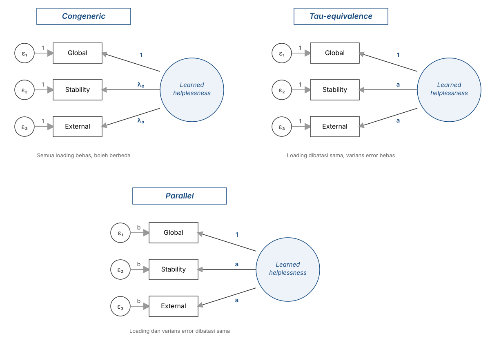
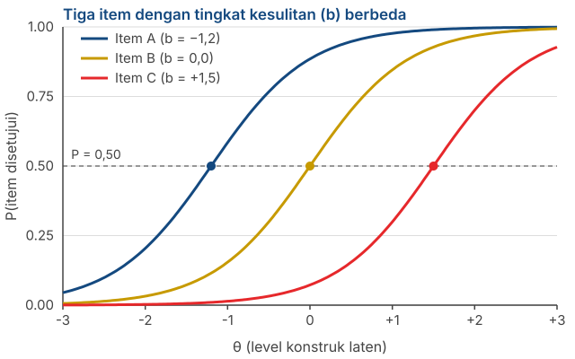
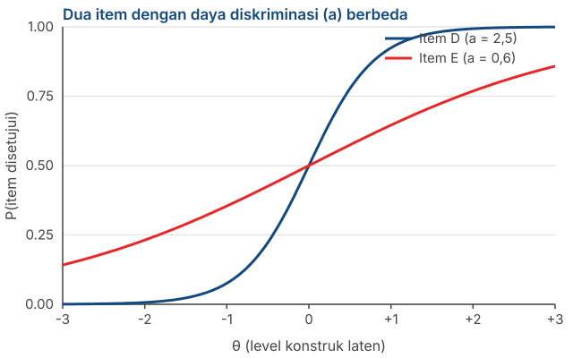

## _Outline_

::: {.incremental}

* Apa yang dimaksud dengan **variabel laten**, dan kenapa ia disebut sebagai *penyebab*
* ***Classical Test Theory***: $X = T + E$ dan asumsi-asumsinya
* Kenapa reliabilitas bisa didefinisikan sebagai **proporsi varians**
* Apa sebenarnya arti *true score* dan kenapa ia **bukan** "nilai konstruk yang sesungguhnya"
* Konsekuensi CTT: jumlah item, atenuasi, dan ketergantungan pada sampel
* Keluarga model dalam CTT: *parallel*, *tau-equivalent*, *congeneric*
* Sekilas ***Item Response Theory*** dan apa perbaikan yang ditawarkannya

:::

::: aside
***Disclosure* penggunaan akal imitasi (AI)**

Kami menggunakan Claude Code (Model Opus 5 dan Sonnet 5) untuk *brainstorming* materi, mencari referensi, dan melakukan *troubleshooting* kode `quarto` dan `git`. Kami (Amel dan Dian) bertanggung jawab penuh atas substansi dan penyajian presentasi ini.

:::

# Dari asumsi ke model {background-color="#14497F" .center}

## Apa yang sudah Anda pelajari

::: {.incremental}

* **Pertemuan 1**: pengukuran psikologis bersifat tidak langsung, dan tidak semua kumpulan item dapat serta-merta disebut sebagai skala psikologi.

* **Pertemuan 2**: ada enam asumsi yang kita pakai, sebagian besar implisit tanpa disadari.

* **Hari ini**: asumsi-asumsi itu kita rapikan menjadi sebuah **model matematika formal**

:::

. . .

::: {.callout-note}
#### Kenapa perlu model
Selama asumsi hanya berupa daftar, kita tidak bisa melakukan apapun untuk mengujinya. Begitu asumsinya dituliskan sebagai persamaan matematika, kita bisa **menguji konsekuensinya**, termasuk rumus reliabilitas yang akan Anda pakai di Pertemuan 13.
:::

# Definisi variabel laten {background-color="#14497F" .center}

## Dua kata, dua ciri

:::: {.columns}
::: {.column width="55%"}

::: {.incremental}

* ***Laten***, bukan manifes. Tidak bisa diamati langsung. Aspirasi orang tua terhadap prestasi anaknya tidak bisa dilihat, hanya bisa disimpulkan.

* ***Variabel***, bukan konstanta. Ada sesuatu yang berubah — kekuatannya, besarannya — antar-orang, antar-waktu, antar-situasi.

* Variabel laten biasanya merupakan **karakteristik orang yang menjadi sumber data** (e.g., orangtua), bukan karakteristik objek yang ditanyakan (e.g., prestasi anak).

:::

:::
::: {.column width="45%"}

{fig-align="center" width="80%"}

:::
::::

::: aside
DeVellis & Thorpe (2022), Bab 2.
:::

## Perhatikan siapa yang diukur

::: {.incremental}

* Kalau kita meminta **orang tua** melaporkan aspirasi mereka untuk anaknya, yang kita ukur adalah karakteristik **orang tua**, bukan anaknya.

* Kalau kita meminta orang tua melaporkan aspirasi **anaknya sendiri**, variabel latennya lebih tepat disebut *persepsi orang tua tentang aspirasi anak*, bukan aspirasi anak itu sendiri.

* Kalau kita meminta pembeli menilai sebuah merek (*brand*), yang kita ukur adalah **persepsi pembeli**, bukan sifat aktual mereknya.

:::

. . .

::: {.callout-warning}
#### Kesalahan penamaan yang sering terjadi
Nama konstruk Anda harus mencerminkan **siapa yang datanya diambil** (e.g., *estimand*).
:::

## Variabel laten sebagai *penyebab*

::: {.columns}
::: {.column width="70%"}

::: {.incremental}

* Intinya: **kekuatan variabel laten menyebabkan item punya skor tertentu.**

* Misalnya item *"Tidak ada pengorbanan yang terlalu besar demi keberhasilan anak saya"*. 
  + Seberapa kuat partisipan menyetujuinya ditentukan oleh seberapa kuat aspirasi yang mereka miliki.

* Perhatikan arah panahnya: dari konstruk **ke** item (e.g., ["Model Reflektif"](slides/pertemuan1.html#/skala-item-sebagai-akibat)). Bukan sebaliknya.

:::

. . .

::: {.callout-tip}
#### Penting diperhatikan
Kalau satu sebab yang sama menyebabkan sepuluh item, maka kesepuluh item itu **harus berkorelasi satu sama lain**.

Korelasi antar-item bisa kita hitung. Variabel latennya tidak. Jadi korelasi antar-item adalah **satu-satunya pintu masuk** untuk mengestimasi sesuatu yang tidak bisa kita amati.
:::

:::
::: {.column width="30%"}

{fig-align="center" width="60%"}

:::
:::

## Asumsi ini memungkinkan analisis item

::: {.incremental}

* Kita tidak pernah bisa menghitung korelasi antara item dan *true score*, karena *true score* tidak teramati.

* Tetapi kita bisa menghitung korelasi **antar-item**.

* Dari pola korelasi antar-item itu, kita bisa menyimpulkan seberapa kuat tiap item terhubung dengan variabel latennya.

:::

. . .

::: {.callout-note}
### Penting diingat
Prosedur yang akan Anda jalankan di Pertemuan 13 — *corrected item-total correlation*, membuang item yang korelasinya lemah — seluruhnya bersandar pada logika ini.
:::

# Classical Test Theory {background-color="#14497F" .center}

## Persamaannya

$$X = T + E$$

. . .

::: {.incremental}

* $X$ — ***observed score***. Skor yang benar-benar Anda dapatkan dari responden.

* $T$ — ***true score***. Skor yang akan diperoleh seseorang kalau pengukurannya sempurna.

* $E$ — ***error***. Semua yang membuat $X$ menyimpang dari $T$.

:::

. . .

::: {.callout-note}
#### Yang masuk ke dalam $E$
Kondisi fisik responden saat mengisi, suasana hati sesaat, ambiguitas kalimat item, gangguan di ruangan, salah klik. CTT **tidak memisahkan** sumber-sumber ini. Semuanya dikumpulkan menjadi satu suku *error*.
:::

## Tiga asumsi CTT

::: {.incremental}

1. **Rata-rata *error* adalah nol**: $E(e) = 0$. Kalau pengukuran diulang sebanyak ~ kali, *error* saling meniadakan.

2. ***Error* tidak berkorelasi dengan *true score***: $\text{Cov}(T, E) = 0$. Orang dengan kecemasan tinggi tidak otomatis punya *error* yang lebih besar.

3. ***Error* antar-pengukuran tidak saling berkorelasi**: $\text{Cov}(E_1, E_2) = 0$.

:::

. . .

::: {.callout-warning}
#### Perhatikan apa yang diasumsikan di sini
Ketiganya menyatakan bahwa *error* bersifat **acak**, bukan sistematis. Bias yang konsisten — misalnya seluruh responden menjawab lebih positif karena *social desirability* — **tidak masuk ke dalam** $E$.
:::

## Dari skor ke varians

Kalau $X = T + E$ dan $\text{Cov}(T, E) = 0$, maka variansnya ikut terpisah:

$$\sigma^2_X = \sigma^2_T + \sigma^2_E$$

. . .

::: {.incremental}

* Artinya: **variasi skor yang kita amati** terdiri atas variasi yang berasal dari perbedaan antar-orang yang sesungguhnya, ditambah variasi yang berasal dari *noise*.

* Pertanyaan reliabilitas jadi sangat sederhana: **berapa bagian dari variasi itu yang bukan *noise*?**

:::

## Reliabilitas sebagai proporsi varians

$$\rho_{XX'} = \frac{\sigma^2_T}{\sigma^2_X} = \frac{\sigma^2_T}{\sigma^2_T + \sigma^2_E}$$

. . .

::: {.incremental}

* Nilainya antara 0 dan 1, karena ini sebuah proporsi.

* $\rho = 0{.}80$ berarti **80% variasi skor** berasal dari perbedaan yang sesungguhnya antar-orang, dan 20% dari *error*.

* Perhatikan bahwa ini definisi tentang **seberapa konsisten** skornya, bukan tentang seberapa "benar" skor tersebut mewakili objek ukurnya.

:::

## Contoh

Misalkan skala Anda punya standar deviasi skor total $\sigma_X = 5$, sehingga $\sigma^2_X = 25$. Reliabilitasnya $\rho = 0{.}80$.

. . .

$$\sigma^2_T = 0{.}80 \times 25 = 20 \qquad \sigma^2_E = 25 - 20 = 5$$

. . .

***Standard error of measurement*** (SEM), yaitu standar deviasi dari *error*:

$$SEM = \sigma_X\sqrt{1-\rho} = 5\sqrt{0{.}20} = 2{.}24$$

. . .

::: {.callout-tip}
#### Kenapa angka ini berguna
Seseorang yang mendapat skor **30** sebenarnya berada di suatu rentang, bukan di satu titik. Dengan tingkat kepercayaan 95%:

$$30 \pm 1{.}96 \times 2{.}24 \;\approx\; 25{.}6 \text{ sampai } 34{.}4$$
:::

## Apa artinya rentang ini

::: {.incremental}

* Dua orang dengan skor **30** dan **33** **tidak bisa** kita katakan berbeda. Rentang keduanya bertumpang tindih hampir seluruhnya.

* Padahal skala dengan $\rho = 0{.}80$ sudah tergolong baik menurut kriteria yang lazim dipakai.

* Semakin rendah reliabilitasnya, semakin lebar rentangnya, dan semakin sedikit yang bisa kita simpulkan tentang kondisi psikologis seseorang.

:::

. . .

::: {.callout-warning}
#### Ingat ini saat menyusun norma
Di Pertemuan 14 Anda akan mengubah skor menjadi kategori. Kalau batas kategorinya lebih sempit daripada $SEM$ skala Anda, kategori itu **tidak bermakna**: orang yang sama bisa masuk kategori berbeda hanya karena mengisi di hari yang berbeda.
:::

# Apa sebenarnya true score ini? {background-color="#14497F" .center}

## Definisinya

::: {.incremental}

* Dalam CTT, *true score* didefinisikan sebagai **nilai yang diharapkan (*expected value*) dari *observed score***, kalau orang yang sama diukur berulang kali secara independen dengan alat yang sama.

* Perhatikan: definisinya **melekat pada alat ukurnya**, bukan pada konstruknya.

* *True score* adalah "skor yang stabil yang dihasilkan oleh suatu skala", bukan "kadar konstruk yang sesungguhnya ada pada partisipan/responden".

:::

::: aside
Lord & Novick (1968/2008); DeVellis & Thorpe (2022), Bab 3.
:::

## Analogi timbangan yang meleset

::: {.incremental}

* Bayangkan timbangan badan yang selalu menunjukkan **2 kg lebih berat** dari berat sebenarnya.

* Timbang seseorang seratus kali. Hasilnya sangat konsisten — *error* acaknya kecil, jadi **reliabilitasnya tinggi**.

* *True score* orang itu, menurut definisi CTT, adalah berat sebenarnya **+ 2 kg**.

:::

. . .

::: {.callout-warning}
#### Kesimpulan yang penting
CTT **tidak punya cara** untuk mendeteksi bias yang konsisten. Bias sistematis masuk ke dalam $T$, bukan ke dalam $E$.

Artinya: **alat ukur yang reliabel bisa saja mengukur hal yang salah, secara sangat konsisten.**
:::

## Reliabilitas bukan validitas

::: {.incremental}

* **Reliabilitas** adalah sifat **skor**: seberapa konsisten skor itu kalau pengukurannya diulang.

* **Validitas** juga sifat skor, lebih tepatnya, sifat dari **tafsiran atas skor untuk tujuan tertentu**.

* Yang pertama **tidak menjamin** yang kedua. Skala Anda bisa punya $\alpha = 0{.}92$ dan skornya tetap menunjukkan konstruk yang berbeda dari yang Anda klaim.

:::

. . .

::: {.callout-note}
#### Tapi ada hubungannya
Reliabilitas memberi **batas atas** bagi *koefisien validitas*, yaitu korelasi antara skor Anda dan suatu kriteria:

$$r_{XY} \leq \sqrt{\rho_{XX'} \times \rho_{YY'}}$$

Ini melibatkan reliabilitas kriterianya juga. Kalau kriteria diasumsikan diukur tanpa *error* ($\rho_{YY'}=1$), rumusnya menyederhana jadi $r_{XY} \leq \sqrt{\rho_{XX'}}$: dengan $\rho_{XX'} = 0{.}64$, korelasi maksimum yang mungkin Anda peroleh adalah $0{.}80$ — berapa pun kuatnya hubungan yang sesungguhnya. Kalau kriterianya sendiri juga *fallible*, batas atasnya turun lebih jauh.
:::

## Validitas bukan sifat skala

> Validity refers to the degree to which evidence and theory support the interpretations of test scores for proposed uses of tests.
>
> — AERA, APA, & NCME (2014), *Standards for Educational and Psychological Testing*

. . .

::: {.incremental}

* Kalimat "skala kami valid" sebenarnya **tidak lengkap**. Yang bisa didukung atau tidak didukung oleh bukti adalah **tafsiran atas skor**, untuk **tujuan tertentu**, pada **populasi tertentu**.

* [Messick (1989)](https://psycnet.apa.org/record/1996-10004-001) menyebut validitas sebagai penilaian menyeluruh atas sejauh mana bukti dan teori mendukung **kesimpulan dan tindakan** yang diambil berdasarkan skor.

:::

## Kenapa pembedaan ini penting

::: {.incremental}

* Bukti validitas **tidak otomatis berpindah**. Skala yang tafsiran skornya terdukung untuk penelitian pada mahasiswa belum tentu terdukung untuk seleksi kerja atau penegakan diagnosis.

* Begitu populasi, tujuan, atau cara penggunaannya berubah, buktinya perlu diperiksa ulang.

* Karena itu validitas **tidak pernah selesai**. Ia tidak bisa diuji sekali lalu berlaku selamanya.

:::

. . .

::: {.callout-tip}
#### Cara menuliskannya di laporan Anda
Hindari kalimat "skala kami valid". Tulis seperti ini:

*"Terdapat bukti yang mendukung tafsiran skor skala X sebagai indikator konstruk Y, pada populasi Z, untuk keperluan W."*

Jenis-jenis buktinya kita bahas di Pertemuan 7.
:::
 
## Hubungkan dengan Pertemuan 1

::: {.incremental}

* Ingat kritik Michell: apakah atribut psikologis benar-benar kuantitatif?

* Persamaan $X = T + E$ **mengandaikan jawabannya "ya"**. Kita menjumlahkan dan mengurangkan $T$ dan $E$ seolah-olah keduanya adalah benar-benar angka yang bermakna.

* CTT tidak menguji asumsi ini, tetapi CTT **dibangun di atas asumsi ini**.

:::

# Konsekuensi CTT {background-color="#14497F" .center}

## Kenapa menambah item menaikkan reliabilitas

::: {.incremental}

* *Error* bersifat acak. Sebagian item membuat skor terlalu tinggi, sebagian lagi terlalu rendah.

* Ketika item dijumlahkan, *error* yang berlawanan arah **saling meniadakan**, sementara *true score* justru saling menguatkan.

* Semakin banyak item, semakin kecil proporsi $\sigma^2_E$ terhadap $\sigma^2_X$.

:::

. . .

::: {.callout-note}
#### Ingat anak panah Bernoulli dari Pertemuan 1
Prinsipnya sama persis: satu tembakan tidak memberi banyak informasi, tetapi rata-rata dari banyak tembakan mendekati titik pusat yang sebenarnya.

Rumusnya (*Spearman-Brown*) kita bahas di Pertemuan 6.
:::

## Tapi ada batasnya

::: {.incremental}

* Menambah item hanya menolong kalau item barunya **benar-benar mengukur konstruk yang sama**.

* Menambah item yang isinya nyaris sama akan menaikkan $\alpha$ tanpa menambah informasi apa pun dan ini pelanggaran *local independence* dari Pertemuan 2.

* Dan kuesioner yang terlalu panjang memunculkan masalah baru: kelelahan responden dan jawaban yang asal-asalan.

:::

. . .

::: {.callout-warning}
#### Untuk proyek Anda
Angka $\alpha$ atau $\omega$ yang tinggi **bukan** bukti bahwa skala Anda bagus. Ia bisa dicapai hanya dengan menulis sepuluh parafrase dari kalimat yang sama.
:::

## Sekarang atenuasi bisa kita pahami

Di Pertemuan 1 kita memakai rumus ini tanpa penjelasan yang memadai:

$$r_{XY} = \rho_{T_X T_Y} \times \sqrt{\rho_{XX'} \times \rho_{YY'}}$$

. . .

::: {.incremental}

* Sekarang asalnya jelas: yang kita korelasikan adalah $X$ sedangkan $X$ mengandung $E$.

* Bagian $E$ tidak berkorelasi dengan apa pun, menurut asumsi kedua CTT.

* Jadi *error* hanya menambah penyebut tanpa menambah pembilang, dan korelasinya mengecil.

:::

. . .

::: {.callout-tip}
### Kesimpulannya
Semakin besar porsi *noise*/*error* pengukuran dalam skor kasar Anda, semakin kecil koefisien korelasi yang Anda laporkan. 
:::

## Kelemahan CTT yang paling serius

::: {.incremental}

* Reliabilitas dalam CTT **bergantung pada sampel**.

* Kalau responden Anda sangat seragam pada atribut yang diukur, rentang *true score* mereka sempit. Korelasi antar-item ikut mengecil, dan **reliabilitas terhitung menjadi rendah** — padahal alat ukurnya sama saja.

* Sebaliknya, sampel yang sangat beragam akan membuat alat yang sama tampak lebih reliabel.

:::

::: aside
DeVellis & Thorpe (2022), Bab 8.
:::

. . .

::: {.callout-warning}
#### Konsekuensi praktis untuk uji coba Anda
Reliabilitas yang Anda laporkan **bukan sifat alat ukur Anda semata** — ia juga sebagian merupakan sifat sampel Anda. Karena itu, laporkan **karakteristik sampel** bersama koefisien reliabilitasnya, selalu.
:::

## Bukan hanya reliabilitas

::: {.incremental}

* **Tingkat kesulitan item** dalam CTT diukur sebagai proporsi responden yang menyetujuinya. Angka ini berubah kalau sampelnya berubah.

* **Daya diskriminasi item** diukur sebagai korelasi item dengan skor total. Ini pun berubah mengikuti sampel.

* Artinya, hampir semua statistik item dalam CTT bersifat **relatif terhadap kelompok yang kebetulan Anda ukur**.

:::

# Keluarga model dalam CTT {background-color="#14497F" .center}

## Tiga model pengukuran

{fig-align="center" width="70%"}

::: aside
Angka **1** menandai *reference indicator*; huruf **a** menandai *loading* yang dibatasi agar sama; huruf **b** menandai varians *error* yang dibatasi agar sama; $\lambda_2, \lambda_3$ menandai *loading* yang bebas (boleh berbeda satu sama lain) pada model *congeneric*.
:::

## Apa perbedaan tiga model tadi

::: {.incremental}

* ***Congeneric*** — setiap item boleh punya hubungan yang **berbeda kekuatannya** dengan konstruk, dan varians *error* yang berbeda pula. Paling longgar, paling realistis.

* ***Tau-equivalent*** — semua item diasumsikan punya hubungan yang **sama kuatnya** dengan konstruk, tetapi varians *error*-nya boleh berbeda.

* ***Parallel*** — semua item punya hubungan yang sama kuat **dan** varians *error* yang sama. Paling ketat, paling jarang terpenuhi.

:::

. . .

::: {.callout-note}
Perhatikan bahwa ketiganya adalah asumsi tentang **item Anda**, bukan tentang orangnya. Ini kelanjutan langsung dari asumsi *unit weighting* di Pertemuan 2.
:::

## Kenapa ini akan penting di Pertemuan 6

::: {.incremental}

* ***Cronbach's alpha*** mengasumsikan model **tau-equivalent** — bahwa semua item menyumbang sama kuat.

* Kalau item Anda sebenarnya *congeneric* (dan hampir selalu begitu), $\alpha$ akan **mengestimasi reliabilitas lebih rendah** daripada yang sesungguhnya.

* Koefisien ***omega*** ($\omega$) tidak mensyaratkan asumsi itu, sehingga umumnya lebih tepat.

:::

. . .

::: {.callout-tip}
#### Yang perlu Anda simpan sekarang
Anda belum perlu menghitung apa pun. Yang perlu Anda bawa dari slide ini adalah: **$\alpha$ punya asumsi, dan asumsinya jarang terpenuhi.** Kita akan periksa konsekuensinya di Pertemuan 6.
:::

# Sekilas Item Response Theory {background-color="#14497F" .center}

## Masalah yang ingin dipecahkan

::: {.incremental}

* Dalam pengukuran fisik, **20 kilogram berarti sama** apa pun yang ditimbang. Sifat alat ukurnya tidak bergantung pada objeknya (e.g., [*specific objectivity*](https://www.rasch.org/rmt/rmt83e.htm)).

* IRT ingin mencapai hal yang sama untuk item kuesioner: menetapkan sifat item yang **tidak bergantung pada siapa yang mengisinya**.

* Dalam CTT, sifat alat ukur dan karakteristik orang yang diukur selalu terikat satu sama lain. IRT, setidaknya secara teori, tidak.

:::

::: aside
DeVellis & Thorpe (2022), Bab 8.
:::

## Perbedaan pertama: fokus pada item

:::: {.columns}
::: {.column width="50%"}

### CTT

Menekankan sifat **skala secara keseluruhan**.

Reliabilitas dinaikkan terutama dengan **menambah item**.

:::
::: {.column width="50%"}

### IRT

Menekankan sifat **tiap item**.

Reliabilitas dinaikkan dengan **memilih item yang lebih baik**.

:::
::::

. . .

::: {.callout-note}
Perbedaan ini punya konsekuensi praktis: CTT cenderung menghasilkan skala yang panjang dan banyak mengulang, IRT cenderung menghasilkan skala yang lebih pendek tetapi itemnya yang benar-benar bagus.
:::

## Perbedaan kedua: item punya "tingkat kesulitan"

::: {.incremental}

* Item *"Saya kadang merasa sedih"* mengukur level depresi yang **lebih rendah** daripada item *"Saya merasa hidup tidak layak dijalani"*.

* Item pertama membedakan orang yang jarang sedih dari orang yang agak sering sedih. Item ini **tidak berguna** untuk membedakan orang yang depresinya berat dari yang jauh lebih berat.

* Item kedua hanya membedakan orang-orang di ujung atas kontinum.

:::

. . .

::: {.callout-tip}
#### Intinya
Setiap item **sensitif pada bagian tertentu** dari rentang konstruk. IRT membuat hal itu eksplisit dan bisa dihitung.
:::

## Kurva karakteristik item (*item characteristic curve*)

{.nostretch fig-align="center" width="65%"}

::: {.incremental}

* Sumbu mendatar: level konstruk laten seseorang ($\theta$). Sumbu tegak: peluang menyetujui item.

* Parameter **kesulitan** ($b$) adalah titik di mana peluangnya tepat 0,50 — ditandai lingkaran.

:::

## Cara membaca grafiknya

::: {.incremental}

* **Item A** ($b = -1{,}2$) mudah disetujui. Bahkan orang dengan level konstruk di bawah rata-rata pun cenderung menyetujuinya.

* **Item C** ($b = +1{,}5$) sulit disetujui. Hanya orang di ujung atas yang cenderung menyetujuinya.

* Skala yang baik memuat item yang **tersebar** di sepanjang rentang, bukan menumpuk di satu titik.

:::

. . .

::: {.callout-warning}
#### Kesalahan yang sering dilupakan
Kalau semua item Anda "mudah", skala Anda tidak bisa membedakan orang di ujung atas. Semuanya akan mendapat skor mendekati maksimum. Ini disebut ***ceiling effect***, dan tidak akan terdeteksi oleh $\alpha$ yang tinggi.
:::

## Parameter kedua: daya diskriminasi

{.nostretch fig-align="center" width="70%"}

::: {.incremental}

* Kurva **Item D** curam: perubahan kecil pada $\theta$ langsung mengubah peluang menyetujuinya. Item ini **membedakan orang dengan lebih presisi**.

* Kurva **Item E** landai: peluangnya berubah pelan. Item ini hampir tidak dapat membedakan siapapun.

:::

. . .

::: {.callout-note}
Dalam CTT, padanan terdekat dari daya diskriminasi adalah **korelasi item dengan skor total** — yang akan Anda hitung di Pertemuan 13.
:::

## Keluarga model IRT

::: {.incremental}

* **Rasch / 1PL** — hanya memodelkan **kesulitan** ($b$).

* **2PL** — memodelkan **kesulitan** dan **daya diskriminasi** ($a$).

* **3PL** — menambahkan parameter **tebakan** ($c$), berguna untuk soal pilihan ganda.

* Untuk item Likert yang pilihan jawabannya berjenjang, dipakai model politomus (*polytomous*) seperti ***Graded Response Model***.

:::

## Apa yang disyaratkan IRT

::: {.incremental}

* **Unidimensionalitas** — sama seperti CTT. Item harus berbagi satu variabel laten.

* ***Local independence*** — disyaratkan secara formal, bukan sekadar dianjurkan.

* **Sampel besar dan beragam.** Keunggulan teoretis IRT hanya terwujud kalau itemnya dikalibrasi pada sampel yang besar dan heterogen.

:::

. . .

::: {.callout-note}
#### Perhatikan
Dua asumsi pertama itu persis asumsi nomor 4 dari Pertemuan 2. IRT **tidak menghapus** asumsi, melainkan mensyaratkannya lebih ketat.
:::

## Kenapa mata kuliah ini tetap memakai CTT

::: {.incremental}

* **Ukuran sampel.** Uji coba yang realistis bagi kelompok Anda semester ini belum cukup besar untuk mengalibrasi parameter IRT secara stabil.

* **Perangkat lunak.** Kita akan memakai `jamovi`, dan alur kerja CTT di sana jauh lebih sederhana untuk dipelajari dalam satu semester.

* **Hasilnya tetap baik.** Untuk penyusunan skala Likert dengan tujuan penelitian, metode klasik sudah memadai.

:::

. . .

::: {.callout-tip}
#### Yang perlu Anda bawa dari bagian ini
Bukan kemampuan menjalankan analisis IRT, melainkan kesadaran bahwa **statistik item dalam CTT bersifat relatif terhadap sampel Anda** — dan bahwa ada kerangka lain yang menangani persoalan itu secara langsung.
:::

# Latihan kelompok {background-color="#14497F" .center}

## Mengurutkan item berdasarkan "kesulitan"

Berikut enam item untuk konstruk **kecemasan sosial**:

::: {.incremental}

a. Saya agak gugup ketika harus memperkenalkan diri di kelas baru.
b. Saya menghindari acara yang mengharuskan saya berbicara dengan orang yang tidak dikenal.
c. Saya membatalkan rencana yang penting karena takut bertemu banyak orang.
d. Saya merasa tidak nyaman ketika diperhatikan orang lain.
e. Saya tidak bisa kuliah atau bekerja karena takut dinilai orang.
f. Saya lebih suka duduk di belakang supaya tidak ditanya.

:::

. . .

**Urutkan dari yang paling mudah disetujui sampai yang paling sulit disetujui.** Waktu: 10 menit.

::: {.notes}
Urutan yang paling sering muncul kira-kira a–d–f–b–c–e, tetapi urutan pastinya tidak penting.
Yang penting adalah mereka menyadari bahwa mereka bisa melakukannya sama sekali — artinya intuisi
soal parameter kesulitan sudah ada sebelum ada rumusnya. Tekankan bahwa CTT tidak memakai
informasi ini secara eksplisit, sementara IRT memakainya.
:::

## Lalu diskusikan

::: {.incremental}

1. **Apa dasar yang kelompok Anda pakai untuk mengurutkannya?** Anda tidak punya data sama sekali — jadi dari mana penilaian itu datang?

2. **Bagian mana dari rentang kecemasan sosial yang tidak tercakup** oleh keenam item ini?

3. **Sekarang lihat konstruk kelompok Anda sendiri.** Apakah item yang sudah terbayang di kepala Anda menumpuk di satu bagian rentang, atau tersebar?

4. **Kalau seluruh item Anda "mudah disetujui", apa yang akan terjadi** pada sebaran skor dan pada kemampuan skala Anda membedakan responden?

:::

. . .

::: {.callout-tip}
Pertanyaan nomor 3 akan kita pakai lagi secara langsung ketika menyusun *blueprint* di Pertemuan 10.
:::

# Rangkuman {background-color="#14497F" .center}

## 6️⃣ poin utama

::: {.incremental}

1. **Variabel laten adalah sebab**, dan itulah alasan item dalam satu skala harus berkorelasi.

2. **$X = T + E$**, dengan asumsi bahwa *error* bersifat acak, bukan sistematis.

3. **Reliabilitas adalah proporsi varians**: bagian dari variasi skor yang bukan *noise*.

4. ***True score* melekat pada alat ukur**, bukan pada konstruk. Alat yang bias secara konsisten tetap bisa sangat reliabel dan reliabilitas maupun validitas sama-sama sifat **skor**, bukan sifat skala.

5. **Statistik item dalam CTT bergantung pada sampel.** Laporkan karakteristik sampel bersama koefisiennya.

6. **$\alpha$ mengasumsikan model *tau-equivalent***, yang jarang terpenuhi.

:::

## Untuk Pertemuan 4

Kita turun ke tingkat yang paling konkrit: **format respons**.

::: {.incremental}

* **Likert** — berapa titik yang sebaiknya dipakai, dan apakah perlu titik tengah?
* ***Semantic Differential*** — kapan pasangan kata sifat lebih tepat daripada pernyataan.
* **Guttman** — ketika item memang berjenjang secara logis.
* Dan pertanyaan yang menghubungkannya dengan hari ini: **pilihan format respons itu mengubah asumsi apa?**

:::

. . .

::: {.callout-tip}
#### Persiapan untuk pertemuan minggu depan
Baca **DeVellis & Thorpe (2022), Bab 5** bagian tentang format respons. Kalau ingin melihat versi formal dari materi hari ini, Bab 3 buku yang sama membahas reliabilitas secara lengkap.
:::

## Ada pertanyaan❓

{fig-align="center"}

::: {.callout-note}
### Catatan

* Paparan disusun dengan menggunakan  dan [**Quarto**](https://quarto.org) dengan *template* dari [UNAIR Theme](https://github.com/rameliaz/quarto-unair-theme).
* Kontak saya via <i class="fas fa-paper-plane"></i> <a href="mailto:amelia.zein@psikologi.unair.ac.id">amelia.zein@psikologi.unair.ac.id</a>
:::

## Rujukan {.smaller}

AERA, APA, & NCME. (2014). *Standards for educational and psychological testing*. American Educational Research Association.

Crocker, L., & Algina, J. (2008). *Introduction to classical and modern test theory*. Cengage.

DeVellis, R. F., & Thorpe, C. T. (2022). *Scale development: Theory and applications* (5th ed.). SAGE.

Embretson, S. E., & Reise, S. P. (2010). *Item response theory for psychologists*. Psychology Press.

Hambleton, R. K., Swaminathan, H., & Rogers, H. J. (1991). *Fundamentals of item response theory*. SAGE.

Lord, F. M., & Novick, M. R. (2008). *Statistical theories of mental test scores*. Information Age Publishing. (Karya asli terbit 1968)

McDonald, R. P. (1999). *Test theory: A unified treatment*. Lawrence Erlbaum.

Messick, S. (1989). Validity. In R. L. Linn (Ed.), *Educational measurement* (3rd ed., pp. 13–103). Macmillan.

Rasch, G. (1960). *Probabilistic models for some intelligence and attainment tests*. Danmarks Paedagogiske Institut.

Raykov, T., & Marcoulides, G. A. (2011). *Introduction to psychometric theory*. Taylor & Francis.

Samejima, F. (1969). Estimation of latent ability using a response pattern of graded scores. *Psychometrika Monograph Supplement, 34*(4, Pt. 2).
