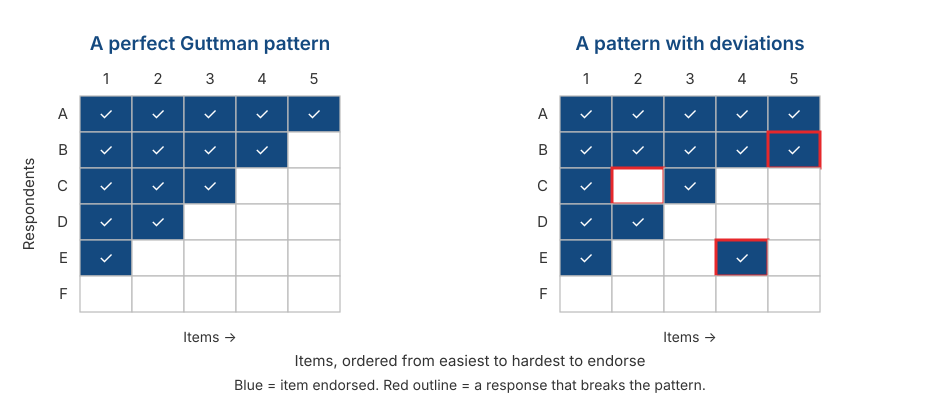

## _Outline_

::: {.incremental}

* What we are actually choosing when we choose a response format
* **Likert**: where it came from, and the four decisions you have to make
* **Semantic Differential**: when adjective pairs work better than statements
* **Guttman**: when items really are ordered by logic — and why it rarely works
* Comparing the three
* The closing question: **which assumptions does a response format change?**

:::

::: aside
***Disclosure* on the use of artificial intelligence (AI)**

We used Claude Code (Opus 5 and Sonnet 5) to brainstorm material, locate references, and troubleshoot `quarto` and `git` code. We (Amel and Dian) take full responsibility for the substance and presentation of these slides.

:::

# From a model to the first real decision {background-color="#14497F" .center}

## Where we are

::: {.incremental}

* **Session 3** gave us the model: $X = T + E$, the latent variable as a cause, and reliability as a proportion of variance.

* So far all of it has been abstract. Today the model touches a decision you will actually make.

* **Response format is the first place** measurement theory turns into something visible on a questionnaire.

:::

. . .

::: {.callout-note}
#### What to hold on to today
A response format is **not a matter of taste or habit**. Each format carries its own package of assumptions, and that package determines which analyses you may later use.
:::

## What a response format does

::: {.incremental}

* A response format is **a rule that maps a respondent's internal state onto a number**.

* Most items have two parts: a **stem** (a statement or question) and a set of **response options**.

* What you choose is not just the appearance, but:
  - how much information one item can yield,
  - the level of measurement you are claiming,
  - which kinds of error become possible,
  - and which analyses can be defended.

:::

::: aside
DeVellis & Thorpe (2022), Chapter 5.
:::

# Likert {background-color="#14497F" .center}

## Where it came from

::: {.incremental}

* Introduced by **Rensis Likert (1932)** in his dissertation, *A technique for the measurement of attitudes*.

* The core idea is not the "Strongly Disagree to Strongly Agree" options, but ***summated ratings***: a set of items answered on a graded scale and then **added together** into one score.

* So what Likert called a "scale" is the **set of items**, not the response options.

:::

. . .

::: {.callout-warning}
#### A precision most people skip
A single item with five options is **not** a "Likert scale". It is a **Likert-type item**.

A Likert scale exists only when items are summed. Note that this is consistent with Session 3: reliability can only be computed for a **set** of items.
:::

## Anatomy of a Likert-type item

**Stem:** *"I feel nervous when I have to speak in front of the class."*

 

| 1 | 2 | 3 | 4 | 5 |
|:-:|:-:|:-:|:-:|:-:|
| Strongly Disagree | Disagree | Neutral | Agree | Strongly Agree |

. . .

::: {.incremental}

* **Stem** — the statement being responded to.
* **Number of points** — five here.
* **Anchors** — the words describing each point.
* **Direction** — negative to positive, or the reverse.

:::

. . .

All four are decisions. Let us take them one at a time.

## Decision 1: how many points?

::: {.incremental}

* **Below 4 points**, you lose information. Variation between respondents is compressed and reliability falls (Preston & Colman, 2000).

* **Around 5–7 points** is the range most often recommended. Lozano et al. (2008) suggest a minimum of 4, with the best results at 6–7.

* **Above 6–7 points**, the added benefit is small. Simms et al. (2019) found almost no psychometric improvement beyond 6 options.

:::

. . .

::: {.callout-note}
#### Two further considerations from DeVellis
First, **whether respondents can actually discriminate**. If they cannot tell seven levels apart, seven points only add noise.

Second, **whether you will use that precision**. If you are going to collapse the scores into three categories anyway, why ask for ten points of resolution?
:::

## Decision 2: midpoint or no midpoint?

:::: {.columns}
::: {.column width="50%"}

### Odd number

Allows **neutrality** or **uncertainty**.

Appropriate when a neutral position is theoretically meaningful.

:::
::: {.column width="50%"}

### Even number

**Forces** respondents to take a side, however weakly.

Appropriate when you suspect the midpoint will be used to avoid choosing.

:::
::::

. . .

::: {.callout-note}
#### Neither is automatically better
DeVellis states this plainly: **neither format is inherently superior**. It depends on the type of question, the type of response option, and your purpose.
:::

## The problem with midpoints

::: {.incremental}

* If every item has a midpoint, some respondents will learn they can **always choose it** and finish faster.

* The midpoint becomes the safe, lowest-effort option — not a report of their state.

* Krosnick (1991) calls this ***satisficing***: giving an answer that is good enough rather than the most accurate one.

:::

. . .

::: {.callout-warning}
#### Something you can check yourself
When a midpoint is available it is often **the most frequently chosen option**. If that happens in your pilot data in Session 12, do not immediately conclude your respondents are genuinely neutral.
:::

## "Neutral" and "undecided" are not the same thing

::: {.incremental}

* Midpoints get labelled **"Neutral"**, **"Undecided"**, **"Neither agree nor disagree"**, or **"Agree and disagree equally"** as though these were interchangeable.

* **"Neither agree nor disagree"** suggests indifference. **"Agree and disagree equally"** suggests a strong but balanced pull in both directions. **"Undecided"** suggests not knowing yet.

* These sit at different places on the continuum, but all receive the same number: 3.

:::

. . .

::: {.callout-warning}
#### Why this is not a small matter
It bears directly on the equal-interval assumption from Session 2. It is also possible that most respondents do not attend to the wording at all and simply treat any centre option as a midpoint — which is its own problem, because then your label is doing no work.
:::

## Decision 3: label every point, or only the ends?

::: {.incremental}

* Labelling **every point** generally yields better reliability and validity than labelling only the endpoints (Krosnick & Presser, 2010).

* The reason is simple: if only the ends are labelled, each respondent decides for themselves what the points in between mean.

* But the labels you choose have to be genuinely distinguishable.

:::

. . .

::: {.callout-warning}
#### An example of problematic labels
Consider this arrangement, from DeVellis:

| | |
|---|---|
| Very Helpful | Not Very Helpful |
| Somewhat Helpful | Not at All Helpful |

**Two problems at once.** First, "somewhat" and "not very" are hard to tell apart under the best of circumstances. Second, reading down the columns makes "Somewhat Helpful" look higher than "Not Very Helpful"; reading across the rows reverses that ordering.
:::

## Decision 4: which anchors?

::: {.incremental}

* **Agreement** — "Strongly Disagree" to "Strongly Agree". The most common, and the most vulnerable to acquiescence (Session 2).

* **Frequency** — "Never" to "Always". More concrete, but it needs an explicit **time referent**: "often" within a week, or within a year?

* **Item-specific anchors** — for example "How often do you feel nervous before a presentation?" with "Never / Once or twice / Several times / Almost every time / Always".

:::

. . .

::: {.callout-tip}
#### A tendency worth knowing
Agreement anchors invite respondents simply to agree. Anchors written specifically for the item's content generally suppress that, because respondents have to read the options properly.

Weijters et al. (2010) show that scale format itself shapes which response styles appear.
:::

## How strongly should the stem be worded?

Three versions of the same content, at different strengths:

::: {.incremental}

1. *"Lecturers generally ignore what students say."* — strong
2. *"Sometimes lecturers do not pay as much attention to students' comments as they should."* — moderate
3. *"Once in a while a lecturer might forget or miss something a student has said."* — weak

:::

. . .

::: {.callout-note}
#### DeVellis's advice
For a Likert format, statements should be **fairly strong but not extreme**. The reason: **degree is already expressed by the response options**.

If the sentence itself is very mild (version 3), almost everyone will agree, and the item stops distinguishing anyone. Recall the discussion of item difficulty in Session 3.
:::

# Semantic Differential {background-color="#14497F" .center}

## The format

Developed by **Osgood, Suci, & Tannenbaum (1957)** in research on meaning and attitudes.

. . .

**Object being rated: The Faculty Student Services Office**

| | 1 | 2 | 3 | 4 | 5 | 6 | 7 | |
|---|:-:|:-:|:-:|:-:|:-:|:-:|:-:|---|
| Slow | ○ | ○ | ○ | ○ | ○ | ○ | ○ | Fast |
| Convoluted | ○ | ○ | ○ | ○ | ○ | ○ | ○ | Straightforward |
| Unfriendly | ○ | ○ | ○ | ○ | ○ | ○ | ○ | Friendly |

. . .

The respondent marks one point between a pair of opposing adjectives.

## Bipolar and unipolar pairs

:::: {.columns}
::: {.column width="50%"}

### Bipolar pairs

Two **opposite** adjectives.

*honest — dishonest*
*friendly — hostile*

:::
::: {.column width="50%"}

### Unipolar pairs

The presence and absence of **one** attribute.

*friendly — not friendly*

:::
::::

. . .

::: {.incremental}

* Choosing between them is a matter of the logic of your construct, not of style.

* "Not friendly" is not necessarily the same as "hostile". Treating them as one continuum is already a theoretical claim.

:::

## When this format is useful

::: {.incremental}

* When you are measuring an **attitude or impression toward an object** — a service, a product, a programme, a group, a public figure.

* When you want to **compare several objects** on the same dimensions.

* When reading load must be kept low: adjective pairs are far lighter than rows of long sentences.

:::

. . .

::: {.callout-note}
#### Still compatible with the Session 3 model
Several adjective pairs tapping the same thing — *honest/dishonest*, *fair/unfair*, *truthful/untruthful* — can be summed into a single "honesty" score.

The logic is identical: one latent variable as the common cause, the items as its indicators.
:::

## What to watch out for

::: {.incremental}

* **The pair must be genuinely opposite in the respondent's language.** Pairs that feel neatly opposed in English often have no clean counterpart in another language.

* **The midpoint is ambiguous.** Does point 4 mean "neutral", "both at once", or "I don't know"?

* **Invariance risk** (Session 2): an adjective pair can carry different meanings across groups, so the scores are not directly comparable.

:::

. . .

::: {.callout-warning}
#### If your group uses this format
Test your adjective pairs on a few prospective respondents before the pilot. Ask one simple question: *"What would you say is the opposite of this word?"* If the answer is not the word you paired it with, the pair needs replacing.
:::

# Guttman {background-color="#14497F" .center}

## The cumulative idea

::: {.incremental}

* **Guttman (1944)** proposed a scale whose items are **ordered**: endorsing one item implies endorsing every "easier" one.

* A person's level is indicated by **the hardest item they still endorse**.

* A clean example from DeVellis: *"Do you smoke?"* → *"Do you smoke more than 10 cigarettes a day?"* → *"Do you smoke more than a pack a day?"*

:::

. . .

::: {.callout-note}
Note the contrast with Likert. In Likert we sum **degrees of agreement across all items**. In Guttman we look for **the point of transition** from "yes" to "no".
:::

## What the pattern looks like

{.nostretch fig-align="center" width="82%"}

## Reading that pattern

::: {.incremental}

* In a perfect pattern, **the total score tells you exactly which items were endorsed**. Nothing is lost by summarising it as a single number.

* In the right-hand panel, three respondents deviate: they endorse a harder item while rejecting an easier one.

* The more deviations, the less the total score means. The usual index for this is the ***coefficient of reproducibility***.

:::

## Where Guttman works

::: {.incremental}

* When the hierarchy is a **logical necessity**: 20 cigarettes a day always implies more than 10.

* **Physical functioning**: can get out of bed → can walk indoors → can climb stairs → can walk a kilometre.

* **Social distance** (Bogardus, 1925): willing to live in the same country → the same city → the same neighbourhood → be close friends → marry into the family.

:::

. . .

::: {.callout-tip}
Note that all three concern **concrete behaviour or capability**, not abstract attitudes.
:::

## Where Guttman fails

::: {.incremental}

* As soon as the construct is not concrete, the ordering **stops being the same for everyone**.

* DeVellis gives an example: two items about parental aspirations that are logically ordered, yet someone might agree with the third and disagree with the fourth because they see success as simultaneously helping and hindering happiness.

* For most psychological constructs, deviations like this are not the exception — they are ordinary.

:::

. . .

::: {.callout-warning}
#### An important theoretical consequence
DeVellis notes something easy to miss: **the assumption that all items relate equally strongly to the latent variable does not hold** for Guttman items.

So the *parallel* and *tau-equivalent* models from Session 3 **do not fit** a Guttman scale — and coefficients like $\alpha$ cannot simply be applied.
:::

## Guttman's idea did not disappear

::: {.incremental}

* Guttman's weakness is that it is **deterministic**: any deviation counts as an error.

* Item Response Theory takes the same idea and makes it **probabilistic**: the higher a person's $\theta$, the **greater the probability** that they endorse a hard item — not a certainty.

* The Rasch model is essentially **a probabilistic version of Guttman's idea**.

:::

. . .

::: {.callout-tip}
This is why the item characteristic curves in Session 3 were smooth rather than a vertical step. Guttman assumes a step; IRT assumes a curve.
:::

# Comparing the three {background-color="#14497F" .center}

## Summary

| | **Likert** | **Semantic Differential** | **Guttman** |
|---|---|---|---|
| Item form | Statement + degree of agreement | Adjective pair | Ordered statements, yes/no |
| Score | Sum of all items | Sum of all pairs | Point of transition |
| Suited to | Attitudes, beliefs, traits | Impressions of an object | Ordered behaviour/capability |
| Fits CTT | Yes | Yes | **Not directly** |
| Main weakness | Acquiescence, unequal intervals | Finding true antonyms, ambiguous midpoint | Pattern deviations |

. . .

::: {.callout-note}
For your project this semester, **Likert and Semantic Differential are the realistic options**. Guttman only makes sense if your construct really is logically ordered.
:::

## Choosing a format means choosing assumptions

::: {.incremental}

* **Likert** assumes equal intervals between categories, that all respondents read the anchors the same way, and that all items carry equal weight.

* **Semantic Differential** assumes the adjective pair is genuinely bipolar and means the same thing to everyone.

* **Guttman** assumes a **deterministic** cumulative order — the strongest assumption of the three.

:::

. . .

::: {.callout-warning}
#### The answer to the question we deferred from Session 3
Guttman makes the strongest assumption, and precisely for that reason it is the easiest to **see fail**: the pattern visibly falls apart.

Likert's assumptions are far weaker, but their violation is **completely invisible** in the data. That is what makes it the more dangerous of the two.
:::

# Demonstration and exercise {background-color="#14497F" .center}

## Part 1: find the problem

Each of the four response formats below has a problem. Discuss in your group, **15 minutes**.

::: {.incremental}

**A.** *"What is your opinion of the faculty's academic services?"*
Very Good — Good — Adequate — Poor

**B.** *"How often do you feel anxious?"*
Never — Rarely — Sometimes — Often — Always

**C.** *"I find my lecturers competent and caring towards students."*
Strongly Disagree — Disagree — Neutral — Agree — Strongly Agree

**D.** *"How satisfied are you with this course?"*
A 1-to-10 scale with only the endpoints labelled.

:::

::: {.notes}
Expected answers — A: unbalanced anchors, three positive and one negative, which pushes the score
distribution upward. B: vague quantifiers with no time referent; "often" means different things to
different people. C: double-barrelled (competent and caring are two things); a respondent who agrees
with only one half has no correct answer available. D: ten points with no middle labels, so each
respondent decides for themselves what the spacing means.
If time is short, cover A and C only — those two appear most often in student drafts.
:::

## Part 2: one content, three formats

Take **one** construct your group chose in Session 1.

::: {.incremental}

1. Write **one Likert-type item** for it, complete with anchors.

2. Write **one Semantic Differential item** attempting to capture the same content.

3. Write **one Guttman item** — or explain why your construct cannot be ordered in a Guttman way.

:::

. . .

Time: **20 minutes**. Each group presents which version they think fits best, **and why**.

## Four questions to close the discussion

::: {.incremental}

1. Which version was **easiest to write**? Is the easiest also the best?

2. For your construct, does a **midpoint** need to exist? What would it mean if a respondent chose it?

3. If you used frequency anchors, what **time referent** did you use, and why?

4. Which assumption from Session 2 is **most threatened** by the format your group chose?

:::

. . .

::: {.callout-tip}
Keep the output of this exercise. The items you write today become raw material when we build the blueprint in Session 10.
:::

# Summary {background-color="#14497F" .center}

## Six key points

::: {.incremental}

1. **Response format is not a matter of taste.** Each format brings its own package of assumptions.

2. **A "Likert scale" means a set of summed items**, not one item with five options.

3. **Around 5–7 points** is the sensible range; below 4 loses information, above 7 adds little.

4. **Midpoints have costs and benefits.** Neither format is automatically better — and "neutral", "undecided", and "agree and disagree equally" are not the same thing.

5. **Semantic Differential** requires adjective pairs that are genuinely opposed in the respondent's language.

6. **Guttman** requires a deterministic cumulative order, so it rarely fits psychological constructs — but its idea reappears inside IRT.

:::

## For Session 5

We continue to response formats that are used less often but have particular strengths:

::: {.incremental}

* **Thurstone** — when items are given different weights by a panel of judges rather than treated as equivalent.
* ***Situational Judgement Tests*** — when what is measured is judgement in a concrete situation.
* ***Forced-choice*** — when social desirability is the main threat, and respondents must choose between options that are equally attractive.

:::

. . .

::: {.callout-tip}
#### Preparation
Read the *Thurstone Scaling* section of **DeVellis & Thorpe (2022), Chapter 5**. Bring the output of today's exercise.
:::

## Any questions❓

{fig-align="center"}

::: {.callout-note}
### Notes

* These slides were built with  and [**Quarto**](https://quarto.org), using the [UNAIR Theme](https://github.com/rameliaz/quarto-unair-theme) template.
* Reach me at <i class="fas fa-paper-plane"></i> <a href="mailto:amelia.zein@psikologi.unair.ac.id">amelia.zein@psikologi.unair.ac.id</a>
:::

## References {.smaller}

Bogardus, E. S. (1925). Measuring social distances. *Journal of Applied Sociology, 9*, 299–308.

DeVellis, R. F., & Thorpe, C. T. (2022). *Scale development: Theory and applications* (5th ed.). SAGE.

Guttman, L. (1944). A basis for scaling qualitative data. *American Sociological Review, 9*(2), 139–150.

Krosnick, J. A. (1991). Response strategies for coping with the cognitive demands of attitude measures in surveys. *Applied Cognitive Psychology, 5*(3), 213–236.

Krosnick, J. A., & Presser, S. (2010). Question and questionnaire design. In P. V. Marsden & J. D. Wright (Eds.), *Handbook of survey research* (2nd ed., pp. 263–313). Emerald.

Likert, R. (1932). A technique for the measurement of attitudes. *Archives of Psychology, 22*(140), 1–55.

Lozano, L. M., García-Cueto, E., & Muñiz, J. (2008). Effect of the number of response categories on the reliability and validity of rating scales. *Methodology, 4*(2), 73–79.

Osgood, C. E., Suci, G. J., & Tannenbaum, P. H. (1957). *The measurement of meaning*. University of Illinois Press.

Preston, C. C., & Colman, A. M. (2000). Optimal number of response categories in rating scales. *Acta Psychologica, 104*(1), 1–15.

Simms, L. J., Zelazny, K., Williams, T. F., & Bernstein, L. (2019). Does the number of response options matter? *Psychological Assessment, 31*(4), 557–566.

Weijters, B., Cabooter, E., & Schillewaert, N. (2010). The effect of rating scale format on response styles. *International Journal of Research in Marketing, 27*(3), 236–247.
