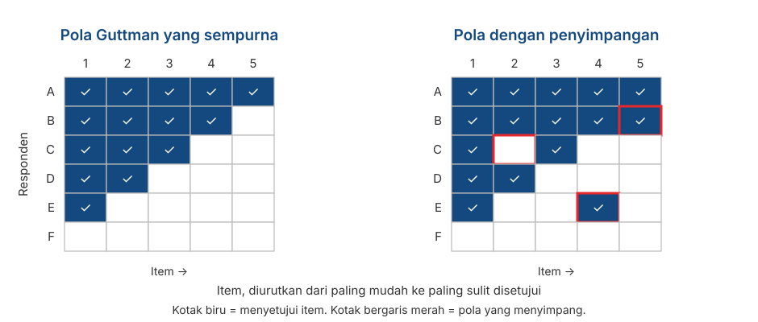

## _Outline_

::: {.incremental}

* Apa yang sebenarnya kita lakukan ketika memilih format respons
* **Likert**: asal-usulnya, dan 4️⃣ keputusan yang harus Anda ambil
* **Semantic Differential**: kapan pasangan kata sifat lebih tepat digunakan daripada pernyataan
* **Guttman**: ketika item memang berjenjang secara logis dan kenapa jarang berhasil
* Membandingkan ketiganya
* Pertanyaan penutup: **memilih format respons berkaitan dengan asumsi pengukuran yang mana?**

:::

::: aside
***Disclosure* penggunaan akal imitasi (AI)**

Kami menggunakan Claude Code (Model Opus 5 dan Sonnet 5) untuk *brainstorming* materi, mencari referensi, dan melakukan *troubleshooting* kode `quarto` dan `git`. Kami (Amel dan Dian) bertanggung jawab penuh atas substansi dan penyajian presentasi ini.

:::

# Dari model ke keputusan pertama {background-color="#14497F" .center}

## Yang sudah Anda pelajari

::: {.incremental}

* Di **Pertemuan 3**, Anda sudah belajar model formalnya: $X = T + E$, variabel laten sebagai sebab, dan reliabilitas sebagai proporsi varians.

* Sampai di sini semuanya masih terasa sangat abstrak. 

* **Format respons adalah lokasi pertama** di mana teori pengukuran (yang abstrak) berubah menjadi sesuatu yang lebih konkrit dan terlihat di kuesioner.

:::

. . .

::: {.callout-note}
#### Yang perlu dipegang hari ini
Format respons **bukan soal selera atau kebiasaan**. Setiap format membawa asumsinya sendiri, dan asumsi-asumsi ini menentukan analisis apa yang nanti boleh Anda pakai.
:::

## Apa yang dilakukan sebuah format respons

::: {.incremental}

* Format respons adalah **aturan yang memetakan kondisi psikologis internal partisipan menjadi sebuah angka**.

* Sebagian besar item terdiri atas dua bagian: **stem** (pernyataan atau pertanyaan) dan **pilihan respons**.

* Yang Anda pilih ketika memilih format respons mencakup:
  - berapa banyak informasi yang bisa diambil dari satu item,
  - level pengukuran yang Anda klaim,
  - jenis *error* yang mungkin muncul,
  - dan analisis apa yang bisa dipertanggungjawabkan.

:::

::: aside
DeVellis & Thorpe (2022), Bab 5.
:::

# Likert {background-color="#14497F" .center}

## Asal-usulnya

::: {.incremental}

* Diperkenalkan **Rensis Likert (1932)** dalam disertasinya, *A technique for the measurement of attitudes*.

* Gagasan intinya bukan pada opsi "Sangat Setuju sampai Sangat Tidak Setuju", melainkan pada ***summated ratings***: sekumpulan item yang direspons dengan skala berjenjang, lalu **dijumlahkan** menjadi satu skor.

* Jadi yang disebut "skala" oleh Likert adalah **kumpulan itemnya**, bukan opsi responsnya.

:::

. . .

::: {.callout-warning}
#### Ketelitian istilah yang jarang dipakai orang
Satu item tunggal dengan lima pilihan respon **bukan** "skala Likert". Skala seperti ini adalah **item bertipe Likert** (*Likert-type item*).

Sebuah *Likert scale* baru berlaku kalau item-itemnya dijumlahkan. Perhatikan bahwa ini konsisten dengan Pertemuan 3: reliabilitas hanya bisa dihitung untuk **sekumpulan** item.
:::

## Anatomi item bertipe Likert

**Stem:** *"Saya merasa gugup ketika harus berbicara di depan kelas."*

 

| 1 | 2 | 3 | 4 | 5 |
|:-:|:-:|:-:|:-:|:-:|
| Sangat Tidak Setuju | Tidak Setuju | Netral | Setuju | Sangat Setuju |

. . .

::: {.incremental}

* **Stem** — pernyataan yang direspons.
* **Jumlah titik** — di sini lima.
* **Label (*anchor*)** — kata yang menerangkan tiap titik.
* **Arah** — dari negatif ke positif, atau sebaliknya.

:::

. . .

Keempatnya adalah keputusan yang berbeda. Mari kita bahas satu per satu.

## Keputusan 1️⃣: berapa pilihan respons?

::: {.incremental}

* **Empat pilihan atau kurang** menekan variasi antar-responden dan menurunkan presisi. 
  + [Preston & Colman (2000)](https://www.sciencedirect.com/science/article/abs/pii/S0001691899000505) melaporkan skala dua, tiga, dan empat pilihan membuat skala kurang presisi.

* **Sekitar 5–7 pilihan** adalah wilayah yang paling sering direkomendasikan. 
  + [Lozano dkk. (2008)](https://econtent.hogrefe.com/doi/abs/10.1027/1614-2241.4.2.73) menyarankan rentang **empat sampai tujuh**, dengan tambahan keuntungan yang kecil di atas tujuh pilihan respon.

* **Di atas 6–7 pilihan**, tambahan performanya cenderung kecil. 
  + [Simms dkk. (2019)](https://psycnet.apa.org/record/2019-12091-001) menemukan hampir tidak ada perbaikan performa psikometrik ketika menyediakan di atas enam pilihan respon.

:::

. . .

::: {.callout-note}
#### Dua pertimbangan lain dari DeVellis
Pertama, **kemampuan responden membedakan**. Kalau responden tidak sanggup membedakan tujuh pilihan respon, menyediakan tujuh pilihan hanya akan menambah *noise*.

Kedua, **tujuan pengukuran yang Anda tetapkan sendiri**. Kalau nanti skornya Anda kelompokkan menjadi tiga kategori, buat apa Anda menggunakan 10 pilihan respons?
:::

## Keputusan 2️⃣: pakai titik tengah atau tidak?

:::: {.columns}
::: {.column width="50%"}

### Jumlah ganjil

Memberi ruang untuk **netral** atau **tidak yakin**.

Cocok kalau posisi netral memang bermakna secara teoretis.

:::
::: {.column width="50%"}

### Jumlah genap

**Memaksa** responden memberikan pilihan, walaupun berbeda dengan kondisi mereka sebenarnya.

Cocok kalau Anda curiga netral akan dipakai partisipan untuk menghindar.

:::
::::

. . .

::: {.callout-note}
#### Tidak ada yang unggul secara mutlak
DeVellis menyatakannya dengan tegas: **tidak ada format yang otomatis lebih baik**. Pilihannya bergantung pada jenis pertanyaan, jenis opsi respons, dan tujuan penelitian Anda.
:::

## Masalah dengan titik tengah

::: {.incremental}

* Kalau setiap item punya pilihan di tengah, sebagian responden akan belajar bahwa mereka **selalu bisa memilih pilihan tengah** dan menyelesaikan kuesioner lebih cepat.

* Pilihan tengah menjadi pilihan yang aman dan paling mudah, bukan laporan yang aktual tentang kondisi psikologis partisipan.

* Krosnick (1991) menyebut pola ini ***satisficing***: responden memberi jawaban yang "cukup memadai", bukan jawaban yang paling akurat.

:::

. . .

::: {.callout-warning}
#### Gejala yang bisa Anda cek
Ketika titik tengah tersedia, ia sering menjadi **opsi yang paling banyak dipilih**. Kalau itu terjadi pada data uji coba Anda di Pertemuan 12, jangan langsung menyimpulkan partisipannya memang kondisinya netral.
:::

## Netral ≠ ragu-ragu

::: {.incremental}

* Dalam banyak kuesioner berbahasa Indonesia, titik tengah diberi label **"Netral"**, **"Ragu-ragu"**, atau **"Kurang Setuju"**, seolah-olah ketiganya sama.

* **"Netral"** berarti tidak condong ke mana pun. **"Ragu-ragu"** berarti tidak tahu atau belum yakin. **"Kurang Setuju"** sebenarnya sudah condong ke sisi tidak setuju.

* Ketiganya menempati posisi yang berbeda pada kontinum, tetapi diberi angka yang sama, yaitu 3.

:::

. . .

::: {.callout-warning}
#### Kenapa ini tidak bisa diremehkan efeknya
Ini melanggar asumsi jarak yang setara dari Pertemuan 2. Kalau **"Kurang Setuju"** dipakai sebagai pilihan tengah, skala Anda sebenarnya tidak simetris: jarak dari 2 ke 3 tidak sama dengan jarak dari 3 ke 4.
:::

## Keputusan 3️⃣: melabeli semua pilihan, atau hanya ujungnya?

::: {.incremental}

* Melabeli **semua pilihan** umumnya menghasilkan reliabilitas dan validitas yang lebih baik daripada hanya melabeli kedua ujungnya [(Krosnick, dkk., 2010)](https://www.researchgate.net/profile/Nasir-Ali-22/post/Writing-a-survey/attachment/59d6467e79197b80779a1841/AS%3A458354666545152%401486291676030/download/The+Future+of+Survey+Research+-+Challenges+and+Opportunities.pdf).

* Alasannya sederhana: kalau hanya ujungnya yang diberi label, tiap responden menafsirkan sendiri arti titik-titik di antaranya.

* Tetapi label yang dipilih harus benar-benar dapat dibedakan oleh partisipan.

:::

. . .

::: {.callout-warning}
#### Contoh label yang bermasalah
Perhatikan susunan ini, yang diadaptasi dari DeVellis:

| | |
|---|---|
| Sangat Membantu | Kurang Membantu |
| Agak Membantu | Tidak Membantu Sama Sekali |

**Dua masalah sekaligus.** *Pertama*, "Agak" dan "Kurang" sulit dibedakan bahkan dalam keadaan terbaik. *Kedua*, kalau dibaca ke bawah kolom, "Agak Membantu" tampak lebih tinggi daripada "Kurang Membantu"; kalau dibaca ke samping per baris, urutannya justru terbalik.
:::

## Keputusan 4️⃣: *Anchor* apa yang dipakai?

::: {.incremental}

* **Persetujuan** — "Sangat Tidak Setuju" sampai "Sangat Setuju". Paling lazim, dan paling rawan *acquiescence bias* (Pertemuan 2).

* **Frekuensi** — "Tidak pernah" sampai "Selalu". Lebih konkret, tapi butuh **rujukan waktu yang jelas**: "sering" dalam seminggu atau dalam setahun?

* ***Anchor* khusus per item** (*item-specific*) — misalnya "Seberapa sering Anda merasa gugup sebelum presentasi?" dengan pilihan "Tidak pernah / Sekali dua kali / Beberapa kali / Hampir tiap kali / Selalu".

:::

. . .

::: {.callout-tip}
#### Penting diketahui
*Anchor* persetujuan mendorong responden untuk sekadar mengiyakan. [Weijters dkk. (2010)](https://psycnet.apa.org/record/2010-04293-009) memperkuat hal ini dengan menunjukkan bahwa format skala ikut menentukan *response style* yang muncul.
:::

## Seberapa kuat sebaiknya kalimat itemnya?

Tiga versi pernyataan yang isinya sama, dengan kekuatan berbeda:

::: {.incremental}

1. *"Dosen umumnya mengabaikan apa yang dikatakan mahasiswa."* — kuat
2. *"Kadang-kadang dosen tidak memperhatikan komentar mahasiswa sebagaimana mestinya."* — sedang
3. *"Sesekali dosen mungkin lupa atau melewatkan sesuatu yang disampaikan mahasiswa."* — lemah

:::

. . .

::: {.callout-note}
#### Saran DeVellis
Untuk format Likert, pernyataan sebaiknya **cukup kuat, tetapi tidak ekstrem**. Alasannya: **derajatnya sudah diwakili oleh opsi responsnya**.

Kalau kalimatnya sendiri sudah sangat lemah *tone*nya (versi 3), hampir semua orang akan setuju, dan item itu tidak lagi mampu membedakan siapa pun. Ingat pembahasan tingkat kesulitan item di Pertemuan 3.
:::

# Semantic Differential {background-color="#14497F" .center}

## Bentuknya

Dikembangkan **Osgood, Suci, & Tannenbaum (1957)** dalam penelitian tentang makna dan sikap.

. . .

**Objek yang dinilai: Layanan Kemahasiswaan Fakultas**

| | 1 | 2 | 3 | 4 | 5 | 6 | 7 | |
|---|:-:|:-:|:-:|:-:|:-:|:-:|:-:|---|
| Lambat | ○ | ○ | ○ | ○ | ○ | ○ | ○ | Cepat |
| Berbelit | ○ | ○ | ○ | ○ | ○ | ○ | ○ | Sederhana |
| Tidak ramah | ○ | ○ | ○ | ○ | ○ | ○ | ○ | Ramah |

. . .

Partisipan menandai satu titik di antara sepasang kata sifat yang berlawanan.

## Bipolar dan unipolar

:::: {.columns}
::: {.column width="50%"}

### Pasangan bipolar

Dua kata sifat yang **berlawanan**.

*jujur — tidak jujur*
*ramah — galak*

:::
::: {.column width="50%"}

### Pasangan unipolar

Ada dan tidak adanya **satu** atribut.

*ramah — tidak ramah*

:::
::::

. . .

::: {.incremental}

* Pilihan di antara keduanya harus mencerminkan logika konstruk Anda.

* "Tidak ramah" belum tentu sama dengan "galak". Kalau Anda memperlakukannya sebagai satu kontinum, Anda sudah membuat klaim teoretis.

:::

## Kapan format ini berguna

::: {.incremental}

* Ketika yang diukur adalah **sikap atau kesan terhadap suatu objek** — layanan, produk, program, kelompok, tokoh.

* Ketika Anda ingin **membandingkan beberapa objek** pada dimensi yang sama.

* Ketika beban kognitif perlu ditekan: pasangan kata sifat jauh lebih mudah direspon daripada deretan kalimat panjang.

:::

. . .

::: {.callout-note}
#### Tetap cocok dengan model Pertemuan 3
Beberapa pasangan kata sifat yang mengukur hal yang sama — *jujur/tidak jujur*, *adil/tidak adil*, *tulus/tidak tulus* — bisa dijumlahkan menjadi satu skor "kejujuran".

Logikanya persis sama: satu variabel laten sebagai penyebab beberapa item (*shared cause*), item-item sebagai indikatornya.
:::

## Yang perlu diwaspadai

::: {.incremental}

* **Pasangan katanya harus benar-benar berlawanan dalam bahasa partisipan.** Ini persoalan yang cukup pelik dalam bahasa Indonesia: banyak pasangan yang terasa berlawanan di bahasa Inggris tidak punya padanan yang setara.

* **Pilihan tengahnya ambigu.** Apakah pilihan 4 berarti "netral", "kedua-duanya", atau "tidak tahu"?

* **Risiko *invariance*** (Pertemuan 2): makna sepasang kata sifat bisa berbeda antar-kelompok, sehingga skornya tidak bisa langsung dibandingkan.

:::

. . .

::: {.callout-warning}
#### Kalau kelompok Anda memakai format ini
Uji pasangan kata sifatnya pada beberapa calon responden sebelum uji coba. Tanyakan satu hal sederhana: *"Menurut Anda, apa lawan kata dari ini?"* Kalau jawabannya bukan kata yang Anda pasangkan, pasangan kata tsb. perlu diganti.
:::

# Guttman {background-color="#14497F" .center}

## Gagasan kumulatif

::: {.incremental}

* **[Guttman (1944)](https://www.jstor.org/stable/2086306?casa_token=2C8Zl22uKroAAAAA:RNpW2exkd0fx33BCmVYWPiVykf-mryV7i2n8cCztAGNqt1R1IPEJzbjpY4BZ-W7gVu6YxaNF4mE0aBNrp8ovKzCHWk8CsHSW8wtVrPT8zJ6gXdBP6-XB)** mengusulkan skala yang itemnya **berjenjang**: menyetujui satu item berarti menyetujui semua item yang lebih "mudah".

* Level atribut seseorang ditunjukkan oleh **item tersulit yang masih ia setujui**.

* Contoh dari DeVellis: *"Apakah Anda merokok?"* → *"Apakah Anda merokok lebih dari 10 batang sehari?"* → *"Apakah Anda merokok lebih dari satu bungkus sehari?"*

:::

. . .

::: {.callout-note}
Perhatikan bedanya dengan Likert. Pada Likert, yang dijumlahkan adalah **derajat persetujuan pada semua item**. Pada Guttman, yang dicari adalah **titik peralihan** dari "ya" ke "tidak".
:::

## Seperti apa polanya

{.nostretch fig-align="center" width="82%"}

## Membaca pola

::: {.incremental}

* Pada pola yang sempurna, **skor total sudah memberi tahu persis item mana saja yang disetujui**. Tidak ada informasi yang hilang ketika kita meringkasnya menjadi satu angka.

* Pada panel kanan, 3️⃣ responden menyimpang: ada yang menyetujui item yang sulit tetapi menolak item yang lebih mudah.

* Semakin banyak penyimpangan, semakin kecil arti skor totalnya. Ukuran yang lazim dipakai untuk ini adalah ***coefficient of reproducibility***.

:::

## Pada situasi seperti apa Skala Guttman berguna

::: {.incremental}

* Ketika hierarkinya merupakan **konsekuensi logis**: makan sepuluh mangkok bakso selalu berarti lebih banyak daripada lima mangkok.

* **Fungsi fisik**: bisa bangun dari tempat tidur → bisa berjalan di dalam rumah → bisa naik tangga → bisa berjalan satu kilometer.

* **Jarak sosial** ([Bogardus, 1925](https://link.springer.com/article/10.1007/s12108-007-9023-9)): bersedia tinggal senegara → sekota → bertetangga → berteman dekat → menjadi keluarga lewat pernikahan.

:::

. . .

::: {.callout-tip}
Perhatikan bahwa ketiganya berhubungan dengan **perilaku atau kemampuan yang konkret**, bukan dengan sikap/konstruk psikologis yang sangat abstrak.
:::

## Pada situasi seperti apa Guttman tidak berguna sama sekali

::: {.incremental}

* Begitu konstruknya tidak konkret, urutannya **tidak lagi sama untuk semua orang**.

* DeVellis memberi contoh: skala Guttman hipotetis tentang aspirasi orang tua, dengan 4 item yang seharusnya berjenjang. Dua yang relevan di sini — item 3, *"Kebahagiaan lebih mungkin tercapai kalau seseorang sudah meraih tujuan pendidikan dan materialnya,"* dan item 4, *"Atribut-atribut kesuksesan yang lazim dihargai bukan penghalang bagi kebahagiaan sejati."*

* Secara logika, menyetujui item 3 seharusnya berarti menyetujui item 4 juga. Tapi seseorang yang memandang kesuksesan sebagai hal yang sekaligus **membantu dan menghambat** kebahagiaan bisa saja menyetujui item 3 sambil menolak item 4, sehingga menyimpang dari pola urutan Guttman.

:::

. . .

::: {.callout-warning}
#### Konsekuensi teoretis yang penting
DeVellis menekankan: **asumsi bahwa semua item punya hubungan yang sama kuat dengan variabel laten tidak berlaku** untuk item Guttman.

Artinya, model *parallel* dan *tau-equivalent* dari Pertemuan 3 **tidak cocok** untuk skala Guttman — dan koefisien seperti  $\omega$ dan $\alpha$ tidak bisa dipakai untuk skala Guttman.
:::

## Skala Guttman mungkin masih berguna

::: {.incremental}

* Kelemahan Guttman ada pada sifatnya yang **deterministik**: pola yang menyimpang dianggap kesalahan.

* *Item Response Theory* mengambil gagasan yang sama tetapi membuatnya **probabilistik**: makin tinggi $\theta$ (tingkat "variabel laten") seseorang, makin **besar peluangnya** menyetujui item yang sulit, jadi bukan kepastian.

* Model IRT pada dasarnya adalah **versi probabilistik dari gagasan Guttman**.

:::

# Membandingkan ketiganya {background-color="#14497F" .center}

## Ringkasan

| | **Likert** | **Semantic Differential** | **Guttman** |
|---|---|---|---|
| Bentuk item | Pernyataan + derajat persetujuan | Pasangan kata sifat | Pernyataan berjenjang, ya/tidak |
| Skor | Jumlah semua item | Jumlah semua pasangan | Titik peralihan |
| Cocok untuk | Sikap, keyakinan, sifat | Kesan terhadap objek | Perilaku/kemampuan berjenjang |
| Cocok dengan CTT | Ya | Ya | **Tidak langsung** |
| Kelemahan utama | *Acquiescence*, jarak tak setara | Padanan antonim, ambiguitas pilihan tengah | Penyimpangan pola |

## Memilih format respons berarti memilih asumsi

::: {.incremental}

* **Likert** mengasumsikan jarak antar-kategori setara, semua responden memaknai jangkar dengan cara yang sama, dan semua item berbobot sama.

* **Semantic Differential** mengasumsikan pasangan kata sifatnya benar-benar bipolar, dan maknanya sama bagi semua responden.

* **Guttman** mengasumsikan urutan kumulatif yang **deterministik** — asumsi yang paling ambisius kalau dibandingkan dengan Likert dan *Semantic Differential*.

:::

# Demo dan latihan {background-color="#14497F" .center}

## Bagian 1: temukan masalahnya

Empat format respons berikut punya masalah. Diskusikan dalam kelompok selama **15 menit**.

::: {.incremental}

**A.** *"Bagaimana pendapat Anda tentang layanan akademik fakultas?"*
Sangat Baik — Baik — Cukup — Kurang

**B.** *"Seberapa sering Anda merasa cemas?"*
Tidak pernah — Jarang — Kadang-kadang — Sering — Selalu

**C.** *"Saya merasa dosen kompeten dan peduli pada mahasiswa."*
Sangat Tidak Setuju — Tidak Setuju — Netral — Setuju — Sangat Setuju

**D.** *"Seberapa puas Anda dengan perkuliahan ini?"*
Skala 1 sampai 10, hanya ujungnya yang diberi label.

:::

::: {.notes}
Jawaban yang diharapkan — A: jangkar tidak seimbang, tiga positif satu negatif, sehingga sebaran
skor terdorong ke atas. B: kuantifier tanpa rujukan waktu; "sering" berbeda artinya bagi tiap orang.
C: item ganda (kompeten dan peduli adalah dua hal), responden yang setuju pada satu bagian saja
tidak punya jawaban yang benar. D: sepuluh titik tanpa label tengah, tiap responden menafsirkan
sendiri jarak antar-angkanya.
Kalau waktu mepet, cukup bahas A dan C — keduanya paling sering muncul di draf mahasiswa.
:::

# Rangkuman {background-color="#14497F" .center}

## Enam poin utama

::: {.incremental}

1. **Format respons bukan soal selera individual.** Setiap format punya asumsinya sendiri.

2. **"Skala Likert" berarti sekumpulan item yang dijumlahkan**, bukan satu item dengan lima pilihan.

3. **Sekitar 5–7 pilihan respon** adalah strategi yang umum dipilih; di bawah 4 maka kita akan kehilangan informasi, di atas 7 tambahan manfaatnya kecil.

4. **Pilihan tengah punya kelebihan dan kekurangan.** Tidak ada format yang otomatis lebih baik — dan "netral", "ragu-ragu", serta "kurang setuju" bukan hal yang sama.

5. **Semantic Differential** memerlukan pasangan kata sifat yang benar-benar berlawanan dalam bahasa responden.

6. **Guttman** memerlukan urutan kumulatif yang deterministik, sehingga jarang cocok untuk konstruk psikologis, tetapi ide dasarnya masih bisa dieksekusi dengan IRT.

:::

## Untuk Pertemuan 5

Kita lanjutkan ke format respons yang lebih jarang dipakai, tetapi punya kelebihan khusus:

::: {.incremental}

* **Thurstone** — ketika item diberi bobot berbeda oleh panel ahli, bukan diperlakukan setara.
* ***Situational Judgement Test*** — ketika yang diukur adalah penilaian dalam situasi konkret.
* ***Forced-choice*** — ketika *social desirability* menjadi masalah utama, dan partisipan dipaksa memilih di antara dua hal yang sama-sama menarik.

:::

. . .

::: {.callout-tip}
#### Persiapan
Baca bagian *Thurstone Scaling* pada **DeVellis & Thorpe (2022), Bab 5**.
:::

## Ada pertanyaan❓

{fig-align="center"}

::: {.callout-note}
### Catatan

* Paparan disusun dengan menggunakan  dan [**Quarto**](https://quarto.org) dengan *template* dari [UNAIR Theme](https://github.com/rameliaz/quarto-unair-theme).
* Kontak saya via <i class="fas fa-paper-plane"></i> <a href="mailto:amelia.zein@psikologi.unair.ac.id">amelia.zein@psikologi.unair.ac.id</a>
:::

## Rujukan {.smaller}

Bogardus, E. S. (1925). Measuring social distances. *Journal of Applied Sociology, 9*, 299–308.

DeVellis, R. F., & Thorpe, C. T. (2022). *Scale development: Theory and applications* (5th ed.). SAGE.

Guttman, L. (1944). A basis for scaling qualitative data. *American Sociological Review, 9*(2), 139–150.

Krosnick, J. A. (1991). Response strategies for coping with the cognitive demands of attitude measures in surveys. *Applied Cognitive Psychology, 5*(3), 213–236.

Krosnick, J. A., & Presser, S. (2010). Question and questionnaire design. In P. V. Marsden & J. D. Wright (Eds.), *Handbook of survey research* (2nd ed., pp. 263–313). Emerald.

Likert, R. (1932). A technique for the measurement of attitudes. *Archives of Psychology, 22*(140), 1–55.

Lozano, L. M., García-Cueto, E., & Muñiz, J. (2008). Effect of the number of response categories on the reliability and validity of rating scales. *Methodology, 4*(2), 73–79.

Osgood, C. E., Suci, G. J., & Tannenbaum, P. H. (1957). *The measurement of meaning*. University of Illinois Press.

Preston, C. C., & Colman, A. M. (2000). Optimal number of response categories in rating scales. *Acta Psychologica, 104*(1), 1–15.

Simms, L. J., Zelazny, K., Williams, T. F., & Bernstein, L. (2019). Does the number of response options matter? *Psychological Assessment, 31*(4), 557–566.

Weijters, B., Cabooter, E., & Schillewaert, N. (2010). The effect of rating scale format on response styles. *International Journal of Research in Marketing, 27*(3), 236–247.
