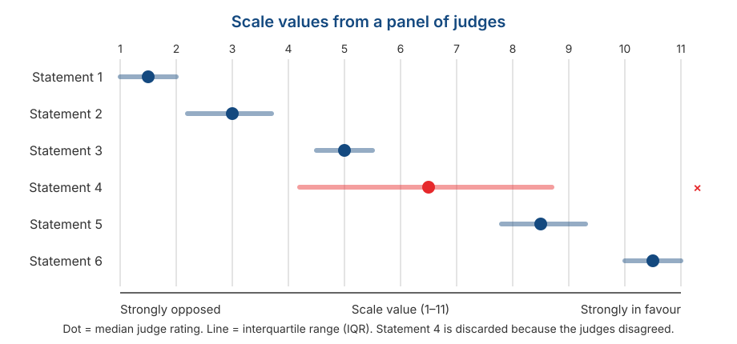

## _Outline_

::: {.incremental}

* Three things we have been taking for granted — and the formats that give them up
* **Thurstone**: items calibrated in advance by a panel of judges
* ***Situational Judgement Tests***: measuring judgement rather than self-description
* ***Forced-choice***: when respondents must choose, and scores become **ipsative**
* Why ipsative data breaks almost everything we built in Session 3

:::

::: aside
***Disclosure* on the use of artificial intelligence (AI)**

We used Claude Code (Opus 5 and Sonnet 5) to brainstorm material, locate references, and troubleshoot `quarto` and `git` code. We (Amel and Dian) take full responsibility for the substance and presentation of these slides.

:::

# Three things we have been taking for granted {background-color="#14497F" .center}

## What sits behind the Session 4 formats

When we use a Likert scale, we quietly accept three things:

::: {.incremental}

1. **All items carry equal weight.** Item 1 and item 7 are each worth a maximum of 5 points.

2. **Items are abstract self-descriptions.** *"I am a careful person."*

3. **Each item is answered independently.** Agreeing with one item does not force you to reject another.

:::

. . .

::: {.callout-note}
#### What today covers
Three formats, each of which **gives up one** of these — and pays a price for it.
:::

## Today's map

| Format | What it gives up | What it gains |
|--------|------------------|---------------|
| **Thurstone** | Equal item weights | Items calibrated across the continuum |
| **SJT** | Abstract self-description | Concrete context and judgement |
| ***Forced-choice*** | Independent responding | Protection from social desirability |

. . .

::: {.callout-warning}
### Keep in mind
All three are conceptually attractive, but **far harder to build** than Likert, and two of them break assumptions we established in Session 3.
:::

# Thurstone {background-color="#14497F" .center}

## The tuning fork analogy

::: {.incremental}

* A **tuning fork** is built to vibrate at one frequency. Put it near a tone of that frequency and it vibrates; at any other frequency it stays still.

* Imagine an array of tuning forks arranged from low to high frequency. To identify a tone's frequency, you just see **which fork vibrates**.

* A Thurstone scale works the same way: each item is "tuned" to respond to a particular level of the attribute.

:::

::: aside
Analogy from DeVellis & Thorpe (2022), Chapter 5.
:::

. . .

::: {.callout-tip}
Contrast this with Likert, where every item is essentially **the same detector** and only the degree of the answer varies.
:::

## How a Thurstone scale is built

::: {.incremental}

1. **Generate many statements** about the attitude object — usually dozens or hundreds.

2. **Ask a panel of judges** to sort each statement into 11 piles, from most opposed to most in favour. Judges are **not** asked their own opinion; they judge **where the statement sits**.

3. **Take the median** judge rating for each statement. That is its **scale value**.

4. **Look at the spread** of judge ratings (the interquartile range). Statements the judges disagreed about are **ambiguous**, and get discarded.

5. **Select from what remains** so that the scale values are **evenly spread** across the continuum.

:::

## What the result looks like

{.nostretch fig-align="center" width="80%"}

## Reading that figure

::: {.incremental}

* Each statement has **one number** marking its position on the continuum — that is the calibration.

* Statement 4 has a **very wide** interquartile range: the judges could not agree where it sits. Statements like this are discarded, however well written.

* The surviving statements are **spread** from end to end. That is by design, not by accident.

:::

. . .

::: {.callout-note}
#### Notice what just happened
We have established each item's "difficulty" **before a single respondent has answered**. CTT cannot do that.
:::

## How respondents answer, and how it is scored

::: {.incremental}

* Respondents are only asked to **agree or disagree** with each statement. There are no degrees.

* A respondent's score is the **mean scale value of the statements they endorsed**.

* So someone endorsing statements with scale values 8.5 and 10.5 scores 9.5 — nothing is summed.

:::

. . .

::: {.callout-warning}
#### A fundamental difference from Likert
In Likert, **the information is in the degree of the answer**. In Thurstone, the information is in **which items were endorsed** — the answer itself is only yes or no.
:::

## Why Thurstone is rarely used

::: {.incremental}

* **The workload is heavy.** You need a judge panel before any respondent data is collected.

* **Finding items that genuinely "resonate"** at a specific level is much harder than it sounds.

* Nunnally (1978), as cited by DeVellis, judged that **the practical problems often outweigh the advantages**, unless a researcher genuinely needs that kind of calibration.

:::

. . .

::: {.callout-warning}
#### And there is a theoretical consequence
Like Guttman in Session 4, Thurstone items are **not equally weighted**. So the *parallel* and *tau-equivalent* models from Session 3 do not apply, and $\alpha$ cannot simply be used.
:::

## But the idea survives in two places

::: {.incremental}

* **Inside IRT.** DeVellis notes that IRT-based methods **share the same goals** as Thurstone scaling. The difficulty parameter $b$ from Session 3 is essentially a Thurstone scale value — except that IRT estimates it from respondent data rather than from a judge panel.

* **Inside your own project.** In Session 11 you will ask a panel of experts to rate the relevance of each item and compute a *Content Validity Index*.

:::

. . .

::: {.callout-tip}
#### Notice the resemblance
The CVI procedure is **Thurstone's logic applied to content relevance** rather than to position on a continuum. A panel of judges, item-by-item ratings, and discarding items the judges disagree about — all the same.

So you will be running a version of Thurstone without realising it.
:::

# Situational Judgement Tests {background-color="#14497F" .center}

## The format

::: {.incremental}

* Respondents are given a **realistic scenario** and asked to evaluate several possible actions.

* What is measured is not a self-description but **judgement in a concrete situation**.

* Rooted in personnel selection testing since the 1940s, and revived after Motowidlo et al. (1990) described it as a *low-fidelity simulation*.

:::

## An example

> **Situation.** You are leading a five-person group assignment. Two days before the deadline, one member tells you they have not started their section at all because of a family emergency.

. . .

**How effective is each of the following actions?**

| | Action | |
|---|---|---|
| A | Do that section yourself so the deadline is met | 1–5 |
| B | Redistribute the section to members who have finished | 1–5 |
| C | Ask the lecturer for an extension | 1–5 |
| D | Submit as is and note who did not contribute | 1–5 |

: {tbl-colwidths="[8,77,15]"}

## Notice the difference

:::: {.columns}
::: {.column width="50%"}

### *"What would you do?"*

Measures **behavioural tendency**.

Closer to personality.

More open to impression management.

:::
::: {.column width="50%"}

### *"What should be done?"*

Measures **knowledge** of effective action.

Closer to cognitive ability.

More resistant to impression management.

:::
::::

. . .

::: {.callout-warning}
#### This is not a cosmetic difference
Ployhart & Ehrhart (2003) showed that **changing the response instruction changes the test's psychometric properties** — both its reliability and the construct it measures.

The response instruction must be decided in advance, not chosen afterwards.
:::

## How it is scored

::: {.incremental}

* **Consensus-based** — the key comes from the average judgement of a large sample.

* **Expert-based** — a panel of practitioners decides which actions are effective.

* **Theory-based** — the key is derived from theory about the construct.

:::

. . .

::: {.callout-note}
Note that the first two **require a panel**, exactly like Thurstone and like the CVI in Session 11.
:::

## Its strengths

::: {.incremental}

* **Concrete context.** Respondents are not asked to generalise about themselves but to react to a specific situation — sidestepping part of the introspective-access problem from Session 2.

* **Face relevance**, which makes it easier to accept in a selection setting.

* **Reasonable prediction of performance.** McDaniel et al. (2001) show SJTs predict job performance adequately.

:::

## Its psychometric problem

::: {.incremental}

* SJTs are almost always **multidimensional**. A single scenario can involve knowledge, personality, and reasoning at once.

* As a result, internal consistency is often **low** — and it **should be**.

* This violates the unidimensionality assumption from Session 2, and makes the CTT model from Session 3 a poor fit as it stands.

:::

::: aside
Whetzel & McDaniel (2009).
:::

. . .

::: {.callout-warning}
#### A mistake people make often
Reporting Cronbach's alpha for an SJT and concluding the test is poor because the number is low.

$\alpha$ assumes every item is driven by one shared latent variable. In an SJT that assumption is not even intended to hold. **The wrong coefficient produces the wrong conclusion**, not a bad instrument.
:::

# Forced-choice {background-color="#14497F" .center}

## The problem it solves

::: {.incremental}

* Recall the sixth assumption from Session 2: respondents are **willing** to report their state honestly.

* In a job selection setting that assumption is plainly unrealistic. Everyone has a reason to look good.

* With a Likert format, a respondent can simply rate **every** attractive-sounding statement highly.

:::

. . .

::: {.callout-tip}
#### The core idea
If respondents are **forced to choose** between two equally attractive statements, they can no longer endorse everything. They must reveal **which one describes them better**.
:::

## The format

**Choose the statement that describes you best:**

| | |
|---|---|
| (a) | I like to finish my work on time. |
| (b) | I like to help other people solve their problems. |

. . .

::: {.incremental}

* Both statements are **equally positive**. Neither is obviously the "better" answer.

* Both measure **different constructs** — roughly conscientiousness and agreeableness here.

* Variants use blocks of three or four statements with *"most like me"* and *"least like me"* instructions.

:::

::: aside
The classic example is the *Edwards Personal Preference Schedule* (Edwards, 1959), whose pairs were matched on social desirability.
:::

## A requirement people forget

::: {.incremental}

* The statements in a pair must be **matched for attractiveness** beforehand — which requires its own preliminary study.

* Without that matching, the format **solves nothing**: respondents will still pick whichever sounds better.

* Matching attractiveness is itself a calibration task — once again, Thurstone-style work.

:::

# Ipsativity {background-color="#14497F" .center}

## The price

::: {.incremental}

* Every time a respondent picks one statement, they automatically **do not pick** the other.

* As a result, **the total across all scales is constant** for every respondent. If one scale score goes up, another **must** go down.

* Data with this property are called **ipsative**: the scores are meaningful **within a person**, not between people.

:::

. . .

::: {.callout-warning}
#### The sentence to remember
With ipsative data, a score answers *"of all these things, which stands out most in me?"* — **not** *"how much of this trait do I have compared with other people?"*
:::

## Why this breaks the analysis

::: {.incremental}

* Because the total is forced to be constant, **correlations between scales are forced negative** — even if the underlying constructs are entirely unrelated.

* For an ipsative instrument with $k$ scales, the average intercorrelation is:

$$\bar{r} = -\frac{1}{k-1}$$

:::

. . .

| Number of scales ($k$) | Forced average correlation |
|:--:|:--:|
| 3 | −0.50 |
| 5 | −0.25 |
| 10 | −0.11 |

. . .

::: {.callout-warning}
Those numbers come **from the format**, not from the respondents' psychology.
:::

## The knock-on effects

::: {.incremental}

* **Between-person comparison becomes invalid.** A conscientiousness score of 8 for person A cannot be compared directly with 8 for person B.

* **Factor analysis becomes misleading**, because the correlation structure was distorted by the format before any analysis began.

* **Classical reliability coefficients become hard to interpret** — the CTT model in Session 3 assumes scores are free to vary, and here they are not.

:::

::: aside
Hicks (1970) reviews these problems comprehensively.
:::

. . .

::: {.callout-warning}
#### The practical conclusion
Ipsative instruments **should not** be used for selection, ranking, or comparison between individuals — which is precisely what such instruments are often sold for.
:::

## There is a way out

::: {.incremental}

* Brown & Maydeu-Olivares (2011) showed that with **IRT** modelling, normative scores can be recovered from forced-choice responses.

* The approach is called ***Thurstonian IRT***, because it builds on Thurstone's model of paired comparisons.

* So the format remains usable — provided the analysis uses the right model rather than simple summing.

:::

. . .

::: {.callout-tip}
#### Notice who reappears
We opened today with Thurstone and we close with Thurstone. A 1920s idea turns out to be what rescues the most problematic of the three formats.
:::

# What is realistic for your project {background-color="#14497F" .center}

## All three are unrealistic

::: {.incremental}

* **Thurstone** — not realistic. You would need a separate judge panel before data collection, and there is no time.

* **SJT** — not realistic this semester. Writing good scenarios and building a scoring key is a project in itself.

* ***Forced-choice*** — not realistic. The correct analysis of ipsative data is outside the scope of this course.

:::

. . .

::: {.callout-note}
#### So why cover them?
Because you **will encounter all three** in practice — especially SJTs and forced-choice instruments, which are widely used in assessment and recruitment.

What you should take from today is not the ability to build them, but the ability to **judge whether such an instrument is being used properly**.
:::

# Demonstration and exercise {background-color="#14497F" .center}

## Part 1: be a Thurstone judge

Attitude object: **using AI to complete coursework**.

Rate each statement from **1** (strongly opposed) to **11** (strongly in favour). Judge **where the statement sits**, not your own opinion.

::: {.incremental}

1. Using AI for coursework is cheating, whatever the reason.
2. AI should only be used to check grammar.
3. AI may be used to find references, as long as the writing is your own.
4. Using AI is like using a calculator: simply a tool.
5. Students who do not use AI will fall behind.
6. Assignments should be judged only on the final product, regardless of how it was made.

:::

::: {.notes}
Collect the whole class's ratings for each statement on the board or in the chat.
Compute the median and interquartile range together. Statements 4 and 6 usually produce the
most disagreement, because both can be read as either normative or descriptive claims.
If time is short, use only statements 1, 3, and 6.
:::

## Part 1: what to compute and discuss

::: {.incremental}

1. Compute the **median** class rating for each statement. That is its scale value.

2. Compute the **interquartile range** for each. Which statement produced the most disagreement?

3. Which statement would you **discard**, and why?

4. Are the surviving statements **evenly spread** across the continuum, or bunched on one side?

:::

. . .

::: {.callout-tip}
Notice that you have just run the same procedure you will use for the CVI in Session 11 — only the criterion differs.
:::

## Part 2: matching for attractiveness

Look at these three forced-choice pairs. **Which are well matched, and which are not?**

::: {.incremental}

**Pair 1**
(a) I am an organised person. (b) I am an outgoing person.

**Pair 2**
(a) I like to plan things in advance. (b) I sometimes put things off.

**Pair 3**
(a) I enjoy working alone. (b) I enjoy working in a team.

:::

. . .

::: {.callout-note}
Time: **10 minutes**. For any pair that is not well matched, write down how you would fix it.
:::

# Summary {background-color="#14497F" .center}

## Six key points

::: {.incremental}

1. **Thurstone calibrates items in advance** using a judge panel, so items have known positions on the continuum.

2. **Thurstone scale values are the ancestor of the IRT difficulty parameter**, and its judging procedure is the ancestor of CVI.

3. **SJTs measure judgement in context** and are almost always multidimensional — so a low $\alpha$ is not a sign of failure.

4. **Response instructions change what an SJT measures.** "Would do" and "should do" are not the same thing.

5. ***Forced-choice* protects against social desirability**, but produces **ipsative** data.

6. **Ipsative data forces negative correlations between scales** and makes between-person comparison invalid.

:::

## For Session 6

After five sessions on concepts and formats, we start computing: **reliability**.

::: {.incremental}

* The **Spearman-Brown** formula we have now deferred twice.
* ***Cronbach's alpha*** and the tau-equivalence assumption that is rarely met.
* The ***omega*** coefficient and why it is generally more appropriate.
* Test-retest, split-half, and internal consistency: three different questions, not three ways of computing the same thing.
* Which coefficient you should actually report in your project.

:::

. . .

::: {.callout-tip}
#### Preparation
Read **DeVellis & Thorpe (2022), Chapter 3**. To see it in practice, the *Reliability* chapter of [Bikos](https://lhbikos.github.io/ReC_Psychometrics/) lays the coefficients out side by side.
:::

## Any questions❓

{fig-align="center"}

::: {.callout-note}
### Notes

* These slides were built with  and [**Quarto**](https://quarto.org), using the [UNAIR Theme](https://github.com/rameliaz/quarto-unair-theme) template.
* Reach me at <i class="fas fa-paper-plane"></i> <a href="mailto:amelia.zein@psikologi.unair.ac.id">amelia.zein@psikologi.unair.ac.id</a>
:::

## References {.smaller}

Brown, A., & Maydeu-Olivares, A. (2011). Item response modeling of forced-choice questionnaires. *Educational and Psychological Measurement, 71*(3), 460–502.

DeVellis, R. F., & Thorpe, C. T. (2022). *Scale development: Theory and applications* (5th ed.). SAGE.

Edwards, A. L. (1959). *Edwards Personal Preference Schedule manual*. Psychological Corporation.

Hicks, L. E. (1970). Some properties of ipsative, normative, and forced-choice normative measures. *Psychological Bulletin, 74*(3), 167–184.

McDaniel, M. A., Morgeson, F. P., Finnegan, E. B., Campion, M. A., & Braverman, E. P. (2001). Use of situational judgment tests to predict job performance. *Journal of Applied Psychology, 86*(4), 730–740.

Motowidlo, S. J., Dunnette, M. D., & Carter, G. W. (1990). An alternative selection procedure: The low-fidelity simulation. *Journal of Applied Psychology, 75*(6), 640–647.

Nunnally, J. C. (1978). *Psychometric theory* (2nd ed.). McGraw-Hill.

Ployhart, R. E., & Ehrhart, M. G. (2003). Be careful what you ask for: Effects of response instructions on the construct validity and reliability of situational judgment tests. *International Journal of Selection and Assessment, 11*(1), 1–16.

Thurstone, L. L. (1928). Attitudes can be measured. *American Journal of Sociology, 33*(4), 529–554.

Thurstone, L. L., & Chave, E. J. (1929). *The measurement of attitude*. University of Chicago Press.

Whetzel, D. L., & McDaniel, M. A. (2009). Situational judgment tests: An overview of current research. *Human Resource Management Review, 19*(3), 188–202.
