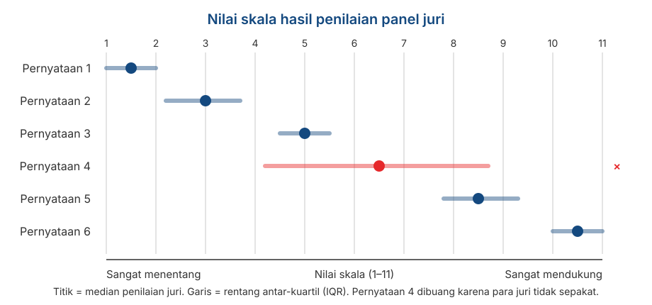

## _Outline_

::: {.incremental}

* 3️⃣ asumsi pengukuran yang selama ini diterima begitu saja
* **Thurstone**: item yang sudah dikalibrasi lebih dulu oleh panel
* ***Situational Judgement Test***: mengukur penilaian atas situasi, bukan pernyataan tentang diri sendiri (*self-report*)
* ***Forced-choice***: partisipan dipaksa memilih, dan skornya menjadi **ipsatif**
* Kenapa data ipsatif berlawanan dengan hampir semua asumsi yang kita pelajari di Pertemuan 3
:::

::: aside
***Disclosure* penggunaan akal imitasi (AI)**

Kami menggunakan Claude Code (Model Opus 5 dan Sonnet 5) untuk *brainstorming* materi, mencari referensi, dan melakukan *troubleshooting* kode `quarto` dan `git`. Kami (Amel dan Dian) bertanggung jawab penuh atas substansi dan penyajian presentasi ini.

:::

# 3️⃣ asumsi yang selama ini diterima begitu saja {background-color="#14497F" .center}

## Yang belum dijelaskan di pertemuan sebelumnya

Ketika kita memakai skala Likert, secara implisit kita menerima 3️⃣ hal:

::: {.incremental}

1. **Semua item berbobot sama.** Item nomor 1 dan nomor 7 sama-sama bernilai maksimum 5 poin.

2. **Item berupa pernyataan tentang diri sendiri (*self-report*), secara abstrak.** (e.g., *"Saya orang yang teliti."*)

3. **Setiap item dijawab secara terpisah.** Menyetujui satu item tidak berarti memaksa partisipan menolak item lain.

:::

. . .

::: {.callout-note appearance="simple"}
Hari ini kita akan memperlajari tiga format respons yang masing-masing **menolak** ketiga asumsi ini.
:::

## Format respons dan asumsi Likert yang ditolak

| Format | Yang ditolak | Yang diasumsikan |
|--------|-----------------|----------------|
| **Thurstone** | Bobot item yang sama | Item terkalibrasi di sepanjang kontinum |
| **SJT** | Pernyataan tentang diri sendiri yang cenderung abstrak | Konteks dan penilaian yang lebih konkret |
| ***Forced-choice*** | Kebebasan menjawab tiap item | Menangkal problem *social desirability* |

. . .

::: {.callout-warning appearance="simple"}
Ketiganya kelihatannya menarik secara konseptual, tetapi **jauh lebih sulit dikembangkan** daripada Likert, dan dua di antaranya berlawanan dengan asumsi yang kita bangun di Pertemuan 3.
:::

# Thurstone {background-color="#14497F" .center}

## Analogi garpu tala

::: {.incremental}

* Sebuah **garpu tala** dirancang bergetar pada frekuensi tertentu. Kalau ada nada dengan frekuensi yang sama di dekatnya, garpu itu ikut bergetar. Kalau frekuensinya berbeda, ia diam.

* Bayangkan sederet garpu tala yang tersusun dari frekuensi rendah ke tinggi. Untuk mengetahui frekuensi sebuah nada, Anda cukup melihat **garpu mana yang bergetar**.

* Skala Thurstone bekerja persis seperti ini: tiap item "disetel" untuk merespons level atribut ($\theta$) tertentu.

:::

::: aside
Analogi dari DeVellis & Thorpe (2022), Bab 5.
:::

. . .

::: {.callout-caution appearance="simple"}
Bandingkan dengan Likert, di mana semua item pada dasarnya adalah **detektor yang sama** dan yang berbeda hanya derajat pilihan responnya.
:::

## Bagaimana skala Thurstone dibuat

::: {.incremental}

* **Kumpulkan banyak pernyataan** tentang objek sikap, yang biasanya puluhan hingga ratusan.

* **Minta anggota panel** menempatkan tiap pernyataan ke dalam 11 kategori, dari paling bertentangan sampai paling mendukung konstruk. 
  - Anggota panel **tidak** diminta pendapat pribadinya; mereka diminta menilai **posisi pernyataannya** di garis kontinum level atribut ($\theta$).

* **Hitung median** penilaian anggota panel untuk tiap pernyataan. 
  + Inilah yang dijadikan **nilai skala** (*scale value*) pernyataan tersebut.

* **Hitung sebaran penilaian anggota panel** (rentang antar-kuartil). Pernyataan yang reviewernya tidak sepakat berarti **ambigu**, dan dibuang.

* **Pilih pernyataan yang tersisa** sedemikian rupa sehingga nilai skalanya **tersebar merata** di sepanjang kontinum level atribut ($\theta$).

:::

## Seperti apa hasilnya

{.nostretch fig-align="center" width="80%"}

## Membaca ilustrasi sebelumnya

::: {.incremental}

* Tiap pernyataan punya **satu angka** yang menandai posisinya di kontinum. 
  - Angka inilah yang mencerminkan kalibrasinya.

* Pernyataan 4 punya rentang antar-kuartil yang **sangat lebar**: para anggota panel tidak sepakat pernyataan itu ada di posisi mana. 
  - Pernyataan seperti ini sebaiknya dibuang, sebagus apapun penulisan kalimatnya.

* Pernyataan yang lolos harus **tersebar** dari ujung ke ujung kontinum level atribut ($\theta$), sehingga merepresentasikan seluruh spektrum konstruk. 

:::

. . .

::: {.callout-note appearance="simple"}
Pembuat skala sudah menentukan "tingkat kesulitan" tiap item **sebelum partisipan mengisinya**. Ini adalah sesuatu yang tidak bisa dilakukan dengan CTT.
:::

## Cara partisipan menjawab dan cara menskornya

::: {.incremental}

* partisipan hanya diminta **setuju atau tidak setuju** (ya/tidak) pada tiap pernyataan.

* Skor partisipan adalah **rata-rata nilai skala dari pernyataan yang ia setujui**.

* Jadi orang yang menyetujui dua pernyataan dengan nilai skala masing-masing 8.5 dan 10.5, akan mendapat skor 9.5.

:::

. . .

::: {.callout-warning}
#### Apa perbedaannya dengan Likert?
Pada Likert, **informasi ada pada derajat jawaban**. Pada Thurstone, informasi ada pada **item mana yang disetujui**.
:::

## Kenapa Thurstone jarang dipakai

::: {.incremental}

* **Lebih sulit dibuat.** Anda perlu panel *reviewer* sebelum satu pun data partisipan dikumpulkan.

* **Menemukan item yang benar-benar "beresonansi"** pada level tertentu jauh lebih sulit daripada membayangkannya.

* Nunnally (1978), sebagaimana dikutip DeVellis, menilai bahwa **masalah praktisnya sering lebih besar daripada keuntungannya**, kecuali kalau peneliti benar-benar membutuhkan kalibrasi seperti yang diilustrasikan oleh Thurstone.

:::

. . .

::: {.callout-warning}
#### Konsekuensi teoretisnya
Seperti Guttman di Pertemuan 4, item Thurstone **tidak berbobot sama**. Artinya model *parallel* dan *tau-equivalent* dari Pertemuan 3 tidak berlaku, dan Cronbach's $\alpha$ tidak bisa dipakai dalam konteks ini.
:::

## Tetapi gagasannya tetap bermanfaat dalam dua hal

::: {.incremental}

* **Pengembangan Model IRT.** Metode berbasis IRT **punya tujuan yang sama** dengan Thurstone. 
  + Parameter kesulitan $b$ yang kita lihat di Pertemuan 3 pada dasarnya adalah nilai skala Thurstone, tetapi bedanya, IRT mengestimasinya dari data pengukuran yang dilakukan pada partisipan, bukan dari panel *reviewer*.

* **Untuk proyek pengembangan skala Anda.** Di Pertemuan 11, Anda akan meminta panel ahli menilai relevansi tiap item, lalu menghitung [*Content Validity Index*](/slides/pertemuan11.html).

:::

. . .

::: {.callout-tip}
#### Perhatikan kemiripannya
Prosedur CVI adalah **logika Thurstone yang diterapkan pada relevansi item dengan substansi konstruk**, bukan pada posisi item di kontinum level atribut ($\theta$).
:::

# Situational Judgement Test {background-color="#14497F" .center}

## Bentuknya

::: {.incremental}

* partisipan diberi **skenario yang realistis**, lalu diminta menilai beberapa kemungkinan tindakan.

* Yang diukur bukan pernyataan tentang diri sendiri (*self report*), melainkan **penilaian dalam situasi konkret**.

* Berakar pada tes seleksi personel sejak 1940-an, dan populer kembali sejak [Motowidlo dkk. (1990)](https://psycnet.apa.org/record/1991-11281-001) menyebutnya sebagai *low-fidelity simulation*.

:::

## Contoh

> **Situasi.** Anda memimpin kelompok tugas beranggotakan lima orang. Dua hari sebelum tenggat, satu anggota memberi tahu bahwa bagiannya belum dikerjakan sama sekali karena ada urusan keluarga.

. . .

**Seberapa efektif tiap tindakan berikut?**

| | Tindakan | Respon Partisipan (1: sama sekali tidak efektif; 5: sangat efektif) |
|---|---|---|
| A | Mengerjakan sendiri bagian itu agar tenggat terkejar | 1–5 |
| B | Membagi bagian tersebut ke anggota lain yang sudah selesai | 1–5 |
| C | Meminta perpanjangan waktu kepada dosen | 1–5 |
| D | Menyerahkan tugas apa adanya dan menuliskan siapa yang tidak berkontribusi | 1–5 |

: {tbl-colwidths="[5,60,35]"}

## Perhatikan perbedaannya

:::: {.columns}
::: {.column width="50%"}

### *"Apa yang akan Anda lakukan?"*

Mengukur **kecenderungan perilaku**.

Lebih dekat ke kepribadian.

Lebih rawan "ditutupi" partisipan.

:::
::: {.column width="50%"}

### *"Apa yang sebaiknya dilakukan?"*

Mengukur **pengetahuan** tentang tindakan yang efektif.

Lebih dekat ke kemampuan kognitif.

Lebih tahan terhadap *social desirability*.

:::
::::

. . .

::: {.callout-warning appearance="simple"}
[Ployhart & Ehrhart (2003)](https://onlinelibrary.wiley.com/doi/abs/10.1111/1468-2389.00222) menunjukkan bahwa **mengganti instruksi respons mengubah properti psikometrik tesnya**, yaitu reliabilitas maupun validitasnya.

:::

## Cara menskornya

::: {.incremental}

* **Berbasis konsensus** — kunci jawabannya diambil dari rata-rata penilaian sampel besar.

* **Berbasis ahli** — panel praktisi menentukan mana tindakan yang efektif.

* **Berbasis teori** — kunci diturunkan dari teori tentang konstruk yang diukur.

:::

. . .

::: {.callout-note appearance="simple"}
Perhatikan bahwa dua yang pertama **membutuhkan panel**, persis seperti Thurstone dan seperti CVI nanti di Pertemuan 11.
:::

## Kelebihannya

::: {.incremental}

* **Konteks yang konkret.** partisipan tidak diminta menggeneralisasi tentang dirinya, melainkan menanggapi situasi tertentu. 
  - Ini menghindari sebagian masalah akses introspektif dari Pertemuan 2.

* **Tampak relevan bagi partisipan**, sehingga lebih mudah diterima dalam konteks seleksi.

* **Prediksi kinerja yang cukup baik.** [McDaniel dkk. (2001)](https://psycnet.apa.org/record/2001-01869-017) menunjukkan SJT memprediksi *job performance* secara memadai.

:::

## Masalah psikometriknya

::: {.incremental}

* SJT hampir selalu **multidimensional**. Satu skenario bisa sekaligus melibatkan pengetahuan, kepribadian, dan penalaran.

* Akibatnya, konsistensi internalnya sering **rendah**.

* Ini melanggar asumsi unidimensionalitas dari Pertemuan 2, dan membuat model CTT di Pertemuan 3 perlu ditambah *layer* kompleksitasnya.

:::

::: aside
[Whetzel & McDaniel (2009)](https://www.sciencedirect.com/science/article/pii/S1053482209000394).
:::

. . .

::: {.callout-warning}
#### Kesalahan yang umum
Melaporkan Cronbach's $\alpha$ untuk SJT lalu menyimpulkan tesnya kurang reliabel karena koefisiennya rendah.

$\alpha$ mengasumsikan semua item digerakkan oleh satu variabel laten yang sama. Pada SJT, asumsi itu memang tidak dimaksudkan untuk terpenuhi. **Koefisien yang salah akan selalu menghasilkan kesimpulan yang salah**.
:::

# Forced-choice {background-color="#14497F" .center}

## Masalah yang ingin dipecahkan

::: {.incremental}

* Ingat asumsi keenam dari Pertemuan 2: partisipan **mau** melaporkan keadaannya apa adanya.

* Pada konteks seleksi kerja, asumsi itu jelas tidak realistis. Semua orang punya alasan untuk menampilkan dirinya sebaik mungkin.

* Dengan format Likert, partisipan bisa memberi nilai tinggi pada **semua** pernyataan yang terbaca baik.

:::

. . .

::: {.callout-tip}
#### Gagasan inti *forced-choice*
Kalau partisipan **dipaksa memilih** di antara dua pernyataan yang sama-sama menarik, ia tidak bisa lagi sekadar menyetujui semuanya. Ia harus mengungkapkan **mana yang lebih menggambarkan dirinya**.
:::

## Bentuknya

**Pilih satu pernyataan yang paling menggambarkan diri Anda:**

| | |
|---|---|
| (a) | Saya suka menyelesaikan pekerjaan tepat waktu. |
| (b) | Saya suka membantu orang lain menyelesaikan masalahnya. |

. . .

::: {.incremental}

* Kedua pernyataan **sama-sama positif**. Tidak ada jawaban yang jelas "lebih baik".

* Keduanya mengukur **konstruk yang berbeda**. Di dua item ini kira-kira ketelitian dan keramahan.

* Variasi lain: blok berisi tiga atau empat pernyataan, dengan instruksi *"paling menggambarkan"* dan *"paling tidak menggambarkan"* saya.

:::

::: aside
Contoh klasiknya adalah *Edwards Personal Preference Schedule* (Edwards, 1959), yang pasangan-pasangannya disetarakan berdasarkan tingkat *social desirability*.
:::

## Syarat penyusunan *forced-choice*

::: {.incremental}

* Pasangan pernyataan harus **disetarakan tingkat kemenarikannya** lebih dulu, dan ini membutuhkan penelitian *preliminary* tersendiri.

* Kalau tidak disetarakan, format ini **tidak menyelesaikan masalah *social desirability***: partisipan akan tetap memilih yang terdengar lebih baik.

* Menyetarakan kemenarikan prosesnya sama dengan dengan mengkalibrasi item.
  + Sekali lagi, mirip dengan Thurstone.

:::

## Risiko yang harus diterima: Ipsativitas

::: {.incremental}

* Setiap kali partisipan memilih satu pernyataan, ia otomatis **tidak memilih** yang lain.

* Akibatnya, **total skor semua skala menjadi konstan** untuk setiap partisipan. 
  + Kalau skor satu skala naik, skor skala lain **harus** turun.

* Data dengan sifat ini disebut **ipsatif**: skornya bermakna **di dalam diri seseorang**, bukan antar-orang.

:::

. . .

::: {.callout-warning appearance="simple"}
Pada data ipsatif, skor menjawab pertanyaan *"dari semua hal ini, mana yang paling menonjol pada diri saya?"*, sedangkan untuk Likert: *"seberapa banyak sifat konstruk ini saya miliki dibandingkan orang lain?"*
:::

## Kenapa ini berpontesi merumitkan analisis

::: {.incremental}

* Karena skor totalnya dipaksa konstan, **korelasi antar-skala dipaksa menjadi negatif**, bahkan kalau konstruk yang sesungguhnya sama sekali tidak berhubungan.

* Untuk instrumen ipsatif dengan $k$ skala, rata-rata korelasi antar-skalanya adalah:

$$\bar{r} = -\frac{1}{k-1}$$

:::

. . .

| Jumlah skala ($k$) | Rata-rata korelasi yang dipaksakan |
|:--:|:--:|
| 3 | −0,50 |
| 5 | −0,25 |
| 10 | −0,11 |

. . .

::: {.callout-warning appearance="simple"}
Koefisien-koefisien ini **lebih banyak dijelaskan oleh format skalanya**, bukan dari proses psikologis partisipan yang ingin diukur.
:::

## Konsekuensinya

::: {.incremental}

* **Perbandingan antar-orang menjadi tidak memungkinkan.** Skor 8 pada skala ketelitian milik A tidak bisa langsung dibandingkan dengan skor 8 milik B.

* **Analisis faktor menjadi menyesatkan**, karena struktur korelasinya sudah diganggu lebih dulu oleh formatnya.

* **Koefisien reliabilitas klasik jadi sulit ditafsirkan**. Model CTT di Pertemuan 3 mengandaikan skor yang bebas bergerak, dan data skala *forced-choice* skornya sudah dibatasi formatnya.

:::

::: aside
[Hicks (1970)](https://psycnet.apa.org/record/1971-01501-001)
:::

. . .

::: {.callout-warning appearance="simple"}
Instrumen ipsatif **tidak boleh** dipakai untuk seleksi, pemeringkatan, atau perbandingan antar-individu.
:::

## Tetapi, ada beberapa alternatif solusi

::: {.incremental}

* [Brown & Maydeu-Olivares (2011)](https://journals.sagepub.com/doi/abs/10.1177/0013164410375112) menunjukkan bahwa dengan pemodelan **IRT**, skor normatif bisa dipulihkan dari respons *forced-choice*.

* Pendekatannya disebut [***Thurstonian IRT***](https://pmc.ncbi.nlm.nih.gov/articles/PMC6713979/), karena berangkat dari model Thurstone tentang perbandingan berpasangan.

* Jadi format ini tetap bisa dipakai. Asalkan analisisnya memakai model yang tepat, bukan penjumlahan sederhana.

:::

. . .

::: {.callout-tip appearance="simple"}
Kita membuka hari ini dengan Thurstone, dan menutupnya dengan Thurstone. Ide kalibrasi item ala Thurstone di tahun 1920-an ini ternyata yang menjadi solusi untuk banyak masalah.
:::

# Apa yang realistis untuk proyek tugas UAS Anda {background-color="#14497F" .center}

## Ketiganya tidak terlalu realistis diterapkan untuk UAS

::: {.incremental}

* **Thurstone** — masih realistis, tetapi lebih sulit secara teknis dibandingkan membuat skala Likert. 

* **SJT** — tidak realistis. Menulis skenario yang baik dan menyusun kunci jawabannya adalah penelitian empirik tersendiri.

* ***Forced-choice*** — tidak realistis. Analisis yang benar untuk data ipsatif berada di luar cakupan mata kuliah ini.

:::

. . .

::: {.callout-note}
#### Lalu mengapa dibahas?
Karena Anda akan **menemui ketiganya** dalam praktiknya, terutama SJT dan *forced-choice*, yang banyak dipakai dalam asesmen dan seleksi kerja di Indonesia.

Oleh karena itu, Anda perlu dibekali kemampuan untuk **menilai apakah alat semacam ini dipakai secara benar**.
:::

# Demo dan latihan {background-color="#14497F" .center}

## Bagian 1: menjadi *reviewer* untuk item Thurstone

Objek sikap: **penggunaan AI untuk mengerjakan tugas kuliah**.

Nilai tiap pernyataan berikut dari **1** (sangat menentang) sampai **11** (sangat mendukung). Nilai **posisi pernyataannya**, bukan pendapat pribadi Anda.

::: {.incremental}

1. Memakai AI untuk tugas kuliah adalah kecurangan, apa pun alasannya.
2. AI sebaiknya hanya dipakai untuk memeriksa tata bahasa.
3. AI boleh dipakai mencari referensi, asalkan tulisannya tetap karya sendiri.
4. Memakai AI sama saja dengan memakai kalkulator: sekadar alat bantu.
5. Mahasiswa yang tidak memakai AI akan tertinggal.
6. Tugas sebaiknya dinilai dari hasil akhirnya saja, tidak peduli bagaimana dibuat.

:::

::: {.notes}
Kumpulkan penilaian seluruh kelas untuk tiap pernyataan, tulis di papan atau di kolom chat.
Hitung median dan rentang antar-kuartil bersama-sama. Pernyataan 4 dan 6 biasanya paling
tidak disepakati, karena keduanya bisa dibaca sebagai pernyataan normatif maupun deskriptif.
Kalau waktunya sempit, cukup pakai tiga pernyataan: 1, 3, dan 6.
:::

## Bagian 1: menjadi *reviewer* untuk item Thurstone

::: {.incremental}

1. Hitung **median** penilaian kelas untuk tiap pernyataan. Itulah nilai skalanya.

2. Hitung **rentang antar-kuartil** tiap pernyataan. Mana yang paling tidak disepakati?

3. Pernyataan mana yang akan Anda **buang**, dan kenapa?

4. Apakah pernyataan yang tersisa **tersebar merata** di sepanjang kontinum, atau menumpuk di satu sisi?

:::

. . .

::: {.callout-tip appearance="simple"}
Perhatikan bahwa Anda baru saja menjalankan prosedur yang sama dengan yang akan Anda pakai untuk CVI di Pertemuan 11, hanya saja kriterianya yang berbeda.
:::

## Bagian 2: menyetarakan kemenarikan

Perhatikan tiga pasangan *forced-choice* berikut. **Mana yang sudah disetarakan dengan baik, mana yang belum?**

::: {.incremental}

**Pasangan 1**
(a) Saya orang yang teratur. (b) Saya orang yang mudah bergaul.

**Pasangan 2**
(a) Saya suka merencanakan segala sesuatu. (b) Saya kadang menunda pekerjaan.

**Pasangan 3**
(a) Saya menikmati bekerja sendirian. (b) Saya menikmati bekerja dalam tim.

:::

. . .

::: {.callout-note appearance="simple"}
Untuk pasangan yang belum setara, tuliskan bagaimana Anda memperbaikinya.
:::

# Rangkuman {background-color="#14497F" .center}

## Enam poin utama

::: {.incremental}

1. **Thurstone mengkalibrasi item lebih dulu** lewat panel *reviewer*, sehingga item punya posisi yang diketahui di kontinum level atribut ($\theta$).

2. **Kalibrasi nilai skala Thurstone adalah asal mula parameter kesulitan dalam IRT**, dan prosedur *expert review*nya menginspirasi prosedur penilaian *reviewer* dalam proses penghitungan CVI.

3. **SJT mengukur penilaian dalam konteks**, dan konstruknya hampir selalu multidimensional, sehingga Cronbach's $\alpha$ hampir selalu rendah.

4. **Instruksi respons pada SJT mengubah konstruk yang terukur.** "*Akan saya lakukan*" dan "*apa yang sebaiknya dilakukan*" bukan hal yang sama.

5. ***Forced-choice* mencegah *social desirability***, tetapi menghasilkan data **ipsatif**.

6. **Data ipsatif membuat korelasi antar-skala menjadi negatif** dan membuat perbandingan antar-orang sulit dilakukan.
  + Tetapi, data ini dapat dikoreksi dengan teknik permodelan yang tepat ([Thurstonian IRT](https://pmc.ncbi.nlm.nih.gov/articles/PMC6713979/)).

:::

## Untuk Pertemuan 6

Setelah lima pertemuan membicarakan konsep dan format, kita mulai menghitung: **reliabilitas**.

::: {.incremental}

* Rumus **Spearman-Brown** yang sudah dua kali kita tunda.
* ***Cronbach's alpha*** dan asumsi *tau-equivalent* yang jarang terpenuhi.
* Koefisien ***omega*** dan kenapa umumnya lebih tepat.
* *Test-retest*, *split-half*, dan konsistensi internal: tiga pertanyaan yang berbeda, bukan tiga cara menghitung hal yang sama.
* Koefisien mana yang sebaiknya Anda laporkan di laporan proyek.

:::

. . .

::: {.callout-tip}
#### Persiapan
Baca **DeVellis & Thorpe (2022), Bab 3**. Kalau ingin melihat versinya dalam praktik, bab *Reliability* pada [Bikos](https://lhbikos.github.io/ReC_Psychometrics/) menunjukkan berbagai koefisien secara berdampingan.
:::

## Ada pertanyaan❓

{fig-align="center"}

::: {.callout-note}
### Catatan

* Paparan disusun dengan menggunakan  dan [**Quarto**](https://quarto.org) dengan *template* dari [UNAIR Theme](https://github.com/rameliaz/quarto-unair-theme).
* Kontak saya via <i class="fas fa-paper-plane"></i> <a href="mailto:amelia.zein@psikologi.unair.ac.id">amelia.zein@psikologi.unair.ac.id</a>
:::

## Rujukan {.smaller}

Brown, A., & Maydeu-Olivares, A. (2011). Item response modeling of forced-choice questionnaires. *Educational and Psychological Measurement, 71*(3), 460–502.

DeVellis, R. F., & Thorpe, C. T. (2022). *Scale development: Theory and applications* (5th ed.). SAGE.

Edwards, A. L. (1959). *Edwards Personal Preference Schedule manual*. Psychological Corporation.

Hicks, L. E. (1970). Some properties of ipsative, normative, and forced-choice normative measures. *Psychological Bulletin, 74*(3), 167–184.

McDaniel, M. A., Morgeson, F. P., Finnegan, E. B., Campion, M. A., & Braverman, E. P. (2001). Use of situational judgment tests to predict job performance. *Journal of Applied Psychology, 86*(4), 730–740.

Motowidlo, S. J., Dunnette, M. D., & Carter, G. W. (1990). An alternative selection procedure: The low-fidelity simulation. *Journal of Applied Psychology, 75*(6), 640–647.

Nunnally, J. C. (1978). *Psychometric theory* (2nd ed.). McGraw-Hill.

Ployhart, R. E., & Ehrhart, M. G. (2003). Be careful what you ask for: Effects of response instructions on the construct validity and reliability of situational judgment tests. *International Journal of Selection and Assessment, 11*(1), 1–16.

Thurstone, L. L. (1928). Attitudes can be measured. *American Journal of Sociology, 33*(4), 529–554.

Thurstone, L. L., & Chave, E. J. (1929). *The measurement of attitude*. University of Chicago Press.

Whetzel, D. L., & McDaniel, M. A. (2009). Situational judgment tests: An overview of current research. *Human Resource Management Review, 19*(3), 188–202.
