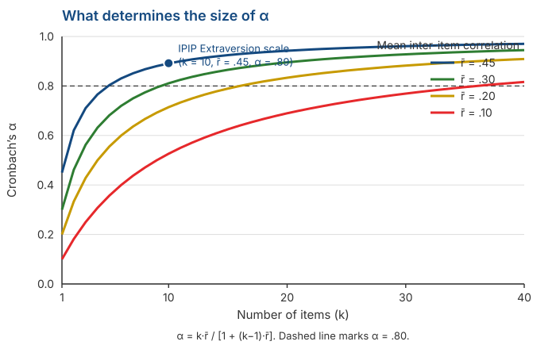

## _Outline_

::: {.incremental}

* Reliability is not one thing: **three different questions**
* *Split-half* and the **Spearman-Brown** formula we have twice deferred
* ***Cronbach's alpha***: what it actually measures, and what it does not
* A demonstration with real data: **$\alpha$ cannot detect multidimensionality**
* The ***omega*** coefficient and the tau-equivalence assumption from Session 3
* Computing it in **jamovi**, and what you should report

:::

::: aside
***Disclosure* on the use of artificial intelligence (AI)**

We used Claude Code (Opus 5 and Sonnet 5) to brainstorm material, locate references, and troubleshoot `quarto` and `git` code. We (Amel and Dian) take full responsibility for the substance and presentation of these slides.

:::

# From a definition to a computation {background-color="#14497F" .center}

## What we already have

In Session 3 we defined reliability as a proportion of variance:

$$\rho_{XX'} = \frac{\sigma^2_T}{\sigma^2_X}$$

. . .

::: {.incremental}

* The problem is that $\sigma^2_T$ is **unobservable**. So that formula cannot be computed directly.

* Everything in today's session is about **estimating it** from something we can observe: correlations.

:::

. . .

::: {.callout-note}
#### The data we use today
Every number on the following slides is computed from `data/data.csv` in this course repository — 50 IPIP *Big Five* items, **n = 19,718**. You can reproduce all of it in jamovi.
:::

# Reliability is not one thing {background-color="#14497F" .center}

## Three different questions

| Question | Source of error examined | Method |
|---|---|---|
| Are scores stable **over time**? | Momentary fluctuation | *Test-retest* |
| Are scores equivalent **across forms**? | Item selection | *Alternate forms* |
| Are the items **consistent with each other**? | Variation between items | *Split-half*, $\alpha$, $\omega$ |

. . .

::: {.callout-warning}
#### These are not three ways of computing the same thing
Each examines a **different source of error**. A scale can be highly internally consistent and yet completely unstable from one week to the next.

Reporting $\alpha$ tells you **nothing** about the stability of your scores over time.
:::

## Test-retest

::: {.incremental}

* Measure the same people twice and correlate the two scores.

* **The interval matters a great deal.** Too short and respondents remember their answers; too long and the attribute may genuinely have changed.

* There is one problem that cannot be avoided: if the correlation is low, we **cannot tell** whether the instrument is unreliable or the people have changed.

:::

. . .

::: {.callout-note}
#### For your project
Test-retest requires reaching the same respondents twice. Given this semester's schedule, that is **not realistic**.

What matters is that you know the internal consistency you will compute **does not substitute** for this information.
:::

# Split-half and Spearman-Brown {background-color="#14497F" .center}

## A simple idea

::: {.incremental}

* Split the scale into two halves — say odd-numbered and even-numbered items.

* Compute a total for each half and correlate them.

* If both halves measure the same thing, the correlation should be high.

:::

. . .

For the IPIP Extraversion scale (10 items), the odd-even correlation is:

$$r = 0.748$$

## But there is a problem

::: {.incremental}

* That correlation is the reliability of a **5-item test**, not a 10-item one.

* We have just cut our scale in half and then reported the reliability of the halved version.

* Recall from Session 3: fewer items means a larger share of error. So 0.748 **underestimates** the real reliability of the scale.

:::

. . .

::: {.callout-tip}
#### What we need
A formula that answers: *"if a test of this length has reliability X, what would its reliability be if we doubled its length?"*
:::

## The Spearman-Brown formula

For split-half, correcting from half length to full length:

$$\rho_{\text{full}} = \frac{2r}{1+r}$$

. . .

With $r = 0.748$:

$$\rho = \frac{2 \times 0.748}{1 + 0.748} = \frac{1.496}{1.748} = \mathbf{0.856}$$

. . .

::: {.callout-note}
The formula was derived independently by **Spearman (1910)** and **Brown (1910)** in the same year and the same journal, which is why both names are attached.
:::

## The general form

If test length is multiplied by $n$:

$$\rho^* = \frac{n\rho}{1 + (n-1)\rho}$$

. . .

This is the formula we have **deferred twice** — in Session 1 with Bernoulli's arrows, and in Session 3 when explaining why adding items raises reliability.

. . .

::: {.callout-warning}
#### The condition people forget
The formula assumes the added items are **equivalent** to the existing ones. Adding ten careless items will not produce this result.
:::

## But which half?

::: {.incremental}

* A 10-item scale can be split into halves in **126 different ways**. Odd-even is only one of them.

* We tried **500 random splits** of the Extraversion scale. The Spearman-Brown results ranged from **0.845 to 0.920**.

* So the answer depends on which split you happen to choose. That is not an ideal situation.

:::

. . .

::: {.callout-tip}
#### The way out
If every split gives a different answer, **take the average of all of them**.

That is what Cronbach's alpha does.
:::

# Cronbach's alpha {background-color="#14497F" .center}

## The formula

$$\alpha = \frac{k}{k-1}\left(1 - \frac{\sum \sigma^2_i}{\sigma^2_X}\right)$$

where $k$ is the number of items, $\sigma^2_i$ each item's variance, and $\sigma^2_X$ the variance of the total score.

. . .

::: {.incremental}

* Note what is being compared: **the sum of item variances** against **the variance of the total**.

* If items do not correlate, the total variance is just the sum of item variances, and $\alpha$ approaches zero.

* If items correlate strongly, the total variance is much larger, and $\alpha$ approaches one.

:::

## $\alpha$ is the average of all splits

::: {.incremental}

* Across those 500 random splits, the mean Spearman-Brown coefficient was **0.892**.

* Cronbach's alpha for the same scale is **0.892**.

* Exactly the same number.

:::

. . .

::: {.callout-note}
#### What $\alpha$ actually is
$\alpha$ is not a special coefficient. It is **the average of all possible split-halves** of your scale (Cronbach, 1951).

That is how it solves the "which half?" problem: it uses all of them.
:::

## What determines the size of $\alpha$

{.nostretch fig-align="center" width="68%"}

## Only two things

::: {.incremental}

* The **number of items** ($k$) and the **mean inter-item correlation** ($\bar{r}$). Nothing else.

$$\alpha = \frac{k\bar{r}}{1 + (k-1)\bar{r}}$$

* The Extraversion scale: $\bar{r} = .45$ with 10 items gives $\alpha = .89$.

* Look at the bottom curve: with $\bar{r} = .10$ you would need **more than 35 items** to pass .80.

:::

. . .

::: {.callout-warning}
#### A consequence worth noting
Because $k$ is part of it, **a high $\alpha$ can be bought simply by adding items**. You do not need better items; you just need more of them.
:::

## Spearman-Brown projections for our scale

Starting from $\alpha = .892$ at 10 items:

| Number of items | Projected $\alpha$ |
|:--:|:--:|
| 5 | .805 |
| 10 | **.892** |
| 20 | .943 |
| 30 | .961 |

. . .

::: {.incremental}

* Doubling the scale from 10 to 20 items raises $\alpha$ by .05. Adding 10 more items (20 to 30, a 50% increase) adds only .018.

* **The returns keep shrinking** while respondent burden keeps growing.

:::

## About the .70 threshold

::: {.incremental}

* Almost everyone cites **.70** as the minimum, and attributes it to Nunnally.

* Lance, Butts, & Michels (2006) went back to the source. Nunnally proposed .70 only for **the early stages of research**; for basic research he recommended **.80**, and for decisions about individuals **.90 or higher**.

* The .70 used everywhere is, in effect, **a misapplied citation**.

:::

. . .

::: {.callout-warning}
#### What to do instead
Do not treat .70 as pass or fail. **Match it to what your scores are for**: for group-level research .70 is adequate; for decisions about individuals it is nowhere near enough.

Recall the SEM computation from Session 3 — that is how to check it concretely.
:::

# What $\alpha$ does not measure {background-color="#14497F" .center}

## An experiment

::: {.incremental}

* We took **5 Extraversion items** and **5 Neuroticism items** from the same dataset.

* They clearly measure **different** constructs. The combined scale makes no substantive sense.

* We then treated them as a single 10-item scale and computed $\alpha$.

:::

. . .

::: {.r-fit-text}
$\alpha = 0.616$
:::

## Look at that number

::: {.incremental}

* 0.616 **does not look problematic**. It looks like a middling scale that could be improved.

* Many reports would describe it as "acceptable" and carry on with the analysis.

* Yet that scale **mixes two different constructs**, and we know it does, because we built it that way on purpose.

:::

. . .

::: {.callout-warning}
#### The main point of today's session
**$\alpha$ was never designed to detect how many dimensions live inside your scale.** It looks only at the mean inter-item correlation and the number of items.
:::

## What is actually going on inside

| | Mean correlation |
|---|:--:|
| Between items within the Extraversion block | .507 |
| Between items within the Neuroticism block | .421 |
| **Between blocks** | **−.125** |

. . .

::: {.incremental}

* Within each block the correlations are high. That alone is enough to lift $\alpha$ to .616.

* The between-block correlation is small and negative — a sign that these are not one thing.

* The eigenvalues of the correlation matrix: **3.53 — 2.23 — 0.79**. The first two are both large, meaning **two** dimensions, not one.

:::

## Now compute $\omega$

::: {.r-fit-text}
$\alpha = 0.616$ but $\omega = 0.151$
:::

 

. . .

::: {.incremental}

* $\omega$ asks a different question: **what proportion of total score variance comes from one general factor?**

* For this mixed set the answer is almost none — because there is no single general factor there.

* The gap between .616 and .151 is the gap between *"these items correlate"* and *"these items measure one thing"*.

:::

# Omega {background-color="#14497F" .center}

## Why $\alpha$ needs a companion

::: {.incremental}

* Recall from Session 3: $\alpha$ assumes the **tau-equivalent** model, in which every item relates **equally strongly** to the latent variable.

* If your items are really congeneric — and they almost always are — that assumption does not hold.

* $\omega$ makes no such assumption. It uses each item's loading as it is.

:::

. . .

$$\omega = \frac{\left(\sum \lambda_i\right)^2}{\left(\sum \lambda_i\right)^2 + \sum \psi_i}$$

where $\lambda_i$ is item $i$'s loading and $\psi_i$ its error variance.

## On a genuinely unidimensional scale

The IPIP Extraversion scale, 10 items:

| | Value |
|---|:--:|
| Cronbach's $\alpha$ | .892 |
| McDonald's $\omega$ | .893 |
| Loading range | .55 – .76 |

. . .

::: {.incremental}

* The two are **almost identical**. That is not a coincidence.

* The loadings are fairly uniform (.55 to .76), so the violation of tau-equivalence here is **small**.

:::

. . .

::: {.callout-note}
#### A note on this
$\omega$ is **not** always larger or smaller than $\alpha$. When items are uniform, the two sit close together. The difference appears precisely when there is something you need to know about.
:::

## When they diverge

::: {.incremental}

* **When item loadings vary widely.** Here $\alpha$ tends to fall below the true reliability.

* **When the scale is multidimensional.** Here $\alpha$ still looks reasonable while $\omega$ collapses — exactly as in the demonstration.

:::

. . .

::: {.callout-tip}
#### How to use this in practice
Compute **both**. If $\alpha$ and $\omega$ are close, you have additional evidence that your scale's structure is reasonably clean. If they are far apart, that is **a sign that something needs checking**, not a choice of which number to use.
:::

## But neither replaces checking dimensionality

::: {.incremental}

* Both $\alpha$ and $\omega$ are **single numbers** summarising an entire scale.

* A single number cannot tell you **how many dimensions** live in your items.

* For that you have to look at the correlation structure itself: eigenvalues, a scree plot, or a factor analysis.

:::

. . .

::: {.callout-warning}
In Session 13 you will do this on your group's pilot data. The order matters: **check dimensionality first, then compute reliability** — separately for each dimension.
:::

# Precision at the individual level {background-color="#14497F" .center}

## SEM with real numbers

The IPIP Extraversion scale: $\sigma_X = 9.22$ and $\alpha = .892$.

$$SEM = \sigma_X\sqrt{1-\alpha} = 9.22 \times \sqrt{0.108} = \mathbf{3.03}$$

. . .

A 95% interval for someone scoring **30**:

$$30 \pm 1.96 \times 3.03 \;\approx\; 24.1 \text{ to } 35.9$$

. . .

::: {.callout-warning}
#### Note the width of that interval
This is a scale with $\alpha = .89$ — excellent by any criterion. Yet one person's confidence interval is **nearly 12 points wide** on a scale running from 10 to 50.

Two people scoring 30 and 35 **cannot** be said to differ.
:::

## Why this matters for Session 14

::: {.incremental}

* When you build norms, you will cut the score distribution into categories.

* If a category is narrower than the SEM, that category is **unstable**: the same person can move between categories simply by responding on a different day.

* A high $\alpha$ does **not** exempt you from this.

:::

# Implementation in jamovi {background-color="#14497F" .center}

## The steps

::: {.incremental}

1. Open the data, then **Analyses → Factor → Reliability Analysis**.

2. Move all of your scale's items into the **Items** box.

3. Open the **Reverse Scored Items** panel and move any **reverse-worded** items into it. Do not skip this step.

4. Under **Scale Statistics**, tick **Cronbach's α** and **McDonald's ω**.

5. Under **Item Statistics**, tick **item-rest correlation** plus **Cronbach's α** and **McDonald's ω** *if item dropped*.

:::

. . .

::: {.callout-warning}
#### The most common mistake
Forgetting to reverse the reverse-worded items. When that happens, your $\alpha$ drops sharply and you conclude the scale is faulty — when what is faulty is the scoring.

The tell-tale sign: **a negative item-rest correlation**.
:::

## What you will see

**Scale Reliability Statistics**

| | mean | sd | Cronbach's α | McDonald's ω |
|---|:--:|:--:|:--:|:--:|
| scale | 30.1 | 9.22 | .892 | .893 |

. . .

**Item Reliability Statistics** (extract)

| Item | item-rest correlation | α if item dropped |
|---|:--:|:--:|
| E5 | .71 | .876 |
| E7 | .70 | .877 |
| E4 | .68 | .878 |
| E1 | .63 | .882 |
| E8 | .52 | .889 |

## How to read it

::: {.incremental}

* **Item-rest correlation** — the correlation between that item and the sum of the others. Below **.30** is usually considered weak; a **negative** value almost always means a scoring error.

* **α if item dropped** — compare with the overall α. If dropping an item **raises** α, that item needs examining.

* In this table, **no** item raises α above .892 when dropped. Even the weakest, E8, is still earning its place.

:::

. . .

::: {.callout-tip}
#### Something to be careful about
Do not drop items purely on the numbers. If an item is **conceptually essential** to defining your construct, removing it to raise α means trading content validity for a higher coefficient.

We take this up further in Sessions 7 and 11.
:::

## Checking dimensionality

::: {.incremental}

* **Analyses → Factor → Exploratory Factor Analysis**, then look at the **eigenvalues** and the **scree plot**.

* If only one eigenvalue is much larger than the rest, your scale is probably unidimensional.

* If there are two or more, compute reliability **per dimension**, not across all items.

:::

. . .

::: {.callout-note}
For the mixed set earlier, the eigenvalues were 3.53 and 2.23 — both large. That is precisely what $\alpha = .616$ could not reveal.
:::

# What you should report {background-color="#14497F" .center}

## The minimum list

::: {.incremental}

* **Which coefficient and its value** — name $\alpha$, $\omega$, or both. Do not just write "reliability".

* **How many items** were included, and **which were reverse-keyed**.

* **Sample size and characteristics** — recall from Session 3 that these coefficients depend on the sample.

* **Evidence about dimensionality**, at minimum eigenvalues or a scree plot.

* **SEM**, if your scores will be used to interpret individuals.

:::

. . .

::: {.callout-tip}
#### An example of how to report it
*"This 10-item scale had $\alpha = .89$ and $\omega = .89$ in n = 200 undergraduates (aged 18–23). Exploratory factor analysis indicated one dominant factor (eigenvalue 4.5 versus 0.9). SEM = 3.0."*
:::

# Group discussion {background-color="#14497F" .center}

## Four situations

Discuss in your group, **25 minutes**. For each: **what do you conclude, and what would you do next?**

::: {.incremental}

**A.** A 30-item scale, $\alpha = .95$, mean inter-item correlation .42. The researcher concludes the scale is excellent.

**B.** A 10-item scale, $\alpha = .62$, $\omega = .20$, two large eigenvalues.

**C.** A 4-item scale, $\alpha = .55$. The group wants to push it above .70.

**D.** One item has an item-rest correlation of **−.38**.

:::

::: {.notes}
Expected answers — A: the high α is largely because k = 30; check whether the items are redundant
(a local independence violation from Session 2) and whether the respondent burden is justified.
B: clearly two dimensions; separate them first, do not report a single coefficient. C: raise it by
writing better items or adding equivalent ones — not by dropping items, since k is already small;
show them the Spearman-Brown projection. D: almost certainly a reverse-worded item that was not
reversed; check the scoring before concluding anything about the item.
:::

## Closing questions

::: {.incremental}

1. Of the four situations, which would be **most problematic** if it reached a final report? Why?

2. For your group's construct, how many items can you realistically write, and what **mean inter-item correlation** do you expect?

3. Will your group's scores be used to **describe a group** or to **interpret individuals**? How does that change the reliability standard you should aim for?

:::

. . .

::: {.callout-tip}
Question 3 is decisive, but is rarely asked.
:::

# Summary {background-color="#14497F" .center}

## Six key points

::: {.incremental}

1. **Reliability is not one thing.** Stability over time and internal consistency are different questions.

2. **Spearman-Brown** corrects split-half to full length, and explains why adding items raises reliability.

3. **$\alpha$ is the average of all possible split-halves**, and is determined only by $k$ and $\bar{r}$.

4. **A high $\alpha$ can be bought by adding items**, and **$\alpha$ cannot detect multidimensionality** — $\alpha = .62$ with $\omega = .15$ is the proof.

5. **Compute $\alpha$ and $\omega$ together**, and check dimensionality separately.

6. **The .70 threshold is not a fixed rule.** The standard depends on what the scores are for.

:::

## For Session 7

We turn to **validity** — and a much harder question.

::: {.incremental}

* Why validity is a property of **score interpretations**, not of a scale. We touched on it in Session 3; next week we take it in full.
* The kinds of **evidence** for validity, and why the old three-way division (content, criterion, construct) has been abandoned.
* Content validity and its connection to the CVI you will compute in Session 11.
* Why high reliability **guarantees nothing** about validity.

:::

. . .

::: {.callout-tip}
#### Preparation
Read **DeVellis & Thorpe (2022), Chapter 4**. If you have time, the *Psychometric Validity* chapter of [Bikos](https://lhbikos.github.io/ReC_Psychometrics/).
:::

## Any questions❓

{fig-align="center"}

::: {.callout-note}
### Notes

* These slides were built with  and [**Quarto**](https://quarto.org), using the [UNAIR Theme](https://github.com/rameliaz/quarto-unair-theme) template.
* Reach me at <i class="fas fa-paper-plane"></i> <a href="mailto:amelia.zein@psikologi.unair.ac.id">amelia.zein@psikologi.unair.ac.id</a>
:::

## References {.smaller}

Brown, W. (1910). Some experimental results in the correlation of mental abilities. *British Journal of Psychology, 3*(3), 296–322.

Cortina, J. M. (1993). What is coefficient alpha? An examination of theory and applications. *Journal of Applied Psychology, 78*(1), 98–104.

Cronbach, L. J. (1951). Coefficient alpha and the internal structure of tests. *Psychometrika, 16*(3), 297–334.

DeVellis, R. F., & Thorpe, C. T. (2022). *Scale development: Theory and applications* (5th ed.). SAGE.

Dunn, T. J., Baguley, T., & Brunsdon, C. (2014). From alpha to omega: A practical solution to the pervasive problem of internal consistency estimation. *British Journal of Psychology, 105*(3), 399–412.

Lance, C. E., Butts, M. M., & Michels, L. C. (2006). The sources of four commonly reported cutoff criteria: What did they really say? *Organizational Research Methods, 9*(2), 202–220.

McDonald, R. P. (1999). *Test theory: A unified treatment*. Lawrence Erlbaum.

Revelle, W., & Zinbarg, R. E. (2009). Coefficients alpha, beta, omega, and the glb: Comments on Sijtsma. *Psychometrika, 74*(1), 145–154.

Schmitt, N. (1996). Uses and abuses of coefficient alpha. *Psychological Assessment, 8*(4), 350–353.

Sijtsma, K. (2009). On the use, the misuse, and the very limited usefulness of Cronbach's alpha. *Psychometrika, 74*(1), 107–120.

Spearman, C. (1910). Correlation calculated from faulty data. *British Journal of Psychology, 3*(3), 271–295.

::: aside
Example data: IPIP *Big Five Factor Markers*, [Open Psychometrics](https://openpsychometrics.org/_rawdata/) (n = 19,718 after listwise deletion).
:::
