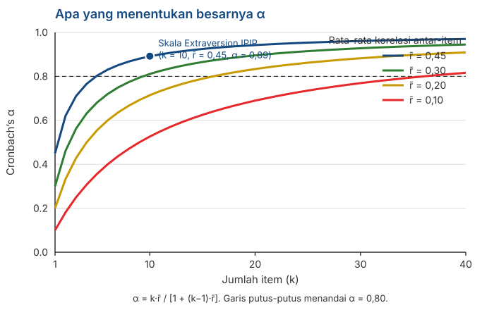

## _Outline_

::: {.incremental}

* Reliabilitas terdiri atas **tiga pertanyaan yang berbeda**
* *Split-half* dan rumus **Spearman-Brown** 
* ***Cronbach's alpha***: apa yang sebenarnya diukurnya
* Demonstrasi dengan data riil: **$\alpha$ tidak bisa mendeteksi multidimensionalitas**
* Koefisien ***omega*** dan asumsi *tau-equivalent* dari Pertemuan 3
* Menghitungnya di **jamovi**, dan apa yang sebaiknya Anda laporkan

:::

::: aside
***Disclosure* penggunaan akal imitasi (AI)**

Kami menggunakan Claude Code (Model Opus 5 dan Sonnet 5) untuk *brainstorming* materi, mencari referensi, dan melakukan *troubleshooting* kode `quarto` dan `git`. Kami (Amel dan Dian) bertanggung jawab penuh atas substansi dan penyajian presentasi ini.

:::

# Dari definisi ke perhitungan {background-color="#14497F" .center}

## Yang sudah kita punya

Di Pertemuan 3 kita mendefinisikan reliabilitas sebagai proporsi varians:

$$\rho_{XX'} = \frac{\sigma^2_T}{\sigma^2_X}$$

. . .

::: {.incremental}

* Masalahnya, $\sigma^2_T$ **tidak bisa kita amati**. Jadi rumus itu tidak bisa langsung dihitung.

* Seluruh isi pertemuan hari ini adalah tentang **cara mengestimasinya** dari sesuatu yang bisa kita amati: korelasi antar-item.

:::

. . .

::: {.callout-note}
#### Data yang kita pakai hari ini
Semua angka pada slide-slide berikut dihitung dari `data/data.csv` di repositori mata kuliah ini — 50 item IPIP *Big Five*, **n = 19.718**. Anda bisa menghitung ulang semuanya sendiri di `jamovi`.
:::

# Reliabilitas {background-color="#14497F" .center}

## Tiga pertanyaan yang berbeda

| Pertanyaan | Sumber *error* yang diperiksa | Metode |
|---|---|---|
| Apakah skornya stabil **lintas waktu**? | Fluktuasi sesaat | *Test-retest* |
| Apakah skornya setara **antar bentuk tes yang berbeda**? | Pemilihan item | *Alternate forms* |
| Apakah item-itemnya **saling konsisten** secara internal? | Variasi antar-item | *Split-half*, $\alpha$, $\omega$ |

. . .

::: {.callout-warning}
#### Tiga cara yang berbeda
Ketiganya menguji **sumber *error* yang berbeda**. Sebuah skala bisa sangat konsisten secara internal tetapi sama sekali tidak stabil antarwaktu (e.g., dari minggu ke minggu).

Melaporkan $\alpha$ **tidak memberikan informasi apapun** tentang stabilitas skor Anda antarwaktu.
:::

## *Test-retest*

::: {.incremental}

* Ukur orang yang sama dua kali, lalu korelasikan kedua skornya.

* **Jarak waktunya sangat menentukan.** Terlalu dekat, responden masih ingat jawabannya. Terlalu jauh, atribut ukurnya mungkin memang sudah berubah.

* Ada satu persoalan yang tidak bisa dihindari: kalau korelasinya rendah, kita **tidak bisa membedakan** apakah alat ukurnya tidak reliabel atau orangnya memang berubah.

:::

# Split-half dan Spearman-Brown {background-color="#14497F" .center}

## Intinya

::: {.incremental}

* Belah skala menjadi dua bagian — misalnya item ganjil dan item genap.

* Hitung skor total tiap bagian, lalu korelasikan keduanya.

* Kalau kedua bagian mengukur hal yang sama, korelasinya harus tinggi.

:::

. . .

Pada skala Extraversion IPIP (10 item), korelasi antara belahan item ganjil dan genap adalah:

$$r = 0{.}748$$

## Tetapi ada masalah

::: {.incremental}

* Korelasi itu adalah reliabilitas **tes sepanjang 5 item**, bukan 10 item.

* Kita baru saja memotong skala kita menjadi separuhnya, lalu melaporkan reliabilitas versi separuh bagian itu.

* Ingat dari Pertemuan 3: makin sedikit item, makin besar porsi *error*. Jadi angka 0.748 **lebih rendah** daripada reliabilitas skala yang sebenarnya.

:::

. . .

::: {.callout-tip}
#### Yang dibutuhkan
Rumus lain yang bisa menjawab: *"kalau tes sepanjang n punya reliabilitas x, berapa reliabilitasnya kalau panjangnya dilipatgandakan?"*
:::

## Rumus Spearman-Brown

Untuk *split-half*, koreksi dari separuh ke *full-length*:

$$\rho_{\text{penuh}} = \frac{2r}{1+r}$$

. . .

Dengan $r = 0{.}748$:

$$\rho = \frac{2 \times 0{.}748}{1 + 0{.}748} = \frac{1{.}496}{1{.}748} = \mathbf{0{.}856}$$

. . .

::: {.callout-note}
Rumus ini diturunkan secara terpisah oleh **Spearman (1910)** dan **Brown (1910)** pada tahun dan jurnal yang sama, sehingga namanya digabung.
:::

## Bentuk umumnya

Kalau panjang tes dikalikan $n$ kali:

$$\rho^* = \frac{n\rho}{1 + (n-1)\rho}$$

. . .

Ingat kembali di Pertemuan 1 kita membahas anak panah Bernoulli. Rumus Spearman-Brown ini menunjukkan mengapa menambah item menaikkan reliabilitas.

. . .

::: {.callout-warning}
#### Tetapi...
Rumus ini mengasumsikan item tambahannya **setara** dengan item yang sudah ada. Menambah sepuluh item yang ditulis asal-asalan tidak akan menghasilkan reliabilitas yang baik.
:::

## Belahan yang mana?

::: {.incremental}

* Skala 10 item bisa dibelah menjadi dua bagian dengan **126 cara berbeda**. Ganjil-genap hanyalah salah satunya.

* Kami mencoba **500 pembelahan acak** pada skala Extraversion. Hasil Spearman-Brown-nya berkisar dari **0.845 sampai 0.920**.

* Jadi jawabannya bergantung pada belahan mana yang kebetulan Anda pilih. Ini tentu bukan situasi yang ideal.

:::

. . .

::: {.callout-tip}
#### Jalan keluarnya
Kalau tiap pembelahan memberi jawaban yang berbeda, **ambil saja rata-rata dari semuanya**.

Inilah dasar rumus Cronbach's $\alpha$.
:::

# Cronbach's alpha {background-color="#14497F" .center}

## Rumusnya

$$\alpha = \frac{k}{k-1}\left(1 - \frac{\sum \sigma^2_i}{\sigma^2_X}\right)$$

dengan $k$ = jumlah item, $\sigma^2_i$ = varians tiap item, $\sigma^2_X$ = varians skor total.

. . .

::: {.incremental}

* Perhatikan apa yang dibandingkan: **jumlah varians item** dengan **varians skor total**.

* Kalau item-itemnya tidak berkorelasi, varians total hanya sebesar jumlah varians item, dan $\alpha$ mendekati nol.

* Kalau item-itemnya berkorelasi kuat, varians total jauh lebih besar, dan $\alpha$ mendekati satu.

:::

## $\alpha$ adalah rata-rata dari semua pembelahan

::: {.incremental}

* Dari 500 pembelahan acak tadi, rata-rata koefisien Spearman-Brown-nya adalah **0.892**.

* Cronbach's $\alpha$ untuk skala yang sama adalah **0.892**.

* Angkanya sama persis.

:::

. . .

::: {.callout-note}
#### Apa arti $\alpha$ sebenarnya
$\alpha$ bukan koefisien istimewa. Ia adalah **rata-rata dari seluruh kemungkinan *split-half*** pada skala Anda (Cronbach, 1951).
:::

## Apa yang menentukan besarnya $\alpha$

{.nostretch fig-align="center" width="68%"}

## Hanya dua hal

::: {.incremental}

* **Jumlah item** ($k$) dan **rata-rata korelasi antar-item** ($\bar{r}$). Tidak ada yang lain.

$$\alpha = \frac{k\bar{r}}{1 + (k-1)\bar{r}}$$

* Skala Extraversion: $\bar{r} = 0{.}45$ dengan 10 item, menghasilkan $\alpha = 0{.}89$.

* Perhatikan kurva paling bawah: dengan $\bar{r} = 0{.}10$, Anda butuh **lebih dari 35 item** untuk mencapai 0.80.

:::

. . .

::: {.callout-warning}
#### Konsekuensi yang perlu diperhatikan
Karena $k$ ikut menentukan, **$\alpha$ yang tinggi bisa dicapai hanya dengan menambah item**. Anda tidak perlu item yang lebih baik; cukup item yang lebih banyak.
:::

## Proyeksi Spearman-Brown pada skala IPIP

Mulai dari $\alpha = 0{.}892$ pada 10 item:

| Jumlah item | Proyeksi $\alpha$ |
|:--:|:--:|
| 5 | 0.805 |
| 10 | **0.892** |
| 20 | 0.943 |
| 30 | 0.961 |

. . .

::: {.incremental}

* Menggandakan panjang skala dari 10 ke 20 item menaikkan $\alpha$ sebesar 0.05. Menambah 10 item lagi (dari 20 ke 30, naik 50%) hanya menambah 0.018.

* **Tambahan keuntungannya makin lama makin kecil**, sementara beban kognitif partisipan terus bertambah.

:::

## Tentang ambang 0.70

::: {.incremental}

* Hampir semua orang mengutip **0.70** sebagai batas minimum, dan menyebut Nunnally sebagai sumbernya.

* [Lance, Butts, & Michels (2006)](https://journals.sagepub.com/doi/abs/10.1177/1094428105284919) memeriksa sumber aslinya. Nunnally menyebut 0.70 hanya untuk **tahap awal penelitian**; untuk penelitian dasar ia menyarankan **0.80**, dan untuk pengambilan keputusan tentang individu **0.90 atau lebih**.

* Angka 0.70 yang dipakai di mana-mana sebenarnya berasal dari **kutipan yang tidak tepat**.

:::

. . .

::: {.callout-warning}
#### Yang perlu Anda lakukan
Jangan memperlakukan 0.70 sebagai *threshold*. **Sesuaikan dengan tujuan penggunaan skor Anda**: untuk penelitian kelompok, 0.70 memang memadai; untuk keputusan tentang individu utamanya ketika konteksnya *high-stake*, 0.7 masih jauh dari cukup.
:::

# Apa yang tidak diukur oleh $\alpha$ {background-color="#14497F" .center}

## Sebuah percobaan

::: {.incremental}

* Kami mengambil **5 item Extraversion** dan **5 item Neuroticism** dari data yang sama.

* Keduanya jelas mengukur konstruk yang **berbeda**. Skala gabungan ini secara substantif tidak masuk akal.

* Lalu kami memperlakukannya sebagai satu skala 10 item dan menghitung $\alpha$.

:::

. . .

::: {.r-fit-text}
$\alpha = 0{.}616$
:::

## Mengapa gabungan dua skala menghasilkan $\alpha$ yang tidak terlalu jelek?

::: {.incremental}

* Angka 0.616 **tidak terlihat bermasalah**. Ia terlihat seperti skala yang sedang-sedang saja dan masih bisa diperbaiki.

* Banyak laporan akan menuliskannya sebagai "cukup memadai" dan melanjutkan analisis.

* Padahal skala itu **mencampur dua konstruk yang berbeda**.

:::

. . .

::: {.callout-warning}
#### Poinnya
**$\alpha$ tidak dirancang untuk mendeteksi berapa banyak dimensi yang ada di dalam skala Anda.** Ia hanya melihat rata-rata korelasi antar-item dan jumlah item.
:::

## Apa yang sebenarnya terjadi

| | Rata-rata korelasi |
|---|:--:|
| Antar-item di dalam subskala Extraversion | 0.507 |
| Antar-item di dalam subskala Neuroticism | 0.421 |
| **Antar-subskala** | **−0.125** |

. . .

::: {.incremental}

* Di dalam tiap subskala, korelasinya tinggi. Itu sudah cukup untuk mengangkat $\alpha$ ke 0.616.

* Korelasi antar-subskala negatif dan kecil — tanda bahwa keduanya bukan satu konstruk yang sama.

* *Eigenvalue* matriks korelasinya: **3.53 — 2.23 — 0.79**. Dua yang pertama sama-sama besar, artinya ada **dua** dimensi, bukan satu.

:::

## Sekarang hitung $\omega$

::: {.r-fit-text}
$\alpha = 0{.}616$ tetapi $\omega = 0{.}151$
:::

 

. . .

::: {.incremental}

* $\omega$ menanyakan hal yang berbeda dibandingkan $\alpha$: **berapa proporsi varians skor total yang berasal dari satu faktor laten yang general?**

* Pada campuran dua subskala ini, jawabannya nyaris tidak ada, karena memang tidak ada satu faktor umum di sana.

* Kesimpulannya
  + $\alpha$ = 0.616 artinya *"item-item ini saling berkorelasi"*
  + $\omega$ = 0.151 artinya *"item-item ini **tidak** mengukur satu konstruk yang sama"*
 
:::

# Omega {background-color="#14497F" .center}

## Kenapa $\alpha$ saja tidak cukup

::: {.incremental}

* Ingat dari Pertemuan 3: $\alpha$ mengasumsikan model **tau-equivalent**, yaitu semua item punya hubungan yang **sama kuat** dengan variabel laten.

* Kalau item Anda sebenarnya *congeneric* (dan hampir selalu seperti ini), asumsi ini tidak terpenuhi.

* $\omega$ tidak mensyaratkan asumsi tersebut. Perhitungannya memakai korelasi antara masing-masing item dengan faktor laten.

:::

. . .

$$\omega = \frac{\left(\sum \lambda_i\right)^2}{\left(\sum \lambda_i\right)^2 + \sum \psi_i}$$

dengan $\lambda_i$ = *loading* item ke-$i$, dan $\psi_i$ = varians *error* item tersebut.

## Pada skala yang benar-benar satu dimensi

Skala Extraversion IPIP, 10 item:

| | Nilai |
|---|:--:|
| Cronbach's $\alpha$ | 0.892 |
| McDonald's $\omega$ | 0.893 |
| Rentang *loading* | 0.55 – 0.76 |

. . .

::: {.incremental}

* Keduanya **hampir sama**. 

* *Loading*-nya cukup seragam (0.55 sampai 0.76), sehingga pelanggaran asumsi *tau-equivalent* di sini **kecil**.

:::

. . .

::: {.callout-note}
#### Catatan
$\omega$ **bukan** selalu lebih besar atau lebih kecil dari $\alpha$. Ketika itemnya seragam, keduanya berdekatan. Perbedaannya muncul justru ketika struktur konstruk Anda tidak unidimensional.
:::

## Kapan keduanya berbeda jauh

::: {.incremental}

* **Ketika *loading* (i.e., korelasi antara item dengan faktor laten) item sangat beragam.** Di sini $\alpha$ cenderung lebih rendah daripada reliabilitas yang sesungguhnya.

* **Ketika skalanya multidimensional.** Di sini $\alpha$ tetap terlihat normal, sementara $\omega$ sangat rendah — persis seperti demonstrasi tadi.

:::

. . .

::: {.callout-tip}
#### Cara memakainya secara praktis
Hitung **keduanya**. Kalau $\alpha$ dan $\omega$ berdekatan, Anda punya bukti tambahan bahwa struktur skala Anda unidimensional. Kalau jaraknya jauh, itu **tanda bahwa ada asumsi tentang konstruk yang harus diperiksa**.
:::

## Tetapi keduanya tidak menggantikan pemeriksaan struktur konstruk

::: {.incremental}

* Baik $\alpha$ maupun $\omega$ adalah **satu koefisien** yang meringkas keseluruhan skala.

* Satu angka tidak bisa memberi tahu Anda **ada berapa dimensi** di dalam item Anda.

* Untuk itu Anda perlu melihat struktur korelasinya sendiri: *eigenvalue*, *scree plot*, dengan analisis faktor.

:::

# Ketepatan pada tingkat individu {background-color="#14497F" .center}

## *Standard error of measurement* (SEM) pada dataset IPIP

Skala Extraversion IPIP: $\sigma_X = 9{.}22$ dan $\alpha = 0{.}892$.

$$SEM = \sigma_X\sqrt{1-\alpha} = 9{.}22 \times \sqrt{0{.}108} = \mathbf{3{.}03}$$

. . .

Interval kepercayaan (*confidence interval*) 95% untuk seseorang yang mendapat skor **30**:

$$30 \pm 1{.}96 \times 3{.}03 \;\approx\; 24{.}1 \text{ sampai } 35{.}9$$

. . .

::: {.callout-warning}
#### Perhatikan lebar intervalnya
Ini adalah skala dengan $\alpha = 0{.}89$ — tergolong sangat baik. Namun interval kepercayaan satu orang **selebar hampir 12 poin** pada skala yang rentangnya 10 sampai 50.

Dua orang dengan skor 30 dan 35 **tidak bisa** Anda katakan berbeda signifikan.
:::

## Kenapa ini penting untuk Pertemuan 14

::: {.incremental}

* Ketika Anda menyusun norma nanti, Anda akan memotong sebaran skor menjadi kategori.

* Kalau lebar kategorinya lebih kecil daripada SEM, kategori itu **tidak stabil**: orang yang sama bisa berpindah kategori hanya karena mengisi di hari yang berbeda.

* $\alpha$ yang tinggi **tidak** menjamin Anda dari persoalan ini.

:::

# Implementasi di `jamovi` {background-color="#14497F" .center}

## Langkah-langkahnya

::: {.incremental}

1. Buka datanya, lalu **Analyses → Factor → Reliability Analysis**.

2. Pindahkan seluruh item skala Anda ke kotak **Items**.

3. Buka panel **Reverse Scored Items**, lalu pindahkan item yang **arah pernyataannya terbalik** ke sana. Jangan lupakan langkah ini.

4. Pada **Scale Statistics**, centang **Cronbach's α** dan **McDonald's ω**.

5. Pada **Item Statistics**, centang **item-rest correlation** serta **Cronbach's α** dan **McDonald's ω** *if item dropped*.

:::

. . .

::: {.callout-warning}
#### Kesalahan yang paling sering terjadi
Lupa membalik item yang terbalik. Kalau itu terjadi, $\alpha$ Anda akan turun drastis dan Anda akan mengira skalanya bermasalah — padahal yang bermasalah adalah penskorannya.

Tandanya khas: **korelasi item-rest bernilai negatif**.
:::

## Apa yang akan Anda lihat

**Scale Reliability Statistics**

| | mean | sd | Cronbach's α | McDonald's ω |
|---|:--:|:--:|:--:|:--:|
| skala | 30.1 | 9.22 | 0.892 | 0.893 |

. . .

**Item Reliability Statistics** (sebagian)

| Item | item-rest correlation | α jika item dibuang |
|---|:--:|:--:|
| E5 | 0.71 | 0.876 |
| E7 | 0.70 | 0.877 |
| E4 | 0.68 | 0.878 |
| E1 | 0.63 | 0.882 |
| E8 | 0.52 | 0.889 |

## Cara membacanya

::: {.incremental}

* **Item-rest correlation** — korelasi antara item tersebut dan jumlah item lainnya. Nilai di bawah **0.30** biasanya dianggap lemah; nilai **negatif** hampir selalu berarti salah penskoran.

* **α jika item dibuang** — bandingkan dengan α keseluruhan. Kalau membuang sebuah item **menaikkan** α, item itu perlu diperiksa.

* Pada tabel ini, **tidak ada** item yang kalau dibuang menaikkan α dari 0.892. Bahkan item terlemah, E8, tetap memberi sumbangan.

:::

. . .

::: {.callout-tip}
#### Yang perlu diperhatikan
Jangan membuang item hanya karena korelasi *item-rest*nya rendah. Kalau sebuah item **penting secara konseptual** untuk mendefinisikan konstruk Anda, membuangnya demi menaikkan α berarti Anda menukar validitas isi hanya untuk konsistensi internal.
:::

## Memeriksa dimensinya ('*nice to know*')

::: {.incremental}

* **Analyses → Factor → Exploratory Factor Analysis**, lalu perhatikan *eigenvalue* dan *scree plot*-nya.

* Kalau hanya ada satu *eigenvalue* yang jauh lebih besar dari sisanya, skala Anda kemungkinan satu dimensi.

* Kalau ada dua atau lebih, hitung reliabilitasnya **per dimensi**, bukan untuk keseluruhan item.

:::

. . .

::: {.callout-note}
Pada set campuran tadi, *eigenvalue*-nya 3.53 dan 2.23 — dua-duanya besar. Itulah yang tidak bisa dilihat dari $\alpha = 0{.}616$.
:::

# Apa yang sebaiknya Anda laporkan {background-color="#14497F" .center}

## *Checklist*

::: {.incremental}

* **Koefisien yang dipakai dan nilainya** — sebutkan $\alpha$, $\omega$, atau keduanya. Jangan cuma menulis "reliabilitas".

* **Jumlah item** yang dihitung, dan **item mana yang diskor balik**.

* **Ukuran dan karakteristik sampel** — ingat dari Pertemuan 3 bahwa koefisien ini bergantung pada sampel.

* **Bukti tentang dimensinya** (apabila memungkinkan), sekurang-kurangnya *eigenvalue* atau *scree plot*.

* **SEM**, kalau skor Anda akan dipakai untuk menafsirkan individu.

:::

. . .

::: {.callout-tip}
#### Contoh kalimat pelaporan
*"Skala 10 item ini memiliki $\alpha = 0{.}89$ dan $\omega = 0{.}89$ pada n = 200 mahasiswa S1 (usia 18–23). Analisis faktor eksploratori menunjukkan satu faktor dominan (eigenvalue 4.5 berbanding 0.9). SEM = 3.0."*
:::

# Diskusi kelompok {background-color="#14497F" .center}

## Empat situasi

Diskusikan dalam kelompok, **25 menit**. Untuk tiap situasi: **apa yang Anda simpulkan, dan apa langkah berikutnya?**

::: {.incremental}

**A.** Skala 30 item, $\alpha = 0{.}95$, rata-rata korelasi antar-item 0.42. Peneliti menyimpulkan skalanya sangat baik.

**B.** Skala 10 item, $\alpha = 0{.}62$, $\omega = 0{.}20$, dua *eigenvalue* besar.

**C.** Skala 4 item, $\alpha = 0{.}55$. Kelompok ingin menaikkannya sampai di atas 0.70.

**D.** Satu item punya *item-rest correlation* sebesar **−0.38**.

:::

::: {.notes}
Jawaban yang diharapkan — A: α tinggi sebagian besar karena k = 30; perlu dicek apakah itemnya
redundan (pelanggaran local independence dari Pertemuan 2), dan apakah beban responden sepadan.
B: jelas dua dimensi; pisahkan dulu, jangan laporkan satu koefisien. C: naikkan lewat penulisan
item yang lebih baik atau tambah item setara — bukan dengan membuang item, karena k sudah kecil;
tunjukkan proyeksi Spearman-Brown. D: hampir pasti item terbalik yang lupa dibalik; periksa
penskorannya sebelum menyimpulkan apa pun tentang itemnya.
:::

## Pertanyaan penutup

::: {.incremental}

1. Dari keempat situasi tadi, mana yang **paling bermasalah** kalau lolos ke laporan akhir? Kenapa?

2. Untuk konstruk kelompok Anda, berapa banyak item yang realistis Anda tulis, dan **rata-rata korelasi antar-item** seperti apa yang Anda harapkan?

3. Skor kelompok Anda akan dipakai untuk apa — **menggambarkan kelompok** atau **menafsirkan individu**? Bagaimana itu mengubah standar reliabilitas yang Anda kejar?

:::

# Rangkuman {background-color="#14497F" .center}

## Enam poin utama

::: {.incremental}

1. **Reliabilitas berkaitan dengan beberapa sumber *error*.** Stabilitas lintas waktu dan konsistensi internal adalah pertanyaan yang berbeda.

2. **Spearman-Brown** mengoreksi *split-half* ke *full-length*, dan menjelaskan kenapa menambah item menaikkan reliabilitas.

3. **$\alpha$ adalah rata-rata dari seluruh kemungkinan *split-half***, dan hanya ditentukan oleh $k$ dan $\bar{r}$.

4. **$\alpha$ yang tinggi bisa diusahakan dengan menambah item**, dan **$\alpha$ tidak bisa mendeteksi multidimensionalitas** — $\alpha = 0{.}62$ vs. $\omega = 0{.}15$ adalah buktinya.

5. **Hitung $\alpha$ dan $\omega$ bersama-sama**, dan periksa dimensinya secara terpisah.

6. **Ambang 0.70 bukan aturan baku.** Standarnya ditentukan oleh tujuan penggunaan skornya.

:::

## Untuk Pertemuan 7

Kita masuk ke **validitas** — dan pertanyaan yang jauh lebih sulit.

::: {.incremental}

* Kenapa validitas adalah sifat **tafsiran atas skor**, bukan sifat skala. Kita sudah menyinggungnya di Pertemuan 3; minggu depan kita bahas lebih lengkap.
* Jenis-jenis **bukti** validitas, dan kenapa pembagian lama (isi, kriteria, konstruk) sudah ditinggalkan.
* Validitas isi dan hubungannya dengan CVI yang akan Anda kerjakan di Pertemuan 11.
* Kenapa reliabilitas tinggi **tidak menjamin apapun** tentang validitas.

:::

. . .

::: {.callout-tip}
#### Persiapan
Baca **DeVellis & Thorpe (2022), Bab 4**. Kalau sempat, bab *Psychometric Validity* pada [Bikos](https://lhbikos.github.io/ReC_Psychometrics/).
:::

## Ada pertanyaan❓

{fig-align="center"}

::: {.callout-note}
### Catatan

* Paparan disusun dengan menggunakan  dan [**Quarto**](https://quarto.org) dengan *template* dari [UNAIR Theme](https://github.com/rameliaz/quarto-unair-theme).
* Kontak saya via <i class="fas fa-paper-plane"></i> <a href="mailto:amelia.zein@psikologi.unair.ac.id">amelia.zein@psikologi.unair.ac.id</a>
:::

## Rujukan {.smaller}

Brown, W. (1910). Some experimental results in the correlation of mental abilities. *British Journal of Psychology, 3*(3), 296–322.

Cortina, J. M. (1993). What is coefficient alpha? An examination of theory and applications. *Journal of Applied Psychology, 78*(1), 98–104.

Cronbach, L. J. (1951). Coefficient alpha and the internal structure of tests. *Psychometrika, 16*(3), 297–334.

DeVellis, R. F., & Thorpe, C. T. (2022). *Scale development: Theory and applications* (5th ed.). SAGE.

Dunn, T. J., Baguley, T., & Brunsdon, C. (2014). From alpha to omega: A practical solution to the pervasive problem of internal consistency estimation. *British Journal of Psychology, 105*(3), 399–412.

Lance, C. E., Butts, M. M., & Michels, L. C. (2006). The sources of four commonly reported cutoff criteria: What did they really say? *Organizational Research Methods, 9*(2), 202–220.

McDonald, R. P. (1999). *Test theory: A unified treatment*. Lawrence Erlbaum.

Revelle, W., & Zinbarg, R. E. (2009). Coefficients alpha, beta, omega, and the glb: Comments on Sijtsma. *Psychometrika, 74*(1), 145–154.

Schmitt, N. (1996). Uses and abuses of coefficient alpha. *Psychological Assessment, 8*(4), 350–353.

Sijtsma, K. (2009). On the use, the misuse, and the very limited usefulness of Cronbach's alpha. *Psychometrika, 74*(1), 107–120.

Spearman, C. (1910). Correlation calculated from faulty data. *British Journal of Psychology, 3*(3), 271–295.

::: aside
Data contoh: IPIP *Big Five Factor Markers*, [Open Psychometrics](https://openpsychometrics.org/_rawdata/) (n = 19.718 setelah *listwise deletion*).
:::
