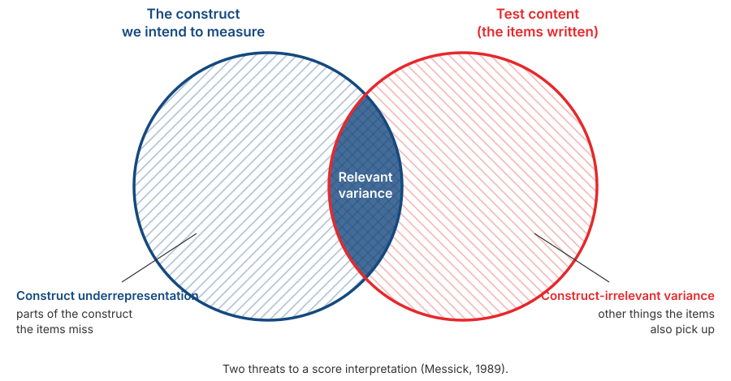

## _Outline_

::: {.incremental}

* Why validity is a property of **score interpretations**, not of a scale
* How three "types of validity" became **one concept with five sources of evidence**
* Those five sources, one at a time
* *Construct underrepresentation* and *construct-irrelevant variance*
* Why pushing $\alpha$ ever higher can actually **reduce** validity
* A realistic plan for collecting evidence in your project

:::

::: aside
***Disclosure* on the use of artificial intelligence (AI)**

We used Claude Code (Opus 5 and Sonnet 5) to brainstorm material, locate references, and troubleshoot `quarto` and `git` code. We (Amel and Dian) take full responsibility for the substance and presentation of these slides.

:::

# From reliability to validity {background-color="#14497F" .center}

## The question still open

::: {.incremental}

* Session 6 gave us ways to compute **consistency**: $\alpha$, $\omega$, split-half.

* All of those coefficients answer the same question: *are the scores stable?*

* None of them answers: *do the scores reflect what we intended?*

:::

. . .

::: {.callout-note}
Recall the bathroom scale from Session 3. A scale that is always 2 kg out is perfectly consistent. Consistency can never detect a systematic error.
:::

# Validity is a property of score interpretations {background-color="#14497F" .center}

## The formal definition

> Validity refers to the degree to which evidence and theory support the interpretations of test scores for proposed uses of tests.
>
> — AERA, APA, & NCME (2014)

. . .

::: {.incremental}

* Note the subject: what is validated is an **interpretation of scores**, for a **stated use**.

* Not the test. Not the scale. Not the items.

:::

## Three consequences

::: {.incremental}

1. **Tied to a purpose.** A scale whose interpretation is supported for research is not thereby supported for job selection or clinical diagnosis.

2. **Tied to a population.** Evidence gathered on students does not automatically transfer to factory workers or schoolchildren.

3. **Never finished.** Evidence can accumulate, and it can also weaken when contradictory findings appear.

:::

. . .

::: {.callout-tip}
#### How to write it
Instead of *"our scale is valid"*, write:

*"There is evidence supporting the interpretation of scores on scale X as an indicator of construct Y, in population Z, for purpose W."*

It is a longer sentence, but it is the one you can defend.
:::

## Sentences worth fixing

| Often written | Better |
|---|---|
| "This scale is valid and reliable." | "Scores on this scale had $\alpha = \ldots$, and content and internal-structure evidence support interpreting them as …" |
| "The scale's validity was 0.62." | "Scores correlated 0.62 with …, which supports interpreting them as …" |
| "Validity testing was carried out." | "The validity evidence we collected consisted of … and …" |

. . .

::: {.callout-note}
The left column is not merely untidy. All three treat validity as something an instrument **possesses** and as something **finished once and for all**.
:::

# From three types to one concept {background-color="#14497F" .center}

## The old division

Until roughly the 1970s, textbooks divided validity into three:

::: {.incremental}

* **Content validity** — do the items represent the intended material?
* **Criterion validity** — do scores correlate with a relevant external measure, now (*concurrent*) or later (*predictive*)?
* **Construct validity** — do scores behave as theory says they should?

:::

. . .

::: {.callout-warning}
#### The problem with this division
It leads people to think there are **three separate jobs** to be ticked off one by one. In practice, many reports state that "content validity was established" and stop there.
:::

## How the view changed

::: {.incremental}

* **Cronbach & Meehl (1955)** introduced construct validity and the *nomological network*: a construct's meaning lies in its network of relations with other constructs.

* **Loevinger (1957)** went further: construct validity is **not one type among several** — it is the whole of validity.

* **Messick (1989, 1995)** unified it: validity is **a single integrated judgement** of how far evidence and theory support the inferences and actions taken from scores.

* The ***Standards* (2014)** turned this into something practical: not "types of validity" but **sources of evidence**, all supporting one interpretation.

:::

## What changed in practice

:::: {.columns}
::: {.column width="50%"}

### The old way

"We conducted content validity testing, then construct validity testing."

Three boxes ticked.

:::
::: {.column width="50%"}

### The current way

"Here is the evidence we collected to support this interpretation, and here is what we do not have."

One argument built from several sources.

:::
::::

. . .

::: {.callout-tip}
This change requires more honesty: you have to name the evidence you **lack**, not only the evidence you have.
:::

# The five sources of evidence {background-color="#14497F" .center}

## The list

| Source of evidence | The question it asks | Can you do it? |
|---|---|:--:|
| **Test content** | Do the items represent the construct? | Yes (S11) |
| **Response processes** | Do respondents think the way we assume? | Yes (before S12) |
| **Internal structure** | Does the item structure match the theory? | Yes (S13) |
| **Relations to other variables** | Do the scores behave as theory predicts? | Partly (S12) |
| **Consequences of use** | What follows from using these scores? | Discussed in the manual (S14) |

::: aside
AERA, APA, & NCME (2014).
:::

# Evidence 1: test content {background-color="#14497F" .center}

## The question

::: {.incremental}

* Do the items you wrote **represent the whole construct** you intend?

* To answer that, you first need **a clear definition of the domain** — what is in and what is out.

* That is the work of Session 9. Without a clear construct boundary, there is no way to judge whether the items represent it.

:::

## Two threats

{.nostretch fig-align="center" width="76%"}

## Reading that figure

::: {.incremental}

* ***Construct underrepresentation*** — parts of the construct that your items **fail to capture**. An anxiety scale containing only physical symptoms, with no cognitive ones, has this problem.

* ***Construct-irrelevant variance*** — your items **also measure something else**. A maths problem written in long, convoluted sentences also measures reading ability.

* The overlap in the middle is the part that is actually doing useful work.

:::

. . .

::: {.callout-tip}
#### The two most useful terms from this session
If you take only two terms from today through to your final report, take these. Almost any criticism of a scale can be phrased as one or the other.
:::

## How to collect the evidence

::: {.incremental}

* Ask a **panel of experts** to rate each item: how relevant is this item to the construct as defined?

* Compute their level of agreement. Items rated irrelevant, or on which the raters disagree, are revised.

* The standard procedure is the ***Content Validity Index*** (Lynn, 1986; Polit & Beck, 2006).

:::

. . .

::: {.callout-note}
#### You have already done a simple version of this
In Session 5 you acted as Thurstone judges: rating where each statement sits, then discarding the ones you could not agree on.

CVI uses the same logic with a different criterion. Dian will guide you through it in **Session 11**.
:::

# Evidence 2: response processes {background-color="#14497F" .center}

## The question

::: {.incremental}

* When respondents answer your items, are they actually going through **the thought process you assume**?

* Recall Session 2: Nisbett & Wilson showed that people often have no access to their own mental processes.

* An item can look perfect on paper and still be read by respondents in an entirely different way.

:::

## Cognitive interviewing

::: {.incremental}

* Ask a few prospective respondents to complete your items while **saying out loud what they are thinking** (*think aloud*).

* Afterwards, ask: *"What do you think this question is asking?"* and *"How did you arrive at that answer?"*

* Note any confusing words, items read two ways, and anchors that are unclear.

:::

::: aside
Willis (2005).
:::

. . .

::: {.callout-tip}
#### The cheapest step, and the one most often skipped
Just **3 to 5 people** before the pilot, and it almost always uncovers problems the authors could not see themselves.

Do this before Session 12. It costs almost nothing and usually saves a great deal of analysis work later.
:::

# Evidence 3: internal structure {background-color="#14497F" .center}

## The question

::: {.incremental}

* Does the **pattern of relations among items** match the structure your theory describes?

* If you claim your construct has three facets, does the factor analysis also show three item clusters?

* If you claim it is unidimensional, do the data support that?

:::

. . .

::: {.callout-note}
This is what you will do in **Session 13**: exploratory factor analysis, then reliability for each dimension.
:::

## What this includes

::: {.incremental}

* **Dimensionality** — how many factors emerge, and whether items group as planned.

* **Equivalence across groups** — whether that structure is the same for men and women, or across age groups. This is assumption five from Session 2.

* **Internal consistency** — $\alpha$ and $\omega$ are also evidence about internal structure, but **weak evidence**.

:::

. . .

::: {.callout-warning}
#### Why $\alpha$ is only weak evidence
Session 6 showed it with numbers: $\alpha = .62$ on a scale that was plainly two-dimensional. A single coefficient cannot describe a structure.
:::

# Evidence 4: relations to other variables {background-color="#14497F" .center}

## Two directions, checked together

:::: {.columns}
::: {.column width="50%"}

### Convergent

Your scores **correlate** with other measures of the same or a similar construct.

Example: a new social anxiety scale correlates with an established one.

:::
::: {.column width="50%"}

### Discriminant

Your scores **do not correlate too highly** with constructs that should be distinct.

Example: a social anxiety scale does not correlate very highly with a depression scale.

:::
::::

. . .

::: {.callout-warning}
Convergent evidence alone is not enough. If your scale correlates .85 with **everything**, what you are measuring may be something very general rather than the construct you claim.
:::

## The multitrait-multimethod matrix

::: {.incremental}

* **Campbell & Fiske (1959)** proposed a way to examine both at once: measure several constructs using several methods, then compare the pattern of correlations.

* The idea: correlations between **the same construct measured by different methods** should exceed correlations between **different constructs measured by the same method**.

* If they do not, much of what you are measuring is **the method**, not the construct.

:::

. . .

::: {.callout-note}
This is why any two self-report scales tend to correlate: part of it comes from sharing a method, not from sharing a construct.
:::

## Criterion-related evidence

::: {.incremental}

* ***Concurrent*** — scores correlate with a criterion measured at the same time.

* ***Predictive*** — scores predict a criterion in the future.

* ***Known-groups*** — scores distinguish groups that theory says should differ. A social anxiety scale should give higher scores to people currently in treatment for that difficulty.

:::

. . .

::: {.callout-tip}
#### What is realistic for your project
Known-groups and concurrent evidence are still within reach. Include **one short established scale** in your pilot questionnaire in Session 12 and report the correlation.

Even a single correlation is far better than no evidence at all.
:::

## The same name does not mean the same content

::: {.incremental}

* Recall Fried's (2017) finding from Session 1: seven depression scales contained 52 different symptoms.

* So a low correlation with a "similar" scale does **not** necessarily mean your scale is poor. The two may genuinely measure different things despite sharing a name.

* What you need to check is the **content of the comparison scale**, not just its title.

:::

# Evidence 5: consequences of use {background-color="#14497F" .center}

## The idea

::: {.incremental}

* Messick argued that **the consequences of using scores** also belong to the validity argument.

* A selection test that systematically disadvantages a particular group is a problem — even if its correlation with the criterion looks good.

* The question is whether that consequence reflects a real difference, or *construct-irrelevant variance*.

:::

. . .

::: {.callout-note}
#### This part is still debated
Some scholars hold that social consequences are a policy question rather than a validity question. You do not have to take a side, but you should know the debate exists.
:::

## For the manual you will write

::: {.incremental}

* In Session 14 you will write a scale manual. That manual determines **what decisions may be made** from the scores.

* State explicitly what the scores may be used for, and what they may **not** be used for.

* A sentence such as *"this scale is not intended for clinical diagnosis or personnel selection"* is part of the validity work, not a formality.

:::

# A dissenting view {background-color="#14497F" .center}

## Borsboom's objection

::: {.incremental}

* **Borsboom, Mellenbergh, & van Heerden (2004)** consider Messick's definition too broad, mixing too many things together.

* On their account the validity question should be far simpler: **does the attribute exist, and does variation in that attribute cause variation in the scores?**

* If yes, the test is valid. If no, it is not. Usefulness and consequences, they argue, are separate questions.

:::

. . .

::: {.callout-tip}
#### Why we cover this
As with Michell's objection in Session 1: you do not have to agree. What you should know is that even a well-established concept is **still argued over** by people who work on it seriously.
:::

# Reliability and validity {background-color="#14497F" .center}

## The upper bound

From Session 3:

$$r_{XY} \leq \sqrt{\rho_{XX'}}$$

. . .

::: {.incremental}

* Low reliability **limits** the correlation you can obtain with any criterion.

* So reliability is necessary.

* But people often draw the wrong conclusion from this: that higher reliability always means better validity.

:::

## The attenuation paradox

::: {.incremental}

* **Loevinger (1954)** showed that beyond a certain point, raising internal consistency actually **lowers** validity.

* The reason is visible in the earlier figure. The easiest way to raise $\alpha$ is to write items that resemble one another.

* Items that resemble one another cover one small corner of the construct very tightly and leave the rest untouched. That is construct underrepresentation.

:::

. . .

::: {.callout-warning}
#### An example
These ten items would produce a very high $\alpha$: *"I feel sad"*, *"I often feel down"*, *"My mood is frequently low"*, and so on.

That scale measures sad mood very consistently — and does not measure sleep disturbance, loss of interest, guilt, or appetite change at all.
:::

## The conclusion

::: {.r-fit-text}
A high $\alpha$

**is not always good news.**
:::

 

. . .

Check $\alpha$ alongside content coverage. A very high value on a short scale of near-identical items should be examined first, not taken as a good sign.

# An evidence plan for your project {background-color="#14497F" .center}

## What is realistic this semester

| Source of evidence | When | How |
|---|:--:|---|
| Content | S11 | CVI from an expert panel |
| Response processes | Before S12 | Cognitive interviews, 3–5 people |
| Internal structure | S13 | Factor analysis + reliability per dimension |
| Relations to other variables | S12 | Include one short established scale |
| Consequences | S14 | Limits of use, stated in the manual |

. . .

::: {.callout-tip}
These five rows are the skeleton of the validity section of your final report. If you cannot do one of them, **say that you did not do it** — that is far better than leaving it unmentioned.
:::

# Group discussion {background-color="#14497F" .center}

## Part 1: assessing claims

Discuss for **15 minutes**. For each claim: **what evidence does it actually provide, and what is missing?**

::: {.incremental}

**A.** *"Our scale is valid because every item has an item-total correlation above .30."*

**B.** *"Our scale's validity is established by its correlation of .88 with a well-known anxiety scale."*

**C.** *"This scale has been validated on students, so it can be used for employee assessment."*

:::

::: {.notes}
Expected answers — A: item-total correlation is weak internal-structure evidence, and no evidence
at all about content or relations to other variables. B: a correlation that high raises a
discriminant question; if it measures the same thing, what is the new scale for? C: evidence does
not transfer across populations or across purposes of use.
If time is short, cover A and C only.
:::

## Part 2: planning your group's evidence

::: {.incremental}

1. Name **two aspects of your construct** most at risk of being missed by the items you have in mind (*construct underrepresentation*).

2. Name **one other thing** your items might also be picking up (*construct-irrelevant variance*).

3. **Which established scale** will you include in the pilot as a comparison? Is it for convergent or discriminant evidence?

4. What must your group's scores **not** be used for? Write one sentence.

:::

. . .

::: {.callout-tip}
Your answers to 1 and 2 will be used directly when you build the blueprint in Session 10.
:::

# Closing the first half {background-color="#14497F" .center}

## Seven sessions, one thread

::: {.incremental}

1. Psychological measurement is indirect, and its definition is still contested.
2. There are six assumptions we rely on, most of them unnoticed.
3. CTT organises those assumptions into $X = T + E$.
4. Response formats determine which assumptions you take on.
5. Other formats give up different assumptions, each at a cost.
6. Reliability can be computed, and $\alpha$ has clear limits.
7. Validity is an argument built from several sources of evidence.

:::

. . .

::: {.callout-note}
All of it comes down to one sentence: **know which assumptions you are relying on, and what follows if they are wrong.**
:::

## The midterm examination

::: {.incremental}

* It is **multiple choice**, covering **Sessions 1 to 7**.

* What is tested is not memorised names and dates but the ability to **recognise a situation**: which coefficient fits, which assumption is being violated, what a given statement actually demonstrates.

* The most likely material: levels of measurement, the six assumptions, $X = T + E$, choosing a response format, interpreting $\alpha$ and $\omega$, and the five sources of validity evidence.

:::

. . .

::: {.callout-tip}
The most useful way to revise: take any scale you can find and answer the seven questions above for it yourself.
:::

## After the midterm

::: {.incremental}

* **Session 9** — the project begins: defining the construct and the *estimand*, from literature review to operational definition.

* **Session 10** — building the blueprint and writing items.

* **Session 11 onward** — with Dian, in a different room, on a different day and time. Check the schedule again.

:::

. . .

::: {.callout-note}
From Session 9 onward, everything from the first half turns into decisions you have to make yourselves.
:::

## Any questions❓

{fig-align="center"}

::: {.callout-note}
### Notes

* These slides were built with  and [**Quarto**](https://quarto.org), using the [UNAIR Theme](https://github.com/rameliaz/quarto-unair-theme) template.
* Reach me at <i class="fas fa-paper-plane"></i> <a href="mailto:amelia.zein@psikologi.unair.ac.id">amelia.zein@psikologi.unair.ac.id</a>
:::

## References {.smaller}

AERA, APA, & NCME. (2014). *Standards for educational and psychological testing*. American Educational Research Association.

Borsboom, D., Mellenbergh, G. J., & van Heerden, J. (2004). The concept of validity. *Psychological Review, 111*(4), 1061–1071.

Campbell, D. T., & Fiske, D. W. (1959). Convergent and discriminant validation by the multitrait-multimethod matrix. *Psychological Bulletin, 56*(2), 81–105.

Cronbach, L. J., & Meehl, P. E. (1955). Construct validity in psychological tests. *Psychological Bulletin, 52*(4), 281–302.

DeVellis, R. F., & Thorpe, C. T. (2022). *Scale development: Theory and applications* (5th ed.). SAGE.

Fried, E. I. (2017). The 52 symptoms of major depression. *Journal of Affective Disorders, 208*, 191–197.

Loevinger, J. (1954). The attenuation paradox in test theory. *Psychological Bulletin, 51*(5), 493–504.

Loevinger, J. (1957). Objective tests as instruments of psychological theory. *Psychological Reports, 3*, 635–694.

Lynn, M. R. (1986). Determination and quantification of content validity. *Nursing Research, 35*(6), 382–385.

Messick, S. (1989). Validity. In R. L. Linn (Ed.), *Educational measurement* (3rd ed., pp. 13–103). Macmillan.

Messick, S. (1995). Validity of psychological assessment. *American Psychologist, 50*(9), 741–749.

Polit, D. F., & Beck, C. T. (2006). The content validity index: Are you sure you know what's being reported? *Research in Nursing & Health, 29*(5), 489–497.

Willis, G. B. (2005). *Cognitive interviewing: A tool for improving questionnaire design*. SAGE.
