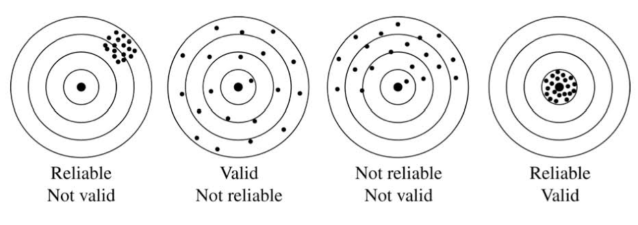
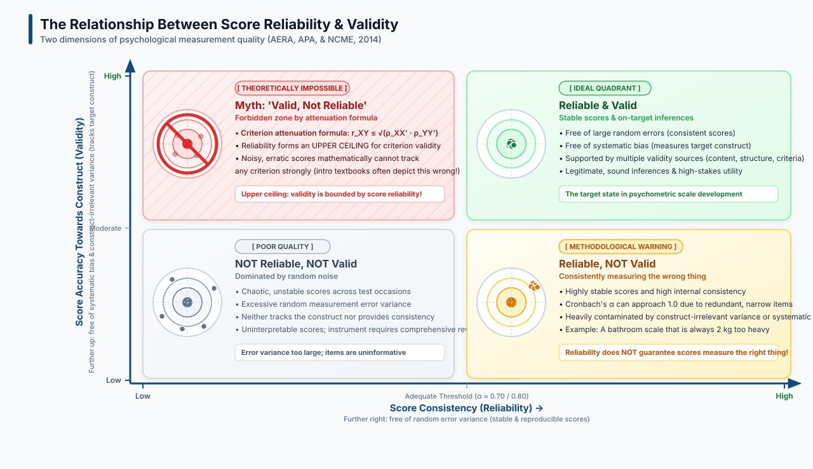
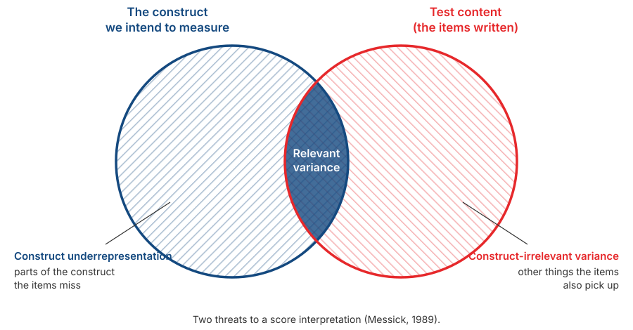

## Agenda {.agenda-slide}

1. Why validity is a property of **score interpretations**, not of a scale
2. How three "types of validity" became **one concept with five sources of evidence**
3. Those five sources, one at a time
4. Why pushing $\alpha$ ever higher can actually **reduce** validity

# From reliability to validity {background-color="#14497F" .center}

## The question still open

::: {.incremental}

* Session 6 gave us ways to compute **internal consistency**: $\alpha$, $\omega$, split-half.

* All of those coefficients answer the same question: *how consistent are the items with one another?*

* None of them answers: *do the scores reflect what we intended?*

:::

. . .

::: {.callout-note appearance="simple"}
Recall the bathroom scale from Session 3. A bathroom scale that always reads 2 kg too high still gives consistent readings. Reliability can never detect a systematic measurement error.
:::

## An illustration you have probably seen before

{.nostretch fig-align="center" width="90%"}

::: aside
A common illustration from psychological measurement textbooks.
:::

## Why this illustration is only partially correct

::: {.incremental}

* The labels *"Reliable"* and *"Valid"* are attached to the **target board itself**, as if these were properties of the instrument.
  + But in fact, both are properties of the scores the measurement produces.

* The *"Valid, Not reliable"* panel is also questionable for criterion-related validity.
  + Reliability sets an **upper bound** on the criterion-related validity coefficient (recall the attenuation formula from Session 3, $r_{XY} \leq \sqrt{\rho_{XX'} \times \rho_{YY'}}$).
  + Inconsistent, unreliable scores automatically cap how strongly they can correlate with any criterion.

:::

## A more accurate illustration

{fig-align="center"  width="120%"}

::: aside
The illustration was generated using Gemini 3.8 Flash.
:::

# Validity is a property of score interpretations {background-color="#14497F" .center}

## The formal definition

> Validity refers to the degree to which evidence and theory support the interpretations of test scores for proposed uses of tests.
>
> — AERA, APA, & NCME (2014)

. . .

::: {.incremental}

* Note the subject: what is validated is an **interpretation of scores**, for a **stated use**.

* Not the test, the scale, or the items.

:::

## Three consequences

::: {.incremental}

1. **Tied to a purpose.** A score interpretation supported by evidence for research is not thereby supported for job selection or clinical diagnosis.

2. **Tied to a population.** Evidence gathered on students does not automatically transfer to factory workers or schoolchildren.

3. **Never finished.** Evidence can accumulate, and it can also weaken when contradictory findings appear.

:::

. . .

::: {.callout-tip}
#### How to write it
Instead of *"our scale is valid"*, write:

*"There is evidence supporting the interpretation of scores on scale X as an indicator of construct Y, in population Z, for purpose W."*

It is a longer sentence, but it is the one you can defend.
:::

## Reporting validity evidence

| Often written | Better |
|---|---|
| "This scale is valid and reliable." | "Scores on this scale had $\alpha = \ldots$, and content and internal-structure evidence support interpreting them as …" |
| "The scale's validity was 0.62." | "Scores correlated 0.62 with …, which supports interpreting them as …" |
| "Validity testing was carried out." | "The validity evidence we collected consisted of … and …" |

. . .

::: {.callout-note appearance="simple"}
All three entries on the left treat validity as something an instrument **possesses** and as something **fixed**.
:::

# From three types to one concept {background-color="#14497F" .center}

## The old division

Until roughly the 1980s, and in many textbooks still today, validity was divided into three:

::: {.incremental}

* **Content validity** — do the items represent the intended material?
* **Criterion validity** — do scores correlate with a relevant external measure, now (*concurrent*) or later (*predictive*)?
* **Construct validity** — do scores behave as theory says they should?

:::

. . .

::: {.callout-warning appearance="simple"}
It leads people to think there are **three separate jobs** to be ticked off one by one. In practice, many students write "content validity was established" in their final theses and say nothing more about it.
:::

## How the view changed

::: {.incremental}

* [**Cronbach & Meehl (1955)**](https://psycnet.apa.org/record/1956-03730-001) developed the idea of construct validity, first proposed in the APA *Technical Recommendations* (1954), together with the *nomological network*: a construct's meaning lies in its network of relations with other constructs and with observable behaviour.

* [**Loevinger (1957)**](https://journals.sagepub.com/doi/abs/10.2466/pr0.1957.3.3.635) went further: construct validity is **not one type among several** but the whole of validity.

* **Messick (1989, [1995](https://doi.org/10.1037/0003-066X.50.9.741))** unified it: validity is **a single integrated judgement** of how far evidence and theory support the inferences and actions taken from scores.

* [***The Standards***](https://www.testingstandards.net/) (from the 1999 edition, retained in 2014) turned this into something practical: not "types of validity" but **sources of evidence**, all supporting one interpretation.

:::

## What changed in practice

:::: {.columns}
::: {.column width="50%"}

### The old way

"We conducted content validity testing, then construct validity testing."

:::
::: {.column width="50%"}

### The current way

"Here is the evidence we collected to support this interpretation, and here is what we do not have."

One argument built from several sources.

:::
::::

. . .

::: {.callout-tip}
This change requires transparency: you have to name the evidence you **lack**, not only the evidence you have.
:::

# The five sources of evidence {background-color="#14497F" .center}

## The list

| Source of evidence | The question it asks | Can you do it? |
|---|---|:--:|
| **Test content** | Do the items represent the construct? | Yes (S11) |
| **Response processes** | Do participants think the way we assume? | Yes (before S12) |
| **Internal structure** | Does the item structure match the theory? | Yes (S13) |
| **Relations to other variables** | Do the scores behave as theory predicts? | Partly (S12) |
| **Consequences of use** | What follows from using these scores? | Discussed in the manual (S14) |

::: aside
AERA, APA, & NCME (2014).
:::

# Evidence 1: test content {background-color="#14497F" .center}

## The question

::: {.incremental}

* Do the items you wrote **represent the whole construct** you intend?

* To answer that, you first need **a clear definition of the domain** — what is in and what is out.

* That is the work of Session 9. Without a clear construct boundary, there is no way to judge whether the items represent it.

:::

## Two threats

{.nostretch fig-align="center" width="76%"}

## *Underrepresentation* vs. *irrelevant*

::: {.incremental}

* ***Construct underrepresentation*** — parts of the construct that your items **fail to capture**. An anxiety scale containing only physical symptoms, with no cognitive ones, has this problem.

* ***Construct-irrelevant variance*** — your items **also measure something else**. A maths problem written in long, convoluted sentences also measures reading ability.

:::

## How to collect the evidence

::: {.incremental}

* Ask a **panel of experts** to rate each item: how relevant is this item to the construct as defined?

* Compute their level of agreement. Items rated irrelevant, or on which the raters disagree, are revised.

* A widely used procedure is the ***Content Validity Index*** ([Lynn, 1986](https://www.ovid.com/jnls/nursingresearchonline/abstract/00006199-198611000-00017~determination-and-quantification-of-content-validity?an=00006199-198611000-00017&redirectionsource=fulltextview); [Polit & Beck, 2006](https://onlinelibrary.wiley.com/doi/abs/10.1002/nur.20147)).

:::

. . .

::: {.callout-note appearance="simple"}
In Session 5 you acted as Thurstone judges: rating where each statement sits, then discarding the ones you could not agree on.

CVI uses the same logic with a different criterion.
:::

# Evidence 2: response processes {background-color="#14497F" .center}

## The question

::: {.incremental}

* When participants answer your items, are they actually going through **the thought process you assume**?

* Recall Session 2: [Nisbett & Wilson (1977)](https://psycnet.apa.org/record/1978-00295-001) showed that people often have no access to their own mental processes.

* An item can look perfect on paper and still be read by participants in an entirely different way.

:::

## Cognitive interviewing

::: {.incremental}

* Ask a few prospective participants to complete your items while **saying out loud what they are thinking** (*think aloud*).

* Afterwards, ask: *"What do you think this question is asking?"* and *"How did you arrive at that answer?"*

* Note any confusing words, items read two ways, and anchors that are unclear.

:::

::: aside
[Willis (2005)](https://doi.org/10.4135/9781412983655).
:::

. . .

::: {.callout-tip}
#### The easiest step, and the one most often skipped
**Three to five people** before the pilot is enough, ideally in two rounds, and it almost always uncovers problems the authors could not see themselves.

Do this before Session 12. It costs almost nothing and usually saves a great deal of analysis work later.
:::

# Evidence 3: internal structure {background-color="#14497F" .center}

## The question

::: {.incremental}

* Does the **pattern of relations among items** match the structure your theory describes?

* If you claim your construct has three facets, does the factor analysis also show three item clusters?

* If you claim it is unidimensional, do the data support that?

:::

## What this includes

::: {.incremental}

* **Dimensionality** — how many factors emerge, and whether items group as planned.

* **Equivalence across groups** — whether that structure is the same for men and women, or across age groups. This is assumption five from Session 2.

* **Internal consistency** — $\alpha$ and $\omega$ are also evidence about internal structure, but **weak evidence**.

:::

. . .

::: {.callout-warning}
#### Why $\alpha$ is only weak evidence
Session 6 showed it with numbers: $\alpha = .62$ on a scale that was plainly two-dimensional.
:::

# Evidence 4: relations to other variables {background-color="#14497F" .center}

## Two directions, checked together

:::: {.columns}
::: {.column width="50%"}

### Convergent

Your scores **correlate** with other measures of the same or a similar construct.

Example: a new social anxiety scale correlates with an established one.

:::
::: {.column width="50%"}

### Discriminant

Your scores **do not correlate too highly** with constructs that should be distinct.

Example: a social anxiety scale does not correlate very highly with a depression scale.

:::
::::

. . .

::: {.callout-warning appearance="simple"}
Convergent evidence alone is not enough. If your scale correlates .85 with **everything**, what you are measuring may be something very general rather than the construct you claim.
:::

## The *multitrait-multimethod* matrix

::: {.incremental}

* [**Campbell & Fiske (1959)**](https://psycnet.apa.org/record/1960-00103-001) proposed a way to examine both at once: measure several constructs using several methods, then compare the pattern of correlations.

* The idea: correlations between **the same construct measured by different methods** should exceed correlations between **different constructs measured by the same method**.

* If they do not, much of what you are measuring is **the method**, not the construct.

:::

. . .

::: {.callout-note appearance="simple"}
This is why any two self-report scales tend to correlate: part of it comes from sharing a method, not from sharing a construct.
:::

## Criterion-related evidence

::: {.incremental}

* ***Concurrent*** — scores correlate with a criterion measured at the same time.

* ***Predictive*** — scores predict a criterion in the future.

* ***Known-groups*** — scores distinguish groups that theory says should differ. This is not a criterion in the narrow sense, but it is still evidence based on relations to other variables. A social anxiety scale should give higher scores to people currently in treatment for social anxiety.

:::

. . .

::: {.callout-tip}
#### What is realistic for your project
Convergent evidence is still within reach. Include **one short established scale** in your pilot questionnaire in Session 12 and report the correlation. If you can, add a known-groups comparison as well.

Even a single correlation is far better than no evidence at all.
:::

## The same name does not mean the same content

::: {.incremental}

* Recall [Fried's (2017)](https://www.sciencedirect.com/science/article/pii/S016503271631312X) finding from Session 1: seven depression scales contained 52 different symptoms.

* So a low correlation with a "similar" scale does **not** necessarily mean your scale is poor. The two may genuinely measure different things despite sharing a name.

* What you need to check is the **content of the comparison scale**, not just its title.

:::

# Evidence 5: consequences of use {background-color="#14497F" .center}

## The idea

::: {.incremental}

* [Messick (1995)](https://psycnet.apa.org/record/1996-10004-001) argued that **the consequences of using scores** also belong to the validity argument.

* A selection test that systematically disadvantages a particular group is a warning sign that needs investigating, even if its correlation with the criterion looks good.

* The question is whether that consequence reflects a real difference, or *construct-irrelevant variance*.

:::

. . .

::: {.callout-note}
#### This part is still debated
Some scholars hold that social consequences are a policy question rather than a validity question ([Popham, 1997](https://doi.org/10.1111/j.1745-3992.1997.tb00586.x); [Mehrens, 1997](https://doi.org/10.1111/j.1745-3992.1997.tb00588.x)). You do not have to take a side, but you should know the debate exists.
:::

## For the manual you will write

::: {.incremental}

* In Session 14 you will write a scale manual. That manual determines **what decisions may be made** from the scores.

* State explicitly what the scores may be used for, and what they may **not** be used for.

* A sentence such as *"this scale is not intended for clinical diagnosis or personnel selection"* is part of the validity claim.

:::

# A dissenting view {background-color="#14497F" .center}

## The objection from Borsboom et al.

::: {.incremental}

* [**Borsboom, Mellenbergh, & van Heerden (2004)**](https://doi.org/10.1037/0033-295X.111.4.1061) consider Messick's definition too broad, mixing too many things together.

* On their account the validity question should be far simpler: **does the attribute exist, and does variation in that attribute cause variation in the scores?**

* If yes, the test is valid. If no, it is not. Usefulness and consequences, they argue, are separate questions.

* Note that they reject the definition we started with. For them, validity is a property of the **test**, not of score interpretations.

:::

. . .

::: {.callout-tip appearance="simple"}
As with Michell's objection in Session 1: you do not have to agree. What you should know is that even a well-established concept is **still argued over** by psychometricians.
:::

# Reliability and validity {background-color="#14497F" .center}

## The upper bound

From Session 3:

$$r_{XY} \leq \sqrt{\rho_{XX'} \times \rho_{YY'}}$$

. . .

::: {.incremental}

* Low reliability, **in your scale or in the criterion**, limits the correlation you can obtain.

* So reliability is necessary.

* But people often draw the wrong conclusion from this: that higher reliability always means better validity.

:::

## The attenuation paradox

::: {.incremental}

* [**Loevinger (1954)**](https://psycnet.apa.org/record/1955-03299-001) showed that beyond a certain point, raising internal consistency actually **lowers** validity.

* In scale-development practice, [Clark & Watson (1995)](https://doi.org/10.1037/1040-3590.7.3.309) explain the mechanism: the easiest way to raise $\alpha$ is to write items that resemble one another, and that is exactly the strategy that weakens validity.

* Items that resemble one another cover one small corner of the construct very tightly and leave the rest untouched. That is *construct underrepresentation*.

:::

. . .

::: {.callout-warning}
#### An example
Ten items like these would produce a very high $\alpha$: *"I feel sad"*, *"I often feel down"*, *"My mood is frequently low"*, and so on.

That scale measures sad mood very consistently, but does not measure sleep disturbance, loss of interest, guilt, or appetite change at all.
:::

## The conclusion

::: {.r-fit-text}
A high $\alpha$

**is not always good news.**
:::

 

. . .

Check $\alpha$ alongside content coverage. A very high value on a short scale of near-identical items should be examined first, not taken as a good sign. DeVellis & Thorpe (2022) suggest considering a shorter scale when $\alpha$ is well above .90.

# An evidence plan for your project {background-color="#14497F" .center}

## What is realistic this semester

| Source of evidence | When | How |
|---|:--:|---|
| Content | S11 | CVI from an expert panel |
| Response processes | Before S12 | Cognitive interviews, 3–5 people |
| Internal structure | S13 | Factor analysis + reliability per dimension |
| Relations to other variables | S12 | Include one short established scale |
| Consequences | S14 | Limits of use, stated in the manual |

# Group discussion {background-color="#14497F" .center}

## Part 1: assessing claims

For each claim: **what evidence does it actually provide, and what is missing?**

::: {.incremental}

**A.** *"Our scale is valid because every item has an item-total correlation above .30."*

**B.** *"Our scale's validity is established by its correlation of .88 with a well-known anxiety scale."*

**C.** *"This scale has been validated on students, so it can be used for employee assessment."*

:::

::: {.notes}
Expected answers — A: item-total correlation is weak internal-structure evidence, and no evidence
at all about content or relations to other variables. B: a correlation that high raises a
discriminant question; if it measures the same thing, what is the new scale for? C: evidence does
not transfer across populations or across purposes of use.
If time is short, cover A and C only.
:::

## Part 2: planning your group's evidence

::: {.incremental}

1. Name **two aspects of your construct** most at risk of being missed by the items you have in mind (*construct underrepresentation*).

2. Name **one other thing** your items might also be picking up (*construct-irrelevant variance*).

3. **Which established scale** will you include in the pilot as a comparison? Is it for convergent or discriminant evidence?

4. What must your group's scores **not** be used for? Write one sentence.

:::

. . .

::: {.callout-tip appearance="simple"}
Your answers to 1 and 2 will be used directly when you build the blueprint in Session 10.
:::

# Closing the first half {background-color="#14497F" .center}

## What we covered in the first half

::: {.incremental}

1. Psychological measurement is indirect, and its definition is still contested.
2. There are six assumptions we rely on, most of them unnoticed.
3. CTT organises those assumptions into $X = T + E$.
4. Response formats determine which assumptions you take on.
5. Other formats give up different assumptions, each at a cost.
6. Reliability can be computed, and $\alpha$ has clear limits.
7. Validity is an argument built from several sources of evidence.

:::

. . .

::: {.callout-note appearance="simple"}
All of it comes down to one sentence: **know which assumptions you are relying on, and what follows if they are wrong.**
:::

## The midterm examination

::: {.incremental}

* It is **multiple choice**, covering the stages of scale construction, Likert, SJT, *Semantic Differential*, and Thurstone.

* What is tested is not memorised names and dates but the ability to **recognise a situation**: which coefficient fits, which assumption is being violated, what a given statement actually demonstrates.

:::

## After the midterm

::: {.incremental}

* **Session 9** — the project begins: defining the construct and the *estimand*, from literature review to operational definition.

* **Session 10** — building the blueprint and writing items.

* **Session 11 onward** — direct mentoring with Bu Dian, in Room 303, on a different day and time. Check the [schedule](https://rameliaz.github.io/psp/#rencana-pertemuan) again.

:::

## Thank you!😊 {.closing-slide}

::: {.closing-subtitle}
Questions?
:::

::: {.closing-contact}

* [ ]{.fa-solid .fa-envelope .fa-fw} [amelia.zein@psikologi.unair.ac.id](mailto:amelia.zein@psikologi.unair.ac.id)
* [ ]{.fa-solid .fa-globe .fa-fw} https://rameliaz.github.io/
* [ ]{.fa-brands .fa-discord .fa-fw} [@rameliaz](https://discord.com/users/807046335613632555)
* [ ]{.fa-brands .fa-keybase .fa-fw} [@rameliaz](https://keybase.io/rameliaz)
* [ ]{.fa-brands .fa-github .fa-fw} [@rameliaz](https://github.com/rameliaz)
:::

::: {.closing-note}
These slides were made using  and [Quarto](https://quarto.org/), with a template from [UNAIR Theme](https://github.com/rameliaz/quarto-unair-theme).
:::

## References {.smaller}

American Educational Research Association, American Psychological Association, & National Council on Measurement in Education. (1999). *Standards for educational and psychological testing*. American Educational Research Association.

American Educational Research Association, American Psychological Association, & National Council on Measurement in Education. (2014). *Standards for educational and psychological testing*. American Educational Research Association.

American Psychological Association. (1954). Technical recommendations for psychological tests and diagnostic techniques. *Psychological Bulletin, 51*(2, Pt. 2), 1–38. https://doi.org/10.1037/h0053479

Borsboom, D., Mellenbergh, G. J., & van Heerden, J. (2004). The concept of validity. *Psychological Review, 111*(4), 1061–1071. https://doi.org/10.1037/0033-295X.111.4.1061

Campbell, D. T., & Fiske, D. W. (1959). Convergent and discriminant validation by the multitrait-multimethod matrix. *Psychological Bulletin, 56*(2), 81–105. https://doi.org/10.1037/h0046016

Clark, L. A., & Watson, D. (1995). Constructing validity: Basic issues in objective scale development. *Psychological Assessment, 7*(3), 309–319. https://doi.org/10.1037/1040-3590.7.3.309

Cronbach, L. J., & Meehl, P. E. (1955). Construct validity in psychological tests. *Psychological Bulletin, 52*(4), 281–302. https://doi.org/10.1037/h0040957

DeVellis, R. F., & Thorpe, C. T. (2022). *Scale development: Theory and applications* (5th ed.). SAGE.

Fried, E. I. (2017). The 52 symptoms of major depression: Lack of content overlap among seven common depression scales. *Journal of Affective Disorders, 208*, 191–197. https://doi.org/10.1016/j.jad.2016.10.019

Loevinger, J. (1954). The attenuation paradox in test theory. *Psychological Bulletin, 51*(5), 493–504. https://doi.org/10.1037/h0058543

Loevinger, J. (1957). Objective tests as instruments of psychological theory. *Psychological Reports, 3*(3), 635–694. https://doi.org/10.2466/pr0.1957.3.3.635

Lynn, M. R. (1986). Determination and quantification of content validity. *Nursing Research, 35*(6), 382–386. https://doi.org/10.1097/00006199-198611000-00017

Mehrens, W. A. (1997). The consequences of consequential validity. *Educational Measurement: Issues and Practice, 16*(2), 16–18. https://doi.org/10.1111/j.1745-3992.1997.tb00588.x

Messick, S. (1989). Validity. In R. L. Linn (Ed.), *Educational measurement* (3rd ed., pp. 13–103). Macmillan.

Messick, S. (1995). Validity of psychological assessment: Validation of inferences from persons' responses and performances as scientific inquiry into score meaning. *American Psychologist, 50*(9), 741–749. https://doi.org/10.1037/0003-066X.50.9.741

Nisbett, R. E., & Wilson, T. D. (1977). Telling more than we can know: Verbal reports on mental processes. *Psychological Review, 84*(3), 231–259. https://doi.org/10.1037/0033-295X.84.3.231

Polit, D. F., & Beck, C. T. (2006). The content validity index: Are you sure you know what's being reported? Critique and recommendations. *Research in Nursing & Health, 29*(5), 489–497. https://doi.org/10.1002/nur.20147

Popham, W. J. (1997). Consequential validity: Right concern—wrong concept. *Educational Measurement: Issues and Practice, 16*(2), 9–13. https://doi.org/10.1111/j.1745-3992.1997.tb00586.x

Willis, G. B. (2005). *Cognitive interviewing: A tool for improving questionnaire design*. SAGE. https://doi.org/10.4135/9781412983655
