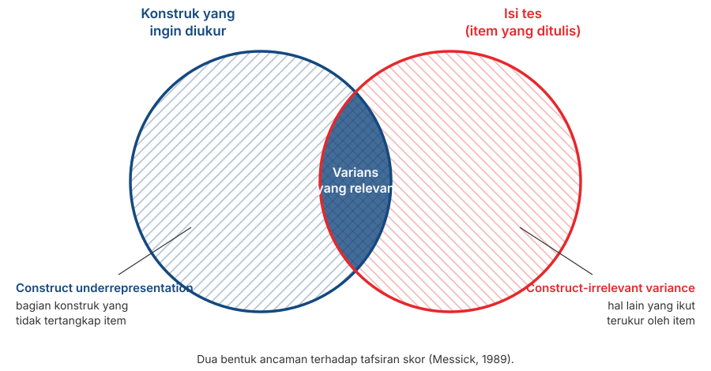

## _Outline_

::: {.incremental}

* Kenapa validitas adalah sifat **tafsiran atas skor**, bukan sifat skala
* Bagaimana tiga "jenis validitas" berubah menjadi **satu konsep dengan lima sumber bukti**
* Lima sumber bukti itu, satu per satu
* *Construct underrepresentation* dan *construct-irrelevant variance*
* Kenapa menaikkan $\alpha$ terus-menerus justru bisa **menurunkan** validitas
* Rencana pengumpulan bukti yang realistis untuk proyek Anda

:::

::: aside
***Disclosure* penggunaan akal imitasi (AI)**

Kami menggunakan Claude Code (Model Opus 5 dan Sonnet 5) untuk *brainstorming* materi, mencari referensi, dan melakukan *troubleshooting* kode `quarto` dan `git`. Kami (Amel dan Dian) bertanggung jawab penuh atas substansi dan penyajian presentasi ini.

:::

# Dari reliabilitas ke validitas {background-color="#14497F" .center}

## Yang belum terjawab

::: {.incremental}

* Pertemuan 6 memberi kita cara menghitung **konsistensi**: $\alpha$, $\omega$, *split-half*.

* Semua koefisien itu menjawab pertanyaan yang sama: *apakah skornya stabil?*

* Tidak satu pun dari koefisien itu menjawab: *apakah skornya menunjukkan hal yang kita maksud?*

:::

. . .

::: {.callout-note}
Ingat analogi timbangan dari Pertemuan 3. Timbangan yang selalu meleset 2 kg tetap sangat konsisten. Konsistensi tidak pernah bisa mendeteksi kesalahan yang sistematis.
:::

# Validitas adalah sifat tafsiran atas skor {background-color="#14497F" .center}

## Definisi resminya

> Validity refers to the degree to which evidence and theory support the interpretations of test scores for proposed uses of tests.
>
> — AERA, APA, & NCME (2014)

. . .

::: {.incremental}

* Perhatikan subjeknya: yang divalidasi adalah **tafsiran atas skor**, untuk **penggunaan tertentu**.

* Bukan tesnya. Bukan skalanya. Bukan itemnya.

:::

## Tiga konsekuensi

::: {.incremental}

1. **Terikat pada tujuan.** Skala yang tafsirannya terdukung untuk penelitian belum tentu terdukung untuk seleksi kerja atau penegakan diagnosis.

2. **Terikat pada populasi.** Bukti yang dikumpulkan pada mahasiswa tidak otomatis berlaku untuk pekerja pabrik atau anak sekolah.

3. **Tidak pernah selesai.** Bukti bisa bertambah, dan bisa juga berkurang ketika muncul temuan yang bertentangan.

:::

. . .

::: {.callout-tip}
#### Cara menuliskannya
Alih-alih *"skala kami valid"*, tulis:

*"Terdapat bukti yang mendukung tafsiran skor skala X sebagai indikator konstruk Y, pada populasi Z, untuk keperluan W."*

Kalimatnya lebih panjang, tetapi kalimat itulah yang bisa Anda pertanggungjawabkan.
:::

## Kalimat yang perlu diperbaiki

| Sering ditulis | Sebaiknya |
|---|---|
| "Skala ini valid dan reliabel." | "Skor skala ini memiliki $\alpha = \ldots$, dan terdapat bukti isi serta struktur internal yang mendukung tafsirannya sebagai …" |
| "Validitas skala sebesar 0,62." | "Skor skala berkorelasi 0,62 dengan …, yang mendukung tafsiran …" |
| "Uji validitas sudah dilakukan." | "Bukti validitas yang kami kumpulkan meliputi … dan …" |

. . .

::: {.callout-note}
Kolom kiri bukan sekadar kurang rapi. Ketiganya memperlakukan validitas sebagai sesuatu yang **dimiliki alat ukur** dan **selesai sekali jadi**.
:::

# Dari tiga jenis menjadi satu konsep {background-color="#14497F" .center}

## Pembagian lama

Sampai sekitar 1970-an, buku teks membagi validitas menjadi tiga:

::: {.incremental}

* **Validitas isi** — apakah itemnya mewakili materi yang seharusnya?
* **Validitas kriteria** — apakah skornya berkorelasi dengan ukuran lain yang relevan, baik saat ini (*concurrent*) maupun di masa depan (*predictive*)?
* **Validitas konstruk** — apakah skornya berperilaku sesuai teori?

:::

. . .

::: {.callout-warning}
#### Masalah dengan pembagian ini
Ia membuat orang mengira ada **tiga pekerjaan terpisah** yang bisa dicentang satu per satu. Dalam praktiknya, banyak laporan menuliskan "validitas isi sudah dilakukan" lalu berhenti di situ.
:::

## Bagaimana pandangannya berubah

::: {.incremental}

* **Cronbach & Meehl (1955)** memperkenalkan validitas konstruk dan gagasan *nomological network*: makna sebuah konstruk terletak pada jaringan hubungannya dengan konstruk lain.

* **Loevinger (1957)** berargumen lebih jauh: validitas konstruk **bukan salah satu jenis**, melainkan keseluruhan validitas itu sendiri.

* **Messick (1989, 1995)** menyatukannya: validitas adalah **satu penilaian menyeluruh** atas sejauh mana bukti dan teori mendukung kesimpulan serta tindakan yang diambil dari skor.

* ***Standards* (2014)** menurunkannya menjadi bentuk yang praktis: bukan "jenis validitas", melainkan **sumber-sumber bukti** yang semuanya menopang satu tafsiran.

:::

## Apa yang berubah secara praktis

:::: {.columns}
::: {.column width="50%"}

### Cara lama

"Kami melakukan uji validitas isi, lalu uji validitas konstruk."

Tiga kotak yang dicentang.

:::
::: {.column width="50%"}

### Cara sekarang

"Berikut bukti yang kami kumpulkan untuk mendukung tafsiran skor ini, dan berikut yang belum kami punya."

Satu argumen yang dibangun dari beberapa sumber.

:::
::::

. . .

::: {.callout-tip}
Perubahan ini memerlukan kejujuran yang lebih besar: Anda harus menyebutkan **bukti yang belum ada**, bukan hanya yang sudah ada.
:::

# Lima sumber bukti {background-color="#14497F" .center}

## Daftarnya

| Sumber bukti | Pertanyaannya | Bisa Anda kerjakan? |
|---|---|:--:|
| **Isi tes** | Apakah item mewakili konstruknya? | Ya (TM11) |
| **Proses respons** | Apakah responden berpikir seperti yang kita bayangkan? | Ya (sebelum TM12) |
| **Struktur internal** | Apakah struktur item sesuai teori? | Ya (TM13) |
| **Hubungan dengan variabel lain** | Apakah skornya berperilaku sesuai teori? | Sebagian (TM12) |
| **Konsekuensi penggunaan** | Apa akibat dari memakai skor ini? | Dibahas di manual (TM14) |

::: aside
AERA, APA, & NCME (2014).
:::

# Bukti 1: isi tes {background-color="#14497F" .center}

## Pertanyaannya

::: {.incremental}

* Apakah item-item yang Anda tulis **mewakili keseluruhan konstruk** yang Anda maksud?

* Untuk bisa menjawabnya, Anda harus lebih dulu punya **definisi domain yang jelas** — apa yang termasuk dan apa yang tidak.

* Itulah pekerjaan Pertemuan 9. Tanpa batas konstruk yang jelas, tidak ada cara menilai apakah itemnya mewakili.

:::

## Dua bentuk ancaman

{.nostretch fig-align="center" width="76%"}

## Membaca gambar itu

::: {.incremental}

* ***Construct underrepresentation*** — ada bagian konstruk yang **tidak tertangkap** oleh item Anda. Skala kecemasan yang hanya memuat gejala fisik, tanpa gejala kognitif, mengalami ini.

* ***Construct-irrelevant variance*** — item Anda **ikut mengukur hal lain**. Soal matematika dengan kalimat panjang dan berbelit ikut mengukur kemampuan membaca.

* Yang di tengah, itulah bagian yang benar-benar berguna.

:::

. . .

::: {.callout-tip}
#### Dua istilah yang paling berguna dari pertemuan ini
Kalau ada dua istilah dari hari ini yang perlu Anda bawa sampai laporan akhir, dua istilah inilah. Hampir semua kritik terhadap sebuah skala bisa dirumuskan sebagai salah satu dari keduanya.
:::

## Cara mengumpulkan buktinya

::: {.incremental}

* Minta **panel ahli** menilai setiap item: seberapa relevan item ini terhadap konstruk yang didefinisikan?

* Hitung tingkat kesepakatan mereka. Item yang dinilai tidak relevan, atau yang para penilainya tidak sepakat, ditinjau ulang.

* Prosedur bakunya disebut ***Content Validity Index*** (Lynn, 1986; Polit & Beck, 2006).

:::

. . .

::: {.callout-note}
#### Sudah pernah Anda kerjakan bentuk sederhananya
Di Pertemuan 5 Anda menjadi juri Thurstone: menilai posisi tiap pernyataan, lalu membuang yang tidak disepakati.

CVI memakai logika yang sama, dengan kriteria yang berbeda. Dian akan membimbing Anda mengerjakannya di **Pertemuan 11**.
:::

# Bukti 2: proses respons {background-color="#14497F" .center}

## Pertanyaannya

::: {.incremental}

* Ketika responden menjawab item Anda, apakah mereka benar-benar melakukan **proses berpikir yang Anda bayangkan**?

* Ingat Pertemuan 2: Nisbett & Wilson menunjukkan bahwa orang sering tidak punya akses pada proses mentalnya sendiri.

* Sebuah item bisa terlihat sempurna di atas kertas dan tetap ditafsirkan responden dengan cara yang sama sekali berbeda.

:::

## Wawancara kognitif

::: {.incremental}

* Minta beberapa calon responden mengisi item Anda sambil **mengucapkan apa yang mereka pikirkan** (*think aloud*).

* Setelah itu, tanyakan: *"Apa maksud pertanyaan ini menurut Anda?"* dan *"Bagaimana Anda sampai pada jawaban itu?"*

* Catat kata yang membingungkan, item yang ditafsirkan ganda, dan jangkar yang tidak jelas.

:::

::: aside
Willis (2005).
:::

. . .

::: {.callout-tip}
#### Ini paling murah dan paling sering dilewati
Cukup **3 sampai 5 orang** sebelum uji coba, dan hampir selalu menemukan masalah yang tidak terlihat oleh penyusunnya sendiri.

Lakukan ini sebelum Pertemuan 12. Biayanya hampir nol, dan hasilnya biasanya menghemat banyak pekerjaan analisis di kemudian hari.
:::

# Bukti 3: struktur internal {background-color="#14497F" .center}

## Pertanyaannya

::: {.incremental}

* Apakah **pola hubungan antar-item** sesuai dengan struktur konstruk yang Anda teorikan?

* Kalau Anda menyatakan konstruk Anda punya tiga aspek, apakah analisis faktornya juga menunjukkan tiga kelompok item?

* Kalau Anda menyatakan konstruknya satu dimensi, apakah datanya mendukung itu?

:::

. . .

::: {.callout-note}
Ini yang akan Anda kerjakan di **Pertemuan 13**: analisis faktor eksploratori, lalu reliabilitas per dimensi.
:::

## Termasuk di dalamnya

::: {.incremental}

* **Dimensionalitas** — berapa faktor yang muncul, dan apakah itemnya mengelompok sesuai rencana.

* **Kesetaraan antar-kelompok** — apakah struktur itu sama untuk laki-laki dan perempuan, atau untuk kelompok usia yang berbeda. Ini asumsi kelima dari Pertemuan 2.

* **Konsistensi internal** — $\alpha$ dan $\omega$ juga termasuk bukti tentang struktur internal, tetapi **bukti yang lemah**.

:::

. . .

::: {.callout-warning}
#### Kenapa $\alpha$ hanya bukti yang lemah
Pertemuan 6 sudah menunjukkannya dengan angka: $\alpha = 0{,}62$ pada skala yang jelas-jelas dua dimensi. Satu koefisien tidak bisa menggambarkan struktur.
:::

# Bukti 4: hubungan dengan variabel lain {background-color="#14497F" .center}

## Dua arah yang harus diperiksa bersama

:::: {.columns}
::: {.column width="50%"}

### Konvergen

Skor Anda **berkorelasi** dengan ukuran lain dari konstruk yang sama atau serupa.

Contoh: skala kecemasan sosial baru berkorelasi dengan skala kecemasan sosial yang sudah mapan.

:::
::: {.column width="50%"}

### Diskriminan

Skor Anda **tidak terlalu berkorelasi** dengan konstruk yang seharusnya berbeda.

Contoh: skala kecemasan sosial tidak berkorelasi sangat tinggi dengan skala depresi.

:::
::::

. . .

::: {.callout-warning}
Bukti konvergen saja tidak cukup. Kalau skala Anda berkorelasi 0,85 dengan **semua** skala lain, yang Anda ukur mungkin sesuatu yang sangat umum, bukan konstruk yang Anda klaim.
:::

## Matriks multitrait-multimethod

::: {.incremental}

* **Campbell & Fiske (1959)** mengusulkan cara memeriksa keduanya sekaligus: ukur beberapa konstruk dengan beberapa metode, lalu bandingkan pola korelasinya.

* Gagasannya: korelasi antara **konstruk yang sama diukur dengan metode berbeda** harus lebih tinggi daripada korelasi antara **konstruk berbeda yang diukur dengan metode sama**.

* Kalau tidak, yang Anda ukur sebagian besar adalah **metodenya**, bukan konstruknya.

:::

. . .

::: {.callout-note}
Ini menjelaskan kenapa dua skala *self-report* apa pun cenderung berkorelasi: sebagiannya berasal dari kesamaan metode, bukan dari kesamaan konstruk.
:::

## Bukti berbasis kriteria

::: {.incremental}

* ***Concurrent*** — skor berkorelasi dengan kriteria yang diukur pada waktu yang sama.

* ***Predictive*** — skor memprediksi kriteria di masa depan.

* ***Known-groups*** — skor membedakan kelompok yang secara teori memang berbeda. Misalnya, skala kecemasan sosial seharusnya memberi skor lebih tinggi pada kelompok yang sedang menjalani terapi untuk keluhan itu.

:::

. . .

::: {.callout-tip}
#### Yang realistis untuk proyek Anda
*Known-groups* dan *concurrent* masih mungkin. Sertakan **satu skala mapan yang pendek** di dalam kuesioner uji coba Anda di Pertemuan 12, lalu laporkan korelasinya.

Satu korelasi saja sudah jauh lebih baik daripada tidak ada bukti sama sekali.
:::

## Nama yang sama belum tentu isi yang sama

::: {.incremental}

* Ingat temuan Fried (2017) dari Pertemuan 1: tujuh skala depresi memuat 52 gejala berbeda.

* Karena itu, korelasi rendah dengan skala "sejenis" **belum tentu** berarti skala Anda buruk. Bisa jadi kedua skala memang mengukur hal yang berbeda meski namanya sama.

* Yang perlu Anda periksa adalah **isi skala pembanding**, bukan hanya namanya.

:::

# Bukti 5: konsekuensi penggunaan {background-color="#14497F" .center}

## Gagasannya

::: {.incremental}

* Messick berargumen bahwa **akibat dari penggunaan skor** juga merupakan bagian dari pertimbangan validitas.

* Sebuah tes seleksi yang secara sistematis merugikan kelompok tertentu bermasalah — meski korelasinya dengan kriteria terlihat baik.

* Pertanyaannya: apakah akibat itu berasal dari perbedaan yang sesungguhnya, atau dari *construct-irrelevant variance*?

:::

. . .

::: {.callout-note}
#### Ini bagian yang masih diperdebatkan
Sebagian ahli menilai konsekuensi sosial adalah persoalan kebijakan, bukan persoalan validitas. Anda tidak harus memihak, tetapi Anda perlu tahu perdebatannya ada.
:::

## Untuk manual yang Anda tulis

::: {.incremental}

* Di Pertemuan 14 Anda akan menulis manual skala. Manual itu menentukan **keputusan apa yang boleh diambil** dari skor.

* Cantumkan secara eksplisit: untuk keperluan apa skor ini boleh dipakai, dan untuk keperluan apa **tidak**.

* Kalimat seperti *"skala ini tidak dimaksudkan untuk penegakan diagnosis atau seleksi kerja"* adalah bagian dari pekerjaan validitas, bukan sekadar formalitas.

:::

# Pandangan yang berbeda {background-color="#14497F" .center}

## Keberatan Borsboom

::: {.incremental}

* **Borsboom, Mellenbergh, & van Heerden (2004)** menilai definisi Messick terlalu luas dan mencampurkan terlalu banyak hal.

* Menurut mereka, pertanyaan validitas seharusnya jauh lebih sederhana: **apakah atribut itu ada, dan apakah variasi pada atribut itu menyebabkan variasi pada skor?**

* Kalau ya, tesnya valid. Kalau tidak, tidak. Soal kegunaan dan konsekuensi, menurut mereka, adalah pertanyaan yang berbeda.

:::

. . .

::: {.callout-tip}
#### Kenapa ini kita bahas
Sama seperti kritik Michell di Pertemuan 1: Anda tidak harus setuju. Yang perlu Anda tahu adalah bahwa konsep yang tampak mapan pun **masih diperdebatkan** oleh orang-orang yang serius menekuninya.
:::

# Reliabilitas dan validitas {background-color="#14497F" .center}

## Batas atas

Dari Pertemuan 3:

$$r_{XY} \leq \sqrt{\rho_{XX'} \times \rho_{YY'}}$$

. . .

::: {.incremental}

* Reliabilitas skala Anda **maupun** reliabilitas kriterianya **membatasi** korelasi yang bisa Anda peroleh dengan kriteria apa pun.

* Jadi reliabilitas memang diperlukan.

* Tetapi dari sini orang sering menarik kesimpulan yang keliru: bahwa makin tinggi reliabilitas, makin baik validitasnya.

:::

## Paradoks atenuasi

::: {.incremental}

* **Loevinger (1954)** menunjukkan bahwa setelah titik tertentu, menaikkan konsistensi internal justru **menurunkan** validitas.

* Alasannya bisa dilihat dari gambar tadi. Cara termudah menaikkan $\alpha$ adalah menulis item yang saling mirip.

* Item yang saling mirip mengukur satu bagian kecil dari konstruk dengan sangat rapat, dan meninggalkan sisanya. Itu persis *construct underrepresentation*.

:::

. . .

::: {.callout-warning}
#### Contohnya
Sepuluh item ini akan menghasilkan $\alpha$ yang sangat tinggi: *"Saya merasa sedih"*, *"Saya kerap murung"*, *"Hati saya sering muram"*, dan seterusnya.

Skala itu mengukur suasana hati sedih dengan sangat konsisten — dan tidak mengukur gangguan tidur, kehilangan minat, rasa bersalah, atau perubahan nafsu makan sama sekali.
:::

## Kesimpulannya

::: {.r-fit-text}
$\alpha$ yang tinggi

**tidak selalu kabar baik.**
:::

 

. . .

Periksalah $\alpha$ bersama-sama dengan cakupan isi. Angka yang sangat tinggi pada skala pendek yang itemnya mirip-mirip perlu diperiksa lebih dulu, bukan langsung dianggap baik.

# Rencana bukti untuk proyek Anda {background-color="#14497F" .center}

## Yang realistis dikerjakan semester ini

| Sumber bukti | Kapan | Caranya |
|---|:--:|---|
| Isi | TM11 | CVI dari panel ahli |
| Proses respons | Sebelum TM12 | Wawancara kognitif, 3–5 orang |
| Struktur internal | TM13 | Analisis faktor + reliabilitas per dimensi |
| Hubungan dengan variabel lain | TM12 | Sertakan satu skala mapan yang pendek |
| Konsekuensi | TM14 | Batasan penggunaan, ditulis di manual |

. . .

::: {.callout-tip}
Lima baris ini adalah kerangka bagian validitas pada laporan akhir Anda. Kalau ada baris yang tidak bisa Anda kerjakan, **tuliskan bahwa Anda tidak mengerjakannya** — itu jauh lebih baik daripada mendiamkannya.
:::

# Diskusi kelompok {background-color="#14497F" .center}

## Bagian 1: menilai klaim

Diskusikan **15 menit**. Untuk tiap klaim: **bukti apa yang sebenarnya ditunjukkan, dan bukti apa yang belum ada?**

::: {.incremental}

**A.** *"Skala kami valid karena semua item memiliki korelasi item-total di atas 0,30."*

**B.** *"Validitas skala kami terbukti karena berkorelasi 0,88 dengan skala kecemasan yang sudah mapan."*

**C.** *"Skala ini sudah divalidasi pada mahasiswa, jadi bisa dipakai untuk asesmen karyawan."*

:::

::: {.notes}
Jawaban yang diharapkan — A: item-total correlation adalah bukti struktur internal yang lemah,
sama sekali bukan bukti isi atau hubungan dengan variabel lain. B: korelasi setinggi itu justru
memunculkan pertanyaan diskriminan; kalau memang mengukur hal yang sama, apa gunanya skala baru?
C: bukti tidak berpindah antar-populasi dan antar-tujuan penggunaan.
Kalau waktu sempit, cukup bahas A dan C.
:::

## Bagian 2: merancang bukti kelompok Anda

::: {.incremental}

1. Sebutkan **dua aspek konstruk Anda** yang paling berisiko tidak tertangkap oleh item yang sudah Anda bayangkan (*construct underrepresentation*).

2. Sebutkan **satu hal lain** yang mungkin ikut terukur oleh item Anda (*construct-irrelevant variance*).

3. **Skala mapan mana** yang akan Anda sertakan di uji coba sebagai pembanding? Apakah untuk bukti konvergen atau diskriminan?

4. Untuk keperluan apa skor kelompok Anda **tidak boleh** dipakai? Tuliskan satu kalimat.

:::

. . .

::: {.callout-tip}
Jawaban nomor 1 dan 2 akan langsung Anda pakai ketika menyusun kisi-kisi di Pertemuan 10.
:::

# Menutup paruh pertama {background-color="#14497F" .center}

## Tujuh pertemuan, satu alur

::: {.incremental}

1. Pengukuran psikologis bersifat tidak langsung, dan definisinya masih diperdebatkan.
2. Ada enam asumsi yang kita pakai, sebagian besar tanpa disadari.
3. CTT merapikan asumsi itu menjadi $X = T + E$.
4. Format respons menentukan asumsi mana yang Anda pakai.
5. Format lain melepaskan asumsi yang berbeda, dengan biayanya masing-masing.
6. Reliabilitas bisa dihitung, dan $\alpha$ punya batas yang jelas.
7. Validitas adalah argumen yang dibangun dari beberapa sumber bukti.

:::

. . .

::: {.callout-note}
Semua ini bermuara pada satu kalimat: **Anda perlu tahu asumsi apa yang sedang Anda pakai, dan apa akibatnya kalau asumsi itu salah.**
:::

## Ujian Tengah Semester

::: {.incremental}

* Bentuknya **pilihan ganda**, mencakup materi **Pertemuan 1 sampai 7**.

* Yang diuji bukan hafalan nama dan tahun, melainkan kemampuan **mengenali situasi**: koefisien mana yang cocok, asumsi mana yang dilanggar, bukti mana yang sebenarnya ditunjukkan sebuah pernyataan.

* Materi paling sering muncul dari: level pengukuran, keenam asumsi, $X = T + E$, pilihan format respons, tafsiran $\alpha$ dan $\omega$, serta lima sumber bukti validitas.

:::

. . .

::: {.callout-tip}
Cara belajar yang paling sesuai: ambil satu skala apa pun yang Anda temukan, lalu jawab sendiri tujuh pertanyaan sesuai tujuh pertemuan di atas.
:::

## Setelah UTS

::: {.incremental}

* **Pertemuan 9** — kita mulai proyeknya: menetapkan konstruk dan *estimand*, dari tinjauan pustaka sampai definisi operasional.

* **Pertemuan 10** — menyusun kisi-kisi dan menulis item.

* **Pertemuan 11 dan seterusnya** — bersama Dian, di Ruang 303, dengan hari dan jam yang berbeda. Periksa kembali jadwalnya.

:::

. . .

::: {.callout-note}
Mulai Pertemuan 9, semua yang kita bahas di paruh pertama berubah menjadi keputusan yang harus Anda ambil sendiri.
:::

## Ada pertanyaan❓

{fig-align="center"}

::: {.callout-note}
### Catatan

* Paparan disusun dengan menggunakan  dan [**Quarto**](https://quarto.org) dengan *template* dari [UNAIR Theme](https://github.com/rameliaz/quarto-unair-theme).
* Kontak saya via <i class="fas fa-paper-plane"></i> <a href="mailto:amelia.zein@psikologi.unair.ac.id">amelia.zein@psikologi.unair.ac.id</a>
:::

## Rujukan {.smaller}

AERA, APA, & NCME. (2014). *Standards for educational and psychological testing*. American Educational Research Association.

Borsboom, D., Mellenbergh, G. J., & van Heerden, J. (2004). The concept of validity. *Psychological Review, 111*(4), 1061–1071.

Campbell, D. T., & Fiske, D. W. (1959). Convergent and discriminant validation by the multitrait-multimethod matrix. *Psychological Bulletin, 56*(2), 81–105.

Cronbach, L. J., & Meehl, P. E. (1955). Construct validity in psychological tests. *Psychological Bulletin, 52*(4), 281–302.

DeVellis, R. F., & Thorpe, C. T. (2022). *Scale development: Theory and applications* (5th ed.). SAGE.

Fried, E. I. (2017). The 52 symptoms of major depression. *Journal of Affective Disorders, 208*, 191–197.

Loevinger, J. (1954). The attenuation paradox in test theory. *Psychological Bulletin, 51*(5), 493–504.

Loevinger, J. (1957). Objective tests as instruments of psychological theory. *Psychological Reports, 3*, 635–694.

Lynn, M. R. (1986). Determination and quantification of content validity. *Nursing Research, 35*(6), 382–385.

Messick, S. (1989). Validity. In R. L. Linn (Ed.), *Educational measurement* (3rd ed., pp. 13–103). Macmillan.

Messick, S. (1995). Validity of psychological assessment. *American Psychologist, 50*(9), 741–749.

Polit, D. F., & Beck, C. T. (2006). The content validity index: Are you sure you know what's being reported? *Research in Nursing & Health, 29*(5), 489–497.

Willis, G. B. (2005). *Cognitive interviewing: A tool for improving questionnaire design*. SAGE.
