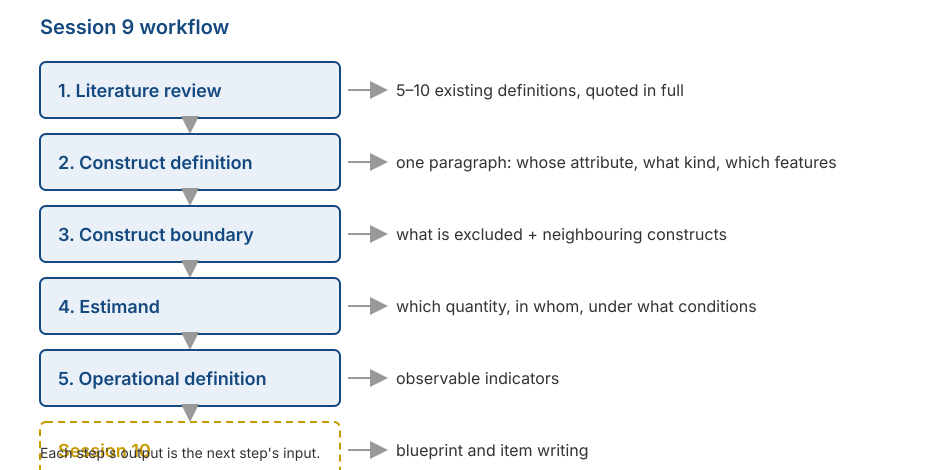

## _Outline_

::: {.incremental}

* What your group has to produce today
* The kind of **literature review** that helps scale construction (and the kind that does not)
* How to write a **construct definition** you can actually use
* **Construct boundary**: what is excluded, and sibling constructs
* **Estimand**: which quantity, in whom, under what conditions
* From construct definition to **operational definition**

:::

::: aside
***Disclosure* on the use of artificial intelligence (AI)**

We used Claude Code (Opus 5 and Sonnet 5) to brainstorm material, locate references, and troubleshoot `quarto` and `git` code. We (Amel and Dian) take full responsibility for the substance and presentation of these slides.

:::

# Starting the work {background-color="#14497F" .center}

## What changes from today

::: {.incremental}

* The first seven sessions covered what you need to know. From now on, all of it becomes **decisions your group has to make**.

* Today is not a lecture. Most of the time is **group work**.

* What you produce today will be used continuously through to Session 15.

:::

## The workflow

{.nostretch fig-align="center" width="62%"}

## Why this step gets skipped

::: {.incremental}

* Many reports begin directly with *"we adapted scale X"*. The construct definition is never written, because it is assumed to be obvious.

* DeVellis calls this "deceptively obvious": many researchers believe they have a clear idea, then discover it was vague — usually after items have been written and data collected.

* At that point, fixing it is far more costly than it would have been at the start.

:::

# Step 1: literature review {background-color="#14497F" .center}

## Not the usual kind of review

::: {.incremental}

* You are **not** summarising all the research on the construct you have chosen.

* What you are looking for is narrow: **how other people define this construct**, and where those definitions differ from one another.

* The target is simple: **5 to 10 definitions**, quoted in full, with their sources.

:::

. . .

::: {.callout-tip}
#### How to record them
Make a three-column table: **source**, **definition (quoted exactly)**, **what it emphasises**. Do not paraphrase yet — the differences between definitions often lie in the exact wording.
:::

## What to look for in the table

::: {.incremental}

* **Points of agreement.** Which elements appear in nearly every definition? Those are probably the core of the construct.

* **Points of disagreement.** Which elements appear in only some? That is where you have to take a position.

* **What nobody mentions.** Sometimes an obviously relevant aspect appears in no definition at all. That can be your group's contribution — as long as you say so openly.

:::

. . .

::: {.callout-note}
Recall Fried's (2017) finding from Session 1: seven depression scales contained 52 different symptoms. Disagreement between definitions is not rare; it is the norm.
:::

# Step 2: writing the construct definition {background-color="#14497F" .center}

## Three things it must state

A usable definition names:

::: {.incremental}

1. **Whose attribute this is.** An individual? A group? A couple? An organisation?

2. **What kind of thing it is.** A relatively stable trait, a momentary state, an ability, an attitude, a belief, or a pattern of behaviour?

3. **Its essential features.** What must be present for something to count as this construct?

:::

::: aside
Adapted from [Podsakoff, MacKenzie, & Podsakoff (2016)](https://journals.sagepub.com/doi/full/10.1177/1094428115624965).
:::

## On "whose attribute"

::: {.incremental}

* We covered this in Session 3: a latent variable is usually a **characteristic of whoever supplies the data**.

* If you ask students to rate their lecturer, you are measuring **students' perceptions**, not the lecturer's qualities.

* If you ask parents to report their child's behaviour, you are measuring **the parents' report**, not the child's behaviour directly.

:::

. . .

::: {.callout-warning}
#### This will be checked
The construct name in your report must match who actually completed the questionnaire. A mismatch here will run through the entire report.
:::

## Common faults

| Definition | The problem |
|---|---|
| "Academic anxiety is anxiety experienced in academic contexts." | **Circular.** The word being defined reappears inside the definition. |
| "Academic anxiety is the score on the Academic Anxiety Scale." | **Names an instrument**, not a meaning. This is an operational definition in the wrong place. |
| "Academic anxiety is discomfort related to university study." | **Too vague.** "Discomfort" could mean almost anything. |
| "Academic anxiety is a disorder that harms students." | **Evaluative.** A definition says what something is, not whether it is good or bad. |

## How specific?

::: {.incremental}

* The level of specificity is **your decision**, not something that emerges on its own.

* DeVellis's example: locus of control. Rotter (1966) framed it generally. Levenson (1973) separated three loci. Wallston et al. (1978) made the outcomes health-specific. A later version can be narrowed to a single illness.

* All four are useful. What determines which is right is **the research question**.

:::

. . .

::: {.callout-tip}
#### A useful rule
Measures relate most strongly to each other when their **levels of specificity match**. A very general scale will not predict a very specific behaviour well, and the reverse is also true.
:::

# Step 3: the construct boundary {background-color="#14497F" .center}

## Naming what is excluded

::: {.incremental}

* We have raised this since Session 1: stating what is **not** included does more for a scale's quality than stating what is.

* The reason is visible in the Session 7 figure. Without a clear boundary, scale content easily **drifts** into territory you did not intend, and that becomes construct-irrelevant variance.

:::

. . .

::: {.callout-tip}
#### How to do it
Write two lists side by side: **included** and **excluded**. Fill both with concrete examples, not abstract categories.
:::

## [*Sibling construct*](https://doi.org/10.1177/10888683211047101)

::: {.incremental}

* For each similar construct, write one sentence: **how is it different from mine?**

* Example: social anxiety and shyness. Both involve discomfort in social situations. The difference lies in fear of negative evaluation and in the degree of avoidance.

* If you cannot write down the difference, you probably cannot separate them through items either.

:::

. . .

::: {.callout-note}
This list becomes directly useful in Session 12, when you choose a comparison scale for discriminant evidence.
:::

## Two classic errors

::: {.incremental}

* ***Jingle fallacy*** — assuming two things are the same because they **share a name**. Two "resilience" scales can measure quite different things.

* ***Jangle fallacy*** — assuming two things differ because they **have different names**. "Grit" and conscientiousness correlate very highly despite the different labels.

:::

::: aside
The terms come from Thorndike (1904) and Kelley (1927).
:::

# Step 4: setting the estimand {background-color="#14497F" .center}

## A term borrowed from elsewhere

::: {.incremental}

* In quantitative research, an **estimand** is **the quantity you want to know**, stated before any method is chosen.

* Lundberg, Johnson, & Stewart (2021) argue that much research skips this step: the method is chosen first, and the meaning is constructed afterwards.

* The same idea is useful for measurement. Before writing a single item, state **which quantity you want to estimate**.

:::

## Four questions

::: {.incremental}

1. **What is the attribute called?** A person's level of it? Their standing relative to others? The presence or absence of a condition?

2. **In whom?** The target population must be named specifically — not "the public", but for instance "enrolled undergraduates in Surabaya, aged 18–24".

3. **Under what conditions?** Are you measuring a present state, a general tendency, or experience within a particular period?

4. **Compared with what?** Will scores be interpreted relative to other people (**norms**) or against a fixed standard (**criterion**)?

:::

## An example estimand

> We want to estimate **the level of social anxiety** **experienced over the past month** among **enrolled undergraduates aged 18–24 in Surabaya**, interpreted **relative to the score distribution of that group**.

. . .

::: {.incremental}

* Notice how much this one sentence settles: the time frame in the items, the pilot population in Session 12, and the form of the norms in Session 14.

* It also closes off claims you have not tested. Your scores do not apply to secondary school students or to employees, and you have said so from the start.

:::

. . .

::: {.callout-tip}
This sentence is the hardest part of today's work. If your group can write it clearly, the rest of the semester becomes considerably easier.
:::

## How it connects to other sessions

| Part of the estimand | Determines |
|---|---|
| Which quantity | Response format (S4–5) and the form of the score |
| In whom | Pilot sample (S12), between-group checks (S13) |
| Under what conditions | The time frame in item wording (S10) |
| Compared with what | The form of norms and standard scores (S14) |

# Step 5: the operational definition {background-color="#14497F" .center}

## Its job is to bridge

::: {.incremental}

* The construct definition says **what** you mean. The operational definition says **how** that shows up in something observable.

* It consists of **indicators**: concrete behaviours, thoughts, or feelings that signal a high level of the attribute.

* These are not yet items. Items come in Session 10, built from these indicators.

:::

## Example

::: {.incremental}

* **Construct**: social anxiety

* **Facet**: fear of negative evaluation

* **Indicators**: worrying about seeming foolish when speaking; replaying conversations afterwards; avoiding asking questions in class even when confused

* **Item** (Session 10): *"After speaking in front of the class, I replay what I said in my head."*

:::

. . .

::: {.callout-note}
Each indicator should yield more than one item. Recall from Session 6 that the number of items affects reliability, and from Session 7 that content coverage affects validity.
:::

## Dimensional structure

::: {.incremental}

* Now is the point to state it: is your construct **unidimensional** or **multidimensional**?

* If multidimensional, name the dimensions and explain how they relate to one another.

* State also whether you treat it as **dimensional** or **categorical** — assumption three from Session 2.

:::

# Group work {background-color="#14497F" .center}

## Today's tasks

::: {.incremental}

* **15 minutes** — Collect existing definitions. At least five, quoted in full with sources.

* **20 minutes** — Write your group's construct definition. One paragraph, containing the three elements above.

* **20 minutes** — Build the two lists: included and excluded. Add two sibling constructs and how yours differs.

* **20 minutes** — Write one estimand sentence answering the four questions.

* **20 minutes** — Set out facets and indicators. At least two indicators per facet.

:::

::: {.notes}
The two most common problems: circular definitions, and target populations that are far too broad
("the general public", "adolescents"). For the second, ask directly: "who can you realistically
reach for a pilot next month?" The answer is usually much narrower, and that is the more honest
estimand.
If a group still has no settled construct, steer them toward one with an adequate literature —
not the one they find most interesting.
Leave 20 minutes for brief presentations.
:::

## Brief presentations

Each group presents **two things only**, one minute each:

::: {.incremental}

1. Your **estimand sentence**.

2. **One sibling construct** and how yours differs from it.

:::

. . .

::: {.callout-tip}
Other groups may ask one question: *"what makes you confident your items will not also measure that sibling construct?"*
:::

# What you must produce {background-color="#14497F" .center}

## The construct specification

One page, containing:

::: {.incremental}

* **Construct definition** — one paragraph, with references.
* **Construct boundary** — the included and excluded lists.
* **Sibling constructs** — at least two, with the distinctions.
* **Estimand** — one sentence.
* **Dimensional structure** — one or several dimensions, and why.
* **Facets and indicators** — as a table.

:::

. . .

::: {.callout-note}
This specification becomes an appendix to your final report, and the material the expert panel reads in Session 11. The panel cannot judge item relevance without first reading the construct definition.
:::

## For Session 10

::: {.incremental}

* We build the **blueprint**: how many items per facet, and why that many.
* We write items, using the principles covered in Sessions 4 and 5.
* The most common item-writing faults: double-barrelled items, convoluted sentences, loaded words, and badly designed reverse-worded items.
* Bring your group's **construct specification**. Without it, there is nothing to work from.

:::

. . .

::: {.callout-tip}
#### Preparation
Read **DeVellis & Thorpe (2022), Chapter 5**, the sections on item writing.
:::

## Any questions❓

{fig-align="center"}

::: {.callout-note}
### Notes

* These slides were built with  and [**Quarto**](https://quarto.org), using the [UNAIR Theme](https://github.com/rameliaz/quarto-unair-theme) template.
* Reach me at <i class="fas fa-paper-plane"></i> <a href="mailto:amelia.zein@psikologi.unair.ac.id">amelia.zein@psikologi.unair.ac.id</a>
:::

## References {.smaller}

DeVellis, R. F., & Thorpe, C. T. (2022). *Scale development: Theory and applications* (5th ed.). SAGE.

Flake, J. K., & Fried, E. I. (2020). Measurement schmeasurement: Questionable measurement practices and how to avoid them. *Advances in Methods and Practices in Psychological Science, 3*(4), 456–465.

Fried, E. I. (2017). The 52 symptoms of major depression. *Journal of Affective Disorders, 208*, 191–197.

Kelley, T. L. (1927). *Interpretation of educational measurements*. World Book.

Levenson, H. (1973). Multidimensional locus of control in psychiatric patients. *Journal of Consulting and Clinical Psychology, 41*(3), 397–404.

Lundberg, I., Johnson, R., & Stewart, B. M. (2021). What is your estimand? Defining the target quantity your research question aims to answer. *American Sociological Review, 86*(3), 532–565.

Podsakoff, P. M., MacKenzie, S. B., & Podsakoff, N. P. (2016). Recommendations for creating better concept definitions in the organizational, behavioral, and social sciences. *Organizational Research Methods, 19*(2), 159–203.

Rotter, J. B. (1966). Generalized expectancies for internal versus external control of reinforcement. *Psychological Monographs, 80*(1), 1–28.

Wallston, K. A., Wallston, B. S., & DeVellis, R. (1978). Development of the Multidimensional Health Locus of Control (MHLC) scales. *Health Education Monographs, 6*(2), 160–170.
