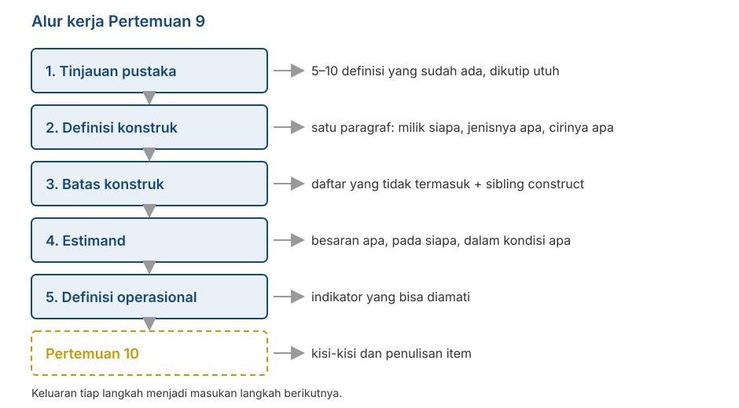

## _Outline_

::: {.incremental}

* Apa yang harus dihasilkan kelompok Anda hari ini
* **Tinjauan pustaka** yang berguna untuk penyusunan skala (dan yang tidak)
* Cara menuliskan **definisi konstruk** yang bisa dipakai
* **Batas konstruk**: apa yang tidak termasuk, dan konstruk tetangga
* **Estimand**: besaran apa, pada siapa, dalam kondisi apa
* Dari definisi konstruk ke **definisi operasional**

:::

::: aside
***Disclosure* penggunaan akal imitasi (AI)**

Kami menggunakan Claude Code (Model Opus 5 dan Sonnet 5) untuk *brainstorming* materi, mencari referensi, dan melakukan *troubleshooting* kode `quarto` dan `git`. Kami (Amel dan Dian) bertanggung jawab penuh atas substansi dan penyajian presentasi ini.

:::

# Mulai mengerjakan {background-color="#14497F" .center}

## Yang berubah mulai hari ini

::: {.incremental}

* Tujuh pertemuan pertama membahas apa yang perlu Anda ketahui. Mulai sekarang, semuanya menjadi **keputusan yang harus kelompok Anda ambil**.

* Pertemuan hari ini bukan kuliah. Sebagian besar waktunya adalah **kerja kelompok**, dan kami berkeliling.

* Yang Anda hasilkan hari ini akan dipakai terus sampai Pertemuan 15.

:::

. . .

::: {.callout-note}
#### Kaitannya dengan penilaian
Hasil hari ini mengisi dua baris pada rubrik RTM: **Pengantar** dan **Operasionalisasi Konstruk**. Keduanya juga menjadi dasar penilaian **Penulisan Item**, karena item tidak bisa dinilai tanpa definisi konstruk yang jelas.
:::

## Alur kerjanya

{.nostretch fig-align="center" width="62%"}

## Kenapa langkah ini sering dilewati

::: {.incremental}

* Banyak laporan langsung mulai dari *"kami mengadaptasi skala X"*. Definisi konstruknya tidak pernah ditulis, karena dianggap sudah jelas.

* DeVellis menyebut ini "*deceptively obvious*": banyak peneliti mengira mereka sudah punya gambaran yang jelas, lalu menyadari gambarannya kabur — biasanya setelah item ditulis dan data dikumpulkan.

* Pada titik itu, memperbaikinya jauh lebih mahal daripada kalau dikerjakan di awal.

:::

. . .

::: {.callout-warning}
Flake & Fried (2020) memasukkan "tidak melaporkan bagaimana konstruk didefinisikan" sebagai salah satu *questionable measurement practices*. Ini bukan sekadar soal kerapian penulisan.
:::

# Langkah 1: tinjauan pustaka {background-color="#14497F" .center}

## Bukan tinjauan pustaka yang biasa

::: {.incremental}

* Anda **tidak** sedang merangkum semua penelitian tentang konstruk itu.

* Yang Anda cari sangat spesifik: **bagaimana orang lain mendefinisikan konstruk ini**, dan di mana definisi-definisi itu berbeda satu sama lain.

* Targetnya sederhana: **5 sampai 10 definisi**, dikutip utuh, lengkap dengan sumbernya.

:::

. . .

::: {.callout-tip}
#### Cara mencatatnya
Buat tabel tiga kolom: **sumber**, **definisi (dikutip persis)**, **apa yang ditekankan**. Jangan diparafrasekan dulu — perbedaan antar-definisi sering terletak pada kata-kata yang tepat.
:::

## Yang Anda cari di dalam tabel itu

::: {.incremental}

* **Titik temu.** Unsur apa yang muncul di hampir semua definisi? Itu kemungkinan besar inti konstruknya.

* **Titik beda.** Unsur apa yang hanya muncul di sebagian definisi? Di situlah Anda harus mengambil sikap.

* **Yang tidak pernah disebut.** Kadang ada aspek yang jelas relevan tetapi tidak muncul di definisi mana pun. Itu bisa menjadi kontribusi kelompok Anda, asalkan Anda menyatakannya secara terbuka.

:::

. . .

::: {.callout-note}
Ingat temuan Fried (2017) dari Pertemuan 1: tujuh skala depresi memuat 52 gejala berbeda. Perbedaan definisi bukan hal yang langka; ia justru hal yang biasa.
:::

# Langkah 2: menuliskan definisi konstruk {background-color="#14497F" .center}

## Tiga hal yang harus ada

Definisi yang bisa dipakai menyebutkan:

::: {.incremental}

1. **Milik siapa atribut ini.** Individu? Kelompok? Pasangan? Organisasi?

2. **Jenisnya apa.** Sifat yang relatif menetap (*trait*), kondisi sesaat (*state*), kemampuan, sikap, keyakinan, atau pola perilaku?

3. **Ciri-ciri pokoknya.** Unsur apa yang harus ada supaya sesuatu disebut sebagai konstruk ini?

:::

::: aside
Diadaptasi dari Podsakoff, MacKenzie, & Podsakoff (2016).
:::

## Soal "milik siapa"

::: {.incremental}

* Kita sudah membahas ini di Pertemuan 3: variabel laten biasanya adalah **karakteristik orang yang datanya diambil**.

* Kalau Anda meminta mahasiswa menilai dosennya, yang Anda ukur adalah **persepsi mahasiswa**, bukan sifat dosennya.

* Kalau Anda meminta orang tua melaporkan perilaku anaknya, yang Anda ukur adalah **laporan orang tua**, bukan perilaku anak secara langsung.

:::

. . .

::: {.callout-warning}
#### Ini akan diperiksa
Nama konstruk pada laporan Anda harus sesuai dengan siapa yang mengisi kuesionernya. Ketidaksesuaian di sini akan merembet ke seluruh laporan.
:::

## Kesalahan yang sering muncul

| Definisi | Masalahnya |
|---|---|
| "Kecemasan akademik adalah kecemasan yang dialami dalam konteks akademik." | **Melingkar.** Kata yang didefinisikan dipakai lagi di dalam definisinya. |
| "Kecemasan akademik adalah skor pada Skala Kecemasan Akademik." | **Menyebut alat ukur**, bukan makna. Ini definisi operasional yang salah tempat. |
| "Kecemasan akademik adalah perasaan tidak nyaman terkait perkuliahan." | **Terlalu kabur.** "Tidak nyaman" bisa berarti apa saja. |
| "Kecemasan akademik adalah gangguan yang merugikan mahasiswa." | **Menghakimi.** Definisi menjelaskan apa sesuatu itu, bukan menilai baik-buruknya. |

## Seberapa spesifik?

::: {.incremental}

* Tingkat kekhususan adalah **keputusan**, bukan sesuatu yang muncul dengan sendirinya.

* Contoh dari DeVellis: *locus of control*. Rotter (1966) menyusunnya secara umum. Levenson (1973) memisahkan tiga sumber kendali. Wallston dkk. (1978) mengkhususkannya pada kesehatan. Versi berikutnya bahkan bisa dikhususkan lagi pada satu penyakit tertentu.

* Keempatnya berguna. Yang menentukan mana yang tepat adalah **pertanyaan penelitiannya**.

:::

. . .

::: {.callout-tip}
#### Kaidah yang berguna
Ukuran akan berkorelasi paling kuat dengan hal lain kalau **tingkat kekhususannya sepadan**. Skala yang sangat umum tidak akan memprediksi perilaku yang sangat khusus dengan baik, dan sebaliknya.
:::

# Langkah 3: batas konstruk {background-color="#14497F" .center}

## Menyebutkan apa yang tidak termasuk

::: {.incremental}

* Kita sudah menyinggungnya sejak Pertemuan 1: menyebutkan apa yang **tidak** termasuk lebih menentukan kualitas skala daripada menyebutkan apa yang termasuk.

* Alasannya terlihat pada gambar Pertemuan 7. Tanpa batas yang jelas, isi skala mudah **melebar** ke wilayah yang tidak Anda maksud, dan itu menjadi *construct-irrelevant variance*.

:::

. . .

::: {.callout-tip}
#### Cara praktisnya
Tulis dua daftar berdampingan: **termasuk** dan **tidak termasuk**. Isi keduanya dengan contoh konkret, bukan kategori abstrak.
:::

## Konstruk tetangga

::: {.incremental}

* Untuk tiap konstruk yang mirip, tuliskan satu kalimat: **apa bedanya dengan konstruk saya?**

* Contoh: kecemasan sosial dan rasa malu. Keduanya melibatkan ketidaknyamanan dalam situasi sosial. Bedanya terletak pada ketakutan akan penilaian negatif dan pada tingkat penghindaran.

* Kalau Anda tidak bisa menuliskan bedanya, kemungkinan besar Anda memang belum bisa memisahkan keduanya lewat item.

:::

. . .

::: {.callout-note}
Daftar ini akan langsung berguna di Pertemuan 12, ketika Anda memilih skala pembanding untuk bukti diskriminan.
:::

## Dua kekeliruan klasik

::: {.incremental}

* ***Jingle fallacy*** — mengira dua hal sama karena **namanya sama**. Dua skala "resiliensi" bisa mengukur hal yang sangat berbeda.

* ***Jangle fallacy*** — mengira dua hal berbeda karena **namanya berbeda**. "Grit" dan "conscientiousness" berkorelasi sangat tinggi, meski dinamai berbeda.

:::

::: aside
Istilahnya berasal dari Thorndike (1904) dan Kelley (1927).
:::

. . .

::: {.callout-warning}
#### Pertanyaan yang harus dijawab kelompok Anda
Kalau konstruk Anda sudah punya nama yang dipakai orang lain, apakah definisi Anda **sama** dengan definisi mereka? Kalau berbeda, katakan berbeda — jangan memakai nama yang sama untuk isi yang lain.
:::

# Langkah 4: menetapkan estimand {background-color="#14497F" .center}

## Istilah yang dipinjam dari tempat lain

::: {.incremental}

* Dalam penelitian kuantitatif, **estimand** adalah **besaran yang ingin Anda ketahui**, dinyatakan sebelum Anda memilih metode apa pun.

* Lundberg, Johnson, & Stewart (2021) berargumen bahwa banyak penelitian melompati langkah ini: metodenya dipilih lebih dulu, lalu maknanya dikarang belakangan.

* Gagasan yang sama berguna untuk pengukuran. Sebelum menulis satu item pun, nyatakan **besaran apa yang ingin Anda estimasi**.

:::

## Empat pertanyaan

::: {.incremental}

1. **Besaran apa?** Tingkat atribut pada seseorang? Posisi relatif dibanding orang lain? Ada atau tidaknya suatu kondisi?

2. **Pada siapa?** Populasi sasarannya harus disebut secara spesifik — bukan "masyarakat", melainkan misalnya "mahasiswa S1 aktif di Surabaya, usia 18–24".

3. **Dalam kondisi apa?** Apakah yang diukur keadaan sekarang, kecenderungan umum, atau pengalaman dalam kurun waktu tertentu?

4. **Dibandingkan dengan apa?** Skor akan ditafsirkan relatif terhadap orang lain (**norma**), atau relatif terhadap suatu patokan tetap (**kriteria**)?

:::

## Contoh kalimat estimand

> Kami ingin mengestimasi **tingkat kecemasan sosial** yang **dialami dalam sebulan terakhir** pada **mahasiswa S1 aktif berusia 18–24 tahun di Surabaya**, dan menafsirkannya **secara relatif terhadap sebaran skor kelompok tersebut**.

. . .

::: {.incremental}

* Perhatikan bahwa kalimat ini menentukan banyak hal sekaligus: kurun waktu pada item, populasi uji coba di Pertemuan 12, dan bentuk norma di Pertemuan 14.

* Kalimat ini juga menutup pintu bagi klaim yang tidak Anda uji. Skor Anda tidak berlaku untuk anak SMA atau pekerja, dan Anda sudah menyatakannya sejak awal.

:::

. . .

::: {.callout-tip}
Satu kalimat ini adalah bagian tersulit dari pekerjaan hari ini. Kalau kelompok Anda bisa menuliskannya dengan jelas, sisa semester jauh lebih mudah.
:::

## Kaitannya dengan pertemuan lain

| Bagian estimand | Menentukan |
|---|---|
| Besaran apa | Format respons (TM4–5) dan bentuk skor |
| Pada siapa | Sampel uji coba (TM12), pemeriksaan antar-kelompok (TM13) |
| Dalam kondisi apa | Kurun waktu pada kalimat item (TM10) |
| Dibandingkan dengan apa | Bentuk norma dan skor standar (TM14) |

# Langkah 5: definisi operasional {background-color="#14497F" .center}

## Fungsinya sebagai jembatan

::: {.incremental}

* Definisi konstruk menjelaskan **apa** yang Anda maksud. Definisi operasional menjelaskan **bagaimana** hal itu muncul dalam sesuatu yang bisa diamati.

* Isinya berupa **indikator**: perilaku, pikiran, atau perasaan konkret yang menandakan tingginya atribut tersebut.

* Belum berupa item. Item disusun di Pertemuan 10, berdasarkan indikator ini.

:::

## Contoh bertahap

::: {.incremental}

* **Konstruk**: kecemasan sosial

* **Aspek**: ketakutan akan penilaian negatif

* **Indikator**: khawatir dinilai bodoh ketika berbicara; memikirkan ulang percakapan setelah selesai; menghindari bertanya di kelas meski tidak paham

* **Item** (Pertemuan 10): *"Setelah berbicara di depan kelas, saya memikirkan ulang apa yang tadi saya katakan."*

:::

. . .

::: {.callout-note}
Tiap indikator sebaiknya menghasilkan lebih dari satu item. Ingat dari Pertemuan 6 bahwa jumlah item ikut menentukan reliabilitas, dan dari Pertemuan 7 bahwa cakupan isi menentukan validitasnya.
:::

## Struktur dimensinya

::: {.incremental}

* Sekarang saatnya menyatakan: konstruk Anda **satu dimensi** atau **beberapa dimensi**?

* Kalau beberapa, sebutkan dimensinya dan jelaskan hubungan antar-dimensi itu.

* Nyatakan juga apakah Anda memperlakukannya sebagai **dimensional** atau **kategoris** — asumsi ketiga dari Pertemuan 2.

:::

. . .

::: {.callout-warning}
Pernyataan ini akan diuji dengan data di Pertemuan 13. Kalau Anda menyatakan tiga dimensi tetapi analisis faktornya menunjukkan satu, itu **temuan yang harus dilaporkan**, bukan kegagalan yang harus disembunyikan.
:::

# Kerja kelompok {background-color="#14497F" .center}

## Yang dikerjakan hari ini

Kerjakan berurutan. Kami berkeliling ke tiap kelompok.

::: {.incremental}

* **15 menit** — Kumpulkan definisi yang sudah ada. Minimal lima, dikutip utuh dengan sumbernya.

* **20 menit** — Tulis definisi konstruk kelompok Anda. Satu paragraf, memuat tiga unsur dari tadi.

* **20 menit** — Buat dua daftar: termasuk dan tidak termasuk. Tambahkan dua konstruk tetangga beserta pembedanya.

* **20 menit** — Tulis satu kalimat estimand, menjawab empat pertanyaan tadi.

* **20 menit** — Uraikan aspek dan indikator. Minimal dua indikator per aspek.

:::

::: {.notes}
Kesalahan yang paling sering muncul: definisi yang melingkar, dan populasi sasaran yang terlalu
luas ("masyarakat umum", "remaja"). Untuk yang kedua, tanyakan langsung: "siapa yang benar-benar
bisa kalian jangkau untuk uji coba bulan depan?" Biasanya jawabannya jauh lebih sempit, dan itu
justru estimand yang lebih jujur.
Kalau ada kelompok yang belum punya konstruk yang mantap, arahkan mereka memilih konstruk yang
sudah punya literatur memadai — bukan yang paling menarik.
Sisakan 20 menit untuk pemaparan singkat tiap kelompok.
:::

## Pemaparan singkat

Tiap kelompok menyampaikan **dua hal** saja, masing-masing satu menit:

::: {.incremental}

1. **Kalimat estimand** Anda.

2. **Satu konstruk tetangga** dan apa bedanya dengan konstruk Anda.

:::

. . .

::: {.callout-tip}
Kelompok lain dipersilakan bertanya satu hal: *"apa yang membuat kalian yakin item kalian tidak akan ikut mengukur konstruk tetangga itu?"*
:::

# Yang harus dihasilkan {background-color="#14497F" .center}

## Dokumen spesifikasi konstruk

Satu halaman, memuat:

::: {.incremental}

* **Definisi konstruk** — satu paragraf, dengan rujukan.
* **Batas konstruk** — daftar termasuk dan tidak termasuk.
* **Konstruk tetangga** — minimal dua, beserta pembedanya.
* **Estimand** — satu kalimat.
* **Struktur dimensi** — satu atau beberapa dimensi, dan alasannya.
* **Aspek dan indikator** — dalam bentuk tabel.

:::

. . .

::: {.callout-note}
Dokumen ini menjadi lampiran laporan akhir Anda, dan menjadi bahan yang dinilai oleh panel ahli di Pertemuan 11. Panel tidak bisa menilai relevansi item tanpa membaca definisi konstruknya lebih dulu.
:::

## Untuk Pertemuan 10

::: {.incremental}

* Kita menyusun **kisi-kisi** (*blueprint*): berapa item untuk tiap aspek, dan kenapa sebanyak itu.
* Menulis item, dengan kaidah yang sudah kita bahas di Pertemuan 4 dan 5.
* Kesalahan penulisan item yang paling umum: item ganda, kalimat berbelit, kata bersayap, dan item bernada terbalik yang salah rancang.
* Bawa **dokumen spesifikasi konstruk** kelompok Anda. Tanpa itu, tidak ada yang bisa dikerjakan.

:::

. . .

::: {.callout-tip}
#### Persiapan
Baca **DeVellis & Thorpe (2022), Bab 5**, bagian tentang penulisan item.
:::

## Ada pertanyaan❓

{fig-align="center"}

::: {.callout-note}
### Catatan

* Paparan disusun dengan menggunakan  dan [**Quarto**](https://quarto.org) dengan *template* dari [UNAIR Theme](https://github.com/rameliaz/quarto-unair-theme).
* Kontak saya via <i class="fas fa-paper-plane"></i> <a href="mailto:amelia.zein@psikologi.unair.ac.id">amelia.zein@psikologi.unair.ac.id</a>
:::

## Rujukan {.smaller}

DeVellis, R. F., & Thorpe, C. T. (2022). *Scale development: Theory and applications* (5th ed.). SAGE.

Eronen, M. I., & Bringmann, L. F. (2021). The theory crisis in psychology: How to move forward. *Perspectives on Psychological Science, 16*(4), 779–788.

Flake, J. K., & Fried, E. I. (2020). Measurement schmeasurement: Questionable measurement practices and how to avoid them. *Advances in Methods and Practices in Psychological Science, 3*(4), 456–465.

Fried, E. I. (2017). The 52 symptoms of major depression. *Journal of Affective Disorders, 208*, 191–197.

Gerring, J. (1999). What makes a concept good? *Polity, 31*(3), 357–393.

Kelley, T. L. (1927). *Interpretation of educational measurements*. World Book.

Levenson, H. (1973). Multidimensional locus of control in psychiatric patients. *Journal of Consulting and Clinical Psychology, 41*(3), 397–404.

Lundberg, I., Johnson, R., & Stewart, B. M. (2021). What is your estimand? Defining the target quantity your research question aims to answer. *American Sociological Review, 86*(3), 532–565.

Podsakoff, P. M., MacKenzie, S. B., & Podsakoff, N. P. (2016). Recommendations for creating better concept definitions in the organizational, behavioral, and social sciences. *Organizational Research Methods, 19*(2), 159–203.

Rotter, J. B. (1966). Generalized expectancies for internal versus external control of reinforcement. *Psychological Monographs, 80*(1), 1–28.

Sartori, G. (1970). Concept misformation in comparative politics. *American Political Science Review, 64*(4), 1033–1053.

Wallston, K. A., Wallston, B. S., & DeVellis, R. (1978). Development of the Multidimensional Health Locus of Control (MHLC) scales. *Health Education Monographs, 6*(2), 160–170.
